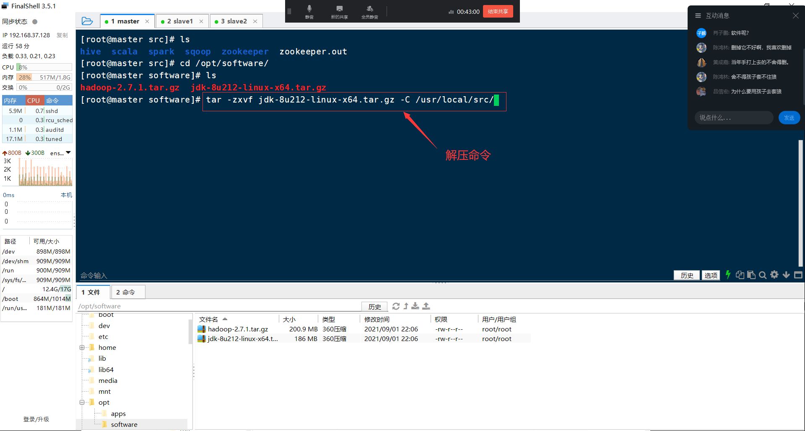
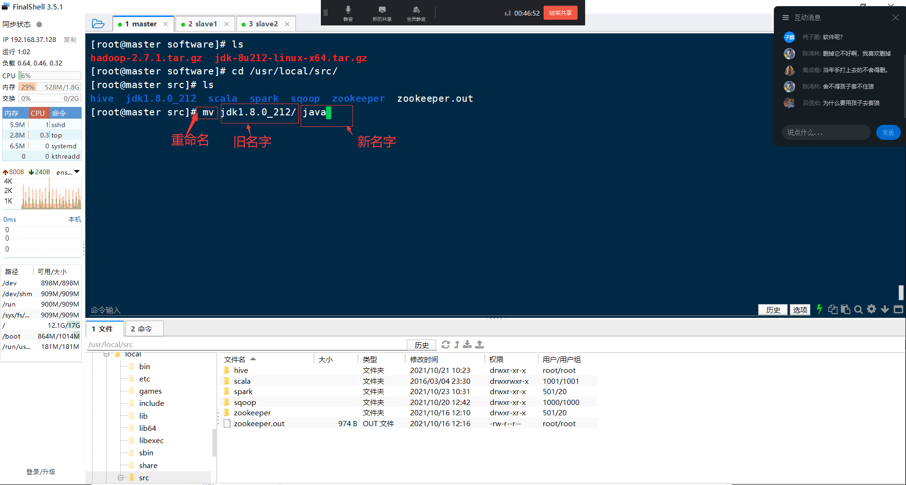
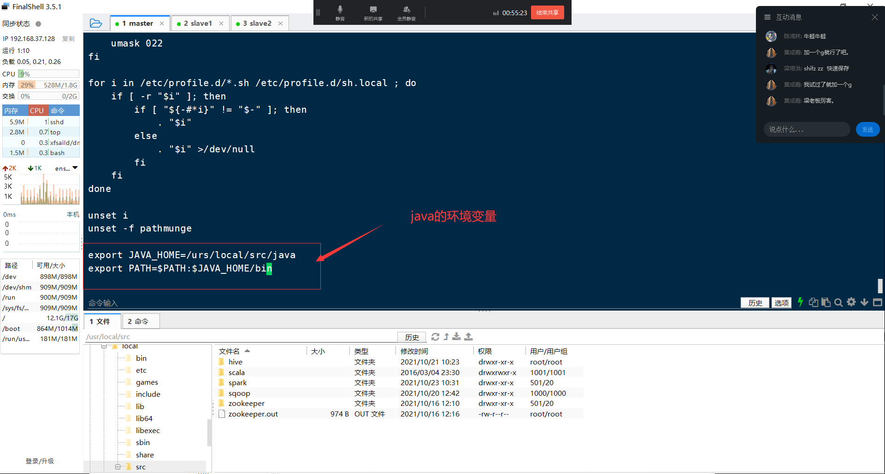

# 第2章 搭建Hadoop集群

## 2.1 FinalShell的使用

### 2.1.1 创建连接

**(1)打开finalshell，如下图所示**


**(2)创建虚拟机的连接，如下图所示**


### 2.1.2 上传我们安装包（hadoop,jdk安装包）

**在finalshell当中上传安装包，通过直接从windwos系统中拖拽到finalshell指定的目录下。**
**（指定的目录：/opt/software目录）如下图：**


## 2.2 修改主机名

### 2.2.1 查看主机名指令

```shell
linux命令上输入：
hostnamectl
```


### 2.2.2修改主机名字

```shell
输入以下命令进行主机名字修改，分别把三台虚拟机主机名更改为master、slave1、slave2
在第一台虚拟机命令行上输入：
hostnamectl set-hostname master
在第二台虚拟机命令行上输入：
hostnamectl set-hostname slave1
在第三台虚拟机命令行上输入：
hostnamectl set-hostname slave2
```


## 2.3 配置Linux host文件

在**master节点(主机点)**找到**host文件**，并进行配置，输入以下命令

```
vi /etc/hosts
```


**在配置文件中添加IP与主机名的映射，如下图**


将**master节点(主节点**)的**/etc/hosts文件**复制给**slave1**和**slave2**节点。输入以下命令

```shell
在master节点上输入以下命令：
scp /etc/hosts slave1:/etc/
scp /etc/hosts slave2:/etc/
(注意：远程复制时会提示输入密码，如下图)
```


远程**复制成功**如下图所示：


测试**各节点之间**是否能根据**主机名**相互**ping通**，如下图所示。


## 2.4 ssh免密登录

### 2.4.1 免密登录理由

**免密登录设置，可以减少不必要的操作。**因为hadoop在启动服务时，会执行ssh操作，如果不做免密登陆，会每执行一个命令就要求输入一次密码，浪费大量时间。又例如：远程复制文件，需要进行密码登录，hadoop启动需要进行密码登录等等。


### 2.4.2 免密设置步骤

1. 在**master节点(主节点)**生成公钥和私钥

```shell
在master节点的linux命令行上输入：
ssh-keygen -t rsa
```

输入命令后，会弹出咨询信息，如下图


**一直回车到结束，如下图所示：**


### 2.4.3 拷贝公钥给相应主机

将**master节点**生成的公钥拷贝给**自己(master节点)**、**slave1节点**、**slave2节点**

```shell
在master节点linux命令行上输入：
ssh-copy-id master
ssh-copy-id slave1
ssh-copy-id slave2
```

**这里需要输入一次linux登录密码，之后就可以免密登录了。**


### 2.4.4 免密登录测试

```shell
在master主机节点上输入以下指令
ssh slave1
```

如下图所示，系统并没有要求我们输入密码进行登录了，**这时免密设置成功**。


## 2.5 时间同步

需要将三台虚拟机的时间同步至一致,分别在master节点、slave1节点、slave2节点执行以下命令

```shell
linux修改时间指令格式如下：
date -s "年-月-日 时:分:秒"
例如：
date -s "2022-9-26 12:30:54"
```

**注意：时间同步的原因防止hadoop启动时，由于各虚拟机时间不一致，导致他们之间无法正常联通，不能成功启动hadoop完全分布式。**


## 2.6 安装部署java

### 2.6.1 解压java的压缩包

```shell
在master节点的命令行上输入指令：

tar -zxvf /opt/software/jdk-8u212-linux-x64.tar.gz -C /usr/local/src/
```




### 2.6.2 重命名操作

```shell
将目录名字jdk1.8.0_212，重命名为java，在master节点的命令行上输入指令：
mv /usr/local/src/jdk1.8.0_212 /usr/local/src/java
```




### 2.6.3 添加环境变量

```shell
在master节点上，编辑Linux系统的配置文件/etc/profile，在命令行输入指令：
vi /etc/profile
```

**添加java的环境变量配置，如下图所示**

```
export JAVA_HOME=/usr/local/src/java
export PATH=$PATH:$JAVA_HOME/bin
```




### 2.6.4 使环境变量生效

```shell
修改完Linux系统的配置文件/etc/profile，需要执行命令是环境变量生效，在master节点命令行上输入指令：
source /etc/profile
```


### 2.6.5 验证java是否安装成功

```shell
安装完Java，需要验证是否安装成功，在master节点命令上输入指令：
java -version
```


### 2.6.6 分发java目录

将**master节点**上的java目录，复制到**slave1节点**、**slave2节点**的**/usr/local/src**目录下

```shell
#远程复制命令如下：
scp -r /usr/local/src/java slave1:/usr/local/src/      #将java目录复制到slave1上面
scp -r /usr/local/src/java slave2:/usr/local/src/      #将java目录复制到slave2上面
```

将**master节点**上的/etc/profile文件，复制到**slave1节点**、**slave2节点**的**/etc**目录下

```shell
#远程复制命令如下：
scp  /etc/profile slave1:/etc      
scp  /etc/profile slave2:/etc      
```

分别在slave1节点、slave2节点上使环境变量生效，输入以下命令

```shell
source /etc/profile
```

## 2.7 安装Hadoop组件

### 2.7.1 解压hadoop压缩包 

- 将压缩包hadoop-2.7.1.tar.gz解压到/usr/local/src目录下

```shell
tar -zxvf /opt/sofware/hadoop-2.7.1.tar.gz -C /usr/local/src/
```


### 2.7.2 重命名操作

- 重命名操作，将hadoop-2.7.1目录更改为hadoop

```
mv /usr/local/src/hadoop-2.7.1/ /usr/local/src/hadoop
```


4. 


### 2.7.1 编辑hadoop配置文件

```shell
首先进入到hadoop配置文件目录下，在master节点命令行上输入指令：
cd /usr/local/src/hadoop/etc/hadoop/
```


#### 1.hadoop-env.sh文件

**编辑文件，在master节点命令行上输入指令：**

```shell
vi /usr/local/src/hadoop/etc/hadoop/hadoop-env.sh
```

**在文件最后一行添加java安装路径**

```shell
export JAVA_HOME=/usr/local/src/java
```


#### 2.core-site.xml文件

**编辑文件，在master节点命令行上输入指令：**

```shell
vi /usr/local/src/hadoop/etc/hadoop/core-site.xml
```


**在<configuration>标签之间加入配置信息，如下图**

```xml
<property>
    <name>fs.defaultFS</name>
    <value>hdfs://master:9000</value>
</property>

<property>
    <name>hadoop.tmp.dir</name>
    <value>file:/usr/local/src/hadoop/tmp</value>
</property>


```

**根据core-site.xml配置信息，我们需要在hadoop目录中新建一个tmp目录，输入命令**

```shell
mkdir /usr/local/src/hadoop/tmp
```

**更多参数说明见网址**

[core-site.xml](https://hadoop.apache.org/docs/stable/hadoop-project-dist/hadoop-common/core-default.xml)


#### 3.hdfs-site.xml文件

**编辑文件，在master节点命令行上输入指令：**

```
vi /usr/local/src/hadoop/etc/hadoop/hdfs-site.xml
```

**在<configuration>标签之间加入配置信息，如下图**

```xml
<property>
    <name>dfs.namenode.name.dir</name>
    <value>file:/usr/local/src/hadoop/dfs/name</value>
</property>

<property>
    <name>dfs.datanode.data.dir</name>
    <value>file:/usr/local/src/hadoop/dfs/data</value>
</property>

<property>
    <name>dfs.replication</name>   
    <value>3</value>
</property>

```

**部分参数说明更多参数说明见网址**

[hdfs-site.xml](https://hadoop.apache.org/docs/stable/hadoop-project-dist/hadoop-hdfs/hdfs-default.xml )


#### 4.mapred-site.xml

**该配置文件没有，需要通过复制操作，在master节点命令行上输入指令**

```shell
cp /usr/local/src/hadoop/etc/hadoop/mapred-site.xml.template /usr/local/src/hadoop/etc/hadoop/mapred-site.xml
```

**编辑文件，在master节点命令行上输入指令：**

```shell
vi /usr/local/src/hadoop/etc/hadoop/mapred-site.xml
```

**在<configuration>标签之间加入配置信息，如下图**

```xml
<property>
    <name>mapreduce.framework.name</name>
    <value>yarn</value>
</property>
```

​	**更多参数说明见网址**

[mapred-site.xml](https://hadoop.apache.org/docs/stable/hadoop-mapreduce-client/hadoop-mapreduce-client-core/mapred-default.xml )


#### 5.yarn-site.xml文件

**编辑文件，在master节点命令行上输入指令：**

```shell
vi /usr/local/src/hadoop/etc/hadoop/yarn-site.xml
```

​	**在<configuration>标签之间加入配置信息，如下图**

```xml
<property>
    <name>yarn.resourcemanager.hostname</name>
    <value>master</value>
</property>
<property>
    <name>yarn.nodemanager.aux-services</name>
    <value>mapreduce_shuffle</value>
</property>
```

​	**部分参数说明更多参数说明见网址**

[yarn-site.xml](https://hadoop.apache.org/docs/stable/hadoop-yarn/hadoop-yarn-common/yarn-default.xml )


#### 6. slaves文件

**编辑文件，在master节点命令行上输入指令：**

```shell
vi /usr/local/src/hadoop/etc/hadoop/slaves
```

	


**在文件中添加以下信息，如下图**

```xml
master
slave1
slave2
```


### 2.7.3 添加环境变量

（1）打开系统配置文件/etc/profile文件

```
vi /etc/profile
```


(2)在系统配置文件的最后一行添加以下配置

```shell
####hadoop的环境变量
export HADOOP_HOME=/usr/local/src/hadoop
export PATH=$PATH:$HADOOP_HOME/bin:$HADOOP_HOME/sbin
```


### 2.7.4 使环境变量生效

- 输入命令

```shell
source /etc/profile
使hadoop环境变量生效
```

### 2.7.5 验证hadoop是否安装成功

- 输入命令

```shell
hadoop version
```


4. 

### 2.7.6 分发Hadoop目录

将**master节点**上的hadoop目录，复制到**slave1节点**、**slave2节点**的**/usr/local/src**目录下

```shell
#远程复制命令如下：
scp -r /usr/local/src/hadoop slave1:/usr/local/src/      #将hadoop目录复制到slave1上面
scp -r /usr/local/src/hadoop slave2:/usr/local/src/      #将hadoop目录复制到slave2上面
```

检查**slave1**节点上/usr/local/src目录下是否有hadoop目录，如下图


检查**slave2**节点上/usr/local/src目录下是否有hadoop目录，如下图


### 2.7.7 初始化并启动hadoop

#### 2.7.7.1 格式化元数据

在**master节点**上执行以下命令

```shell
hdfs namenode -format
#状态为 0 则初始化成功
#注意，格式化成功一次之后，就不需要第二次格式化了，否则会导致hadoop启动不正确
```


#### 2.7.7.2 启动hadoop

**(1)在master节点的命令行上输入指令：**

```shell
start-all.sh
```

(2)验证hadoop是否成功启动,在**master节点、slave1节点、slave2节点**输入命令

```shell
jps
```

如下图所示，则表示Hadoop启动成功

- master节点，如下图：


- slave1节点，如下图：


- slave2节点，如下图：


### 2.7.8 通过网页检查hadoop情况

```shell
首先关闭linux系统的防火墙，在master、slave1、slave2命令行上输入指令：
systemctl stop firewalld    ##关闭防火墙
```

（1）打开浏览器输入http://172.16.106.100:50070/（**注意**：ip地址为master节点的ip）


（2）yarn网页监控界面，打开浏览器输入http://172.16.106.100:8088（**注意**：ip地址为master节点的ip）


### 2.7.9 停止hadoop

**(1)在master节点的命令行上输入指令：**

```shell
stop-all.sh
```

(2)**验证hadoop是否成功停止,输入命令**

```shell
jps
```

**如下图所示，hadoop停止成功。**


## 2.8 Hadoop集群测试

**需求：完成文本单词的统计，如下图，请统计每个单词出现的数量。**


### 2.8.1 步骤一：准备文本数据

**在/opt/software目录下创建一个测试文件word.txt。**

```shell
#进入到/opt/software目录
cd /opt/software
#通过vi创建word.txt文件
vi word.txt
```

**在文件中添加以下内容**


### 2.8.2步骤二：创建目录

在**HDFS**创建**/mytest目录**，用于存放文件**word.txt**。

```shell
#HDFS上面创建目录mytest。
#linux命令行输入以下命令
hadoop fs -mkdir /mytest
```


**（注意：hadoop上面创建目录，在linux系统上是看不到的，需要通过hadoop网页查看，如下图所示）**


### 2.8.3步骤三：**上传文件**

**将Linux系统/opt/software目录下的测试文件word.txt上传到HDFS目录mytest里面。**

```shell
#上传文件word.txt到HDFS目录mytest下
hadoop fs -put /opt/software/word.txt /mytest
```


**（注意：上传到hadoop里面的文件，可通过hadoop网页查看，如下图所示）**


### 2.8.4步骤四：**运行**MapReduce程序

**使用Hadoop官方提供的mapreduce程序包进行测试。**

1. 进入到官方测试包所在的目录下

```shell
#官方测试包目录
cd /usr/local/src/hadoop/share/hadoop/mapreduce/
```


2. 使用测试包进行单词统计的计算

```shell
#执行词频统计计算任务
 hadoop jar hadoop-mapreduce-examples-2.7.1.jar wordcount /mytest/word.txt /mytest_output
```


```shell
#说明
wordcount：hadoop-mapreduce-examples-2.7.1.jar表示jar包中需要运行的主类
/mytest/word.txt：wordcount主类需要的参数（由编写该程序的人决定），指定数据文件目录，统计里面的数据文件
/mytest_output：统计文件后的结果要保存目录（由编写该程序的人决定），必须要求该目录不存在，如存在则会报错。
执行结果如下，注意查看有没有错误，下图是没有错误的结果
```


### 2.8.5步骤五：**查看**统计结果

1. **查看计算结果，通过hadoop网页进行结果的下载查看**


2. **下载文件part-r-00000**


3. **使用文本工具打开下载的文件，结果如图所示**


4. **通过yarn网页查看mapreduce计算任务的运行情况**

```shell
#浏览器中输入yarn网页情况地址：
http://192.168.37.128:8088
#IP地址为自己的master节点上的IP
```


