# 第3章 HDFS分布式文件系统

## 3.1 HDFS 的shell操作

### 3.1.1 ls命令

ls命令用于查看指定路径的当前目录结构，类似于linux的ls命令

```shell
#语法格式如下
hadoop fs –ls [-d] [-h] [-R] <args>
参数说明：
-d:将目录显示为普通文件
-h:使用便于操作人员读取的单位信息格式
-R:递归显示所有子目录的信息
```

- **练习1：显示HDFS的根目录的列表信息**

```shell
#输入下面指令
hadoop fs -ls /
```


- **练习2：递归显示HDFS的根目录的列表信息**

```shell
#输入下面指令
hadoop fs -ls -R /
```


### 3.1.2 mkdir命令

mkdir命令用于在指定路径下创建子目录，其中创建的路径可以采用URI格式进行指定，与linux的mkdir命令相同，可以创建多级目录。

```shell
#语法格式如下
hadoop fs –mkdir [-p] <paths>
参数说明：
-p:表示创建子目录先检查路径是否存在，如果不存在，则创建相应的各级目录
```

**练习1：在hdfs上创建目录/hdfs/test/test1**

```shell
#输入下面指令
hadoop fs -mkdir /hdfs/test/test1
#结果如下图，因为本范例的hdfs目录和test目录都不存在
```


```shell
#正确命令
hadoop fs -mkdir  -p /hdfs/test/test1
```


### 3.1.3 put命令

put命令用于将本地系统的文件或文件夹复制到HDFS上

```shell
#语法格式如下
hadoop fs –put [-f] [-p] <paths>
参数说明：
-f:覆盖目标文件
-p:保留访问和修改时间、权限
```

**练习1：将本地的/opt/software/jdk-8u152-linux-x64.tar.gz传输到hadoop的mytest文件夹中**

```shell
#输入下面指令
hadoop fs -put /opt/software/jdk-8u212-linux-x64.tar.gz /mytest
```


### 3.1.4 cat命令

将路径指定文件的内容输出到控制台。

```shell
#语法格式如下
hadoop fs –cat <paths>
```

**练习1：输出hadoop的/mytest/word.txt文件内容**

```shell
#输入下面指令
 hadoop fs -cat /mytest/word.txt
```


### 3.1.5 rm命令

删除指定的文件。只删除非空目录和文件。如要递归删除请参照rmr指令（已过时）或是使用rm –r格式删除

```shell
#语法格式如下
hadoop fs –rm [-r] <paths>
参数说明：
-r:递归删除时使用，不使用该参数无法删除非空目录
```

**练习1：删除hadoop上的/mytest/jdk-8u212-linux-x64.tar.gz文件**

```shell
#输入下面指令
hadoop fs -rm  /mytest/jdk-8u212-linux-x64.tar.gz
```


**练习2：删除多个目录：删除hadoop上/mytest目录、/ mytest_output**

```shell
#输入下面指令
hadoop fs -rm -r /mytest /mytest_output
```


### 3.1.6 get命令

复制文件到本地文件系统。

```shell
#语法格式如下
hadoop fs -get [-ignorecrc] [-crc] <src> <localdst>
参数说明：
-ignorecrc:选项复制CRC校验失败的文件
-crc:选项复制文件以及CRC信息。
```

**练习1：将hadoop上的word.txt文件下载到linux的/home下**

```shell
#输入下面指令
hadoop fs -get /word.txt /home
```


```shell
#进入到/home目录下
cd /home
#查看word.txt文件是否下载成功
ls
```


### 3.1.7 cp命令

将文件从源路径复制到目标路径。这个命令允许有多个源路径，此时目标路径必须是一个目录。

```shell
#语法格式如下
hadoop fs -cp URI [URI …] <dest>
```

**练习1：将hadoop上的/word.txt复制一份到目录/hdfs/test/test1**

```shell
#输入下面指令
hadoop fs -cp /word.txt /hdfs/test/test1
```


### 3.1.8 mv命令

将文件从源路径移动到目标路径。这个命令允许有多个源路径，此时目标路径必须是一个目录。不允许在不同的文件系统间移动文件。

```shell
#语法格式如下
hadoop fs -mv URI [URI …] <dest>
```

**练习1：将hadoop上的/word.txt，重命名为/word2.txt**

```shell
#输入下面指令
 hadoop fs -mv /word.txt /word2.txt
```


## 3.2 hadoop命令练习

1. 在linux系统/home目录下创建文件test.txt，添加以下内容

```tex
hello world
hello java
hello hadoop
hello world
hello java
```

1. 在hadoop上面创建文件夹/home/test目录
2. 将linux系统/home下的文件test.txt上传到hadoop上目录/home/test中
3. 复制hadoop上目录/home/test中test.txt文件到hadoop根目录/下，并重新命名为test1.txt
4. 查看hadoop上根目录/下的test1.txt文件的前三行内容
5. 下载hadoop上目录/home/test中test.txt文件到linux系统/opt/software目录中
6. 删除hadoop上目录/home/test，上传hadoop根目录/下的test1.txt文件


## 3.3 Hadoop配置项

官方文档：https://hadoop.apache.org/docs/current/hadoop-project-dist/

民间第三方中文文档：https://hadoop.org.cn/docs/      

​		https://hadoop.apache.org/docs/r1.0.4/cn/

### 3.3.1 常用配置文件解析

Hadoop有多个配置文件，这里列举最重要的几个。

**所有配置文件都在$HADOOP_HOME/etc/hadoop目录下。**

配置目录可以被重新安置在文件系统的其他地方（$HADOOP_HOME的外面，以便于升级），只要启动守护进程时使用--config选项（或等价的，使用HADOOP_CONF_DIR环境变量集）说明这个目录在本地文件系统的位置就可以了。


| 文件名称                   | 格式          |                             描述                             |
| -------------------------- | ------------- | :----------------------------------------------------------: |
| [hadoop-env.sh]()          | Bash脚本      |             脚本中要用到的环境变量，以运行Hadoop             |
| mapred-env.sh              | Bash脚本      | 脚本中要用到的环境变量，以运行MapReduce（覆盖hadoop-env.sh中设置的变量） |
| yarn-env.sh                | Bash脚本      | 脚本中要用到的环境变量，以运行YARN（覆盖hadoop-env.sh中设置的变量） |
| [core-site.xml]()          | Hadoop配置XML | Hadoop Core的配置项，例如HDFS、MapReduce和YARN常用的I/O设置等 |
| [hdfs-site.xml]()          | Hadoop配置XML | Hadoop守护进程的配置项，包括namenode、辅助namenode和datanode等 |
| [mapred-site.xml]()        | Hadoop配置XML |        MapReduce守护进程的配置项，包括作业历史服务器         |
| [yarn-site.xml]()          | Hadoop配置XML | YARN守护进程的配置项，包括资源管理器、web应用代理服务器和节点管理器 |
| [slaves]()                 | 纯文本        |        运行datanode和节点管理器的机器列表（每行一个）        |
| hadoop-metrics2.properties | Java属性      |               控制如何在Hadoop上发布度量的属性               |
| log4j.properties           | Java属性      | 系统日志文件、namenode审计日志、任务JVM进程的任务日志的属性  |
| hadoop-policy.xml          | Hadoop配置XML |         安全模式下运行Hadoop时的访问控制列表的配置项         |


### 3.3.2 core-site.xml配置文件

官方文档：https://hadoop.apache.org/docs/current/hadoop-project-dist/hadoop-common/core-default.xml

core-site.xml文件是Hadoop的核心配置文件，它包含了Hadoop的基本设置，如Hadoop运行时的文件系统（fs.defaultFS）和Hadoop临时目录（hadoop.tmp.dir）等。

|      配置参数       |                             说明                             |
| :-----------------: | :----------------------------------------------------------: |
|   fs.default.name   |                    用于指定NameNode的地址                    |
|   hadoop.tmp.dir    |              Hadoop运行时产生文件的临时存储目录              |
| io.file.buffer.size |         缓冲区大小，实际工作中根据服务器性能动态调整         |
|  fs.trash.interval  | 开启hdfs的垃圾桶机制，删除掉的数据可以从垃圾桶中回收，单位分钟* |


自选是否要修改：

```xml
<!-- Put site-specific property overrides in this file. -->

<configuration>
    <!-- 
		用于设置Hadoop的文件系统，由URI指定
		默认协议file:///属于本地路径，由于之后要用HDFS，因此需要修改为hdfs://主机名(ip):端口（内部的一个通讯）
	-->
    <property>
        <name>fs.defaultFS</name>
        <value>hdfs://master:9000</value>
    </property>

    <!-- 配置Hadoop存储数据目录,默认/tmp/hadoop-${user.name} -->
    <property>
       <name>hadoop.tmp.dir</name>
       <value>file:/usr/local/src/hadoop/tmp</value>
    </property>

    <!--  缓冲区大小，实际工作中根据服务器性能动态调整 -->
    <property>
       <name>io.file.buffer.size</name>
       <value>131072</value>
    </property>

    <!--  开启hdfs的垃圾桶机制，删除掉的数据可以从垃圾桶中回收，单位分钟 -->
    <property>
       <name>fs.trash.interval</name>
       <value>10080</value>
    </property>
</configuration>

```

#### 练习1：开启垃圾桶回收机制，设置10080分钟后自动删除文件。并尝试删除文件查看效果

**只有本次练习会提供答案，其他的练习请同学们自己写命令**

先尝试删除文件，执行

```shell
hadoop fs -rm -r 文件名
```

查看删除效果

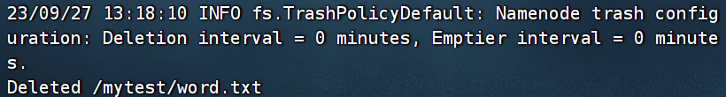


修改core-site.xml文件，增加垃圾桶回收机制

```shell
vi /usr/local/src/hadoop/etc/hadoop/core-site.xml 
```

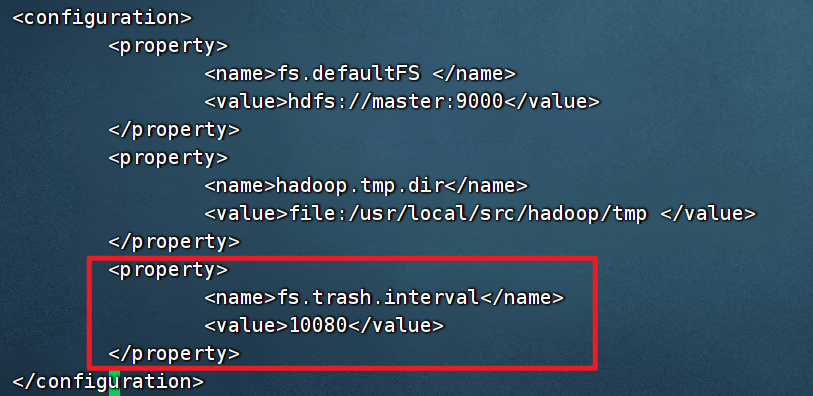


将修改好的文件分发给其他主机：

```shell
scp /usr/local/src/hadoop/etc/hadoop/core-site.xml slave1:/usr/local/src/hadoop/etc/hadoop/

scp /usr/local/src/hadoop/etc/hadoop/core-site.xml slave2:/usr/local/src/hadoop/etc/hadoop/
```

再次尝试删除文件

```shell
hadoop fs -rm -r 文件名
```


文件并没有直接删除，而是移动到了[hdfs://master:9000/user/root/.Trash/Current](hdfs://master:9000/user/root/.Trash/Current)位置下，我们可以通过命令查看被删除的文件

```shell
hadoop fs -ls /user/root/.Trash/Current/
```


### 3.3.3 hadoop-env.sh配置文件

用于定义hadoop运行环境相关的配置信息。

比如配置JAVA_HOME环境变量、为hadoop的JVM指定特定的选项、指定日志文件所在的目录路径以及master和slave文件的位置等

|      属性       |                             含义                             |
| :-------------: | :----------------------------------------------------------: |
|    JAVA_HOME    | 需要设置Hadoop系统的Java安装的位置。方法一是在hadoop-env.sh文件中设置JAVA_HOME项；方法二是在shell中设置JAVA_HOME环境变量。相比之下，方法一更好，因为只需操作一次就能够保证整个集群使用同一版本的Java |
| HADOOP_LOG_DIR  | 系统日志文件存放目录，默认在$HADOOP_HOME/logs。建议修改默认设置，使之独立于Hadoop的安装目录，这样即使Hadoop升级之后安装路径发生变化，也不会影响日志文件的位置。 |
| HADOOP_SSH_OPTS |                        设置SSH选项。                         |


#### 练习1：查看hadoop-env.sh环境变量文件，思考指定日志文件所在的目录路径以及master和slave文件的位置是在哪里定义的？


### 3.3.4 hdfs-site.xml配置文件

官方文档：https://hadoop.apache.org/docs/current/hadoop-project-dist/hadoop-hdfs/hdfs-default.xml

|            属性             |                             含义                             |
| :-------------------------: | :----------------------------------------------------------: |
|    dfs.namenode.name.dir    |       *namenode存储hdfs名字的空间的[元数据]()文件目录*       |
|    dfs.datanode.data.dir    |        datanode上的一个[数据块的物理的存储]()位置文件        |
|       dfs.replication       |             指定HDFS保存数据副本的数量，默认为3              |
|        dfs.blocksize        | 设置一个数据块(block)的大小,默认为128mb（134217728），单位为字节 |
|      dfs.http.address       | 定义namenode界面的web访问地址，默认为50070，设置方式为master:50070 |
| dfs.namenode.checkpoint.dir | 辅助NameNode存放检查点的目录列表。在所列每个目录中均存放一份检查点文件的副本。 |


#### 练习1:将副本的复制数设置为1

#### 练习2:将数据块的大小设置为256mb。 即268435456字节


### 3.3.5 mapred-site.xml配置文件

Hadoop默认只有个模板文件mapred-site.xml.template,需要使用该文件复制出来一份mapred-site.xml文件

yarn 的 web 地址 和 history 的 web 地址以及指定我们的 [mapreduce](https://so.csdn.net/so/search?q=mapreduce&spm=1001.2101.3001.7020) 运行在 yarn 集群上

|                属性                 |                             含义                             |
| :---------------------------------: | :----------------------------------------------------------: |
|      mapreduce.framework.name       |   MapReduce 程序运行在 Yarn 上，表示MapReduce使用yarn框架    |
|    mapreduce.jobhistory.address     |   设置MR历史任务的主机和端口。默认为10020，即master:10020    |
| mapreduce.jobhistory.webapp.address | 设置web访问历史任务的主机和端口。默认为19888，即master:19888 |


自选是否要修改：

```xml
<!-- Put site-specific property overrides in this file. -->

<configuration>
    	<!-- 指定 MapReduce 程序运行在 Yarn 上，表示MapReduce使用yarn框架 -->
        <property>
                <name>mapreduce.framework.name</name>
                <value>yarn</value>
        </property>
		<!-- 设置历史任务的主机和端口 -->
		<property>
			<name>mapreduce.jobhistory.address</name>
			<value>master:10020</value>
		</property>
		<!-- 设置网页访问历史任务的主机和端口 -->
		<property>
			<name>mapreduce.jobhistory.webapp.address</name>
			<value>master:19888</value>
		</property>
</configuration>
```


#### 练习1：修改mapred-site.xml设置历史任务服务器端口，在web端查看历史人物

修改过程略

**开启历史服务器命令（在master上执行）**

```shell
mr-jobhistory-daemon.sh start historyserver
```

 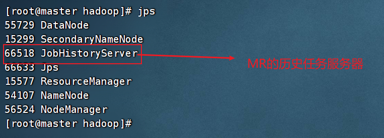

在web端通过19888端口查看历史任务


### 3.3.6 yarn-site.xml配置文件

```xml
<property>
    <name>yarn.resourcemanager.hostname</name>
    <value>master</value>
</property>
<property>
    <name>yarn.nodemanager.aux-services</name>
    <value>mapreduce_shuffle</value>
</property>
```


## 3.4 Hadoop故障排错

我们的集群可能会存在节点启动失败或者运行失败的情况，我们就需要通过Log文件来进行故障排错。

首先，我们来看一下健康的集群应该满足的节点：

- master节点，如下图：


- slave1节点，如下图：


- slave2节点，如下图：


假设我们的集群现在的master、slave1、slave2的DataNode无法启动，我们需要查看日志文件

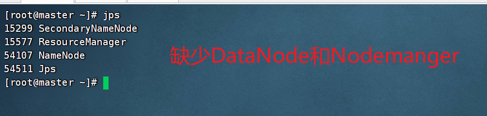


### 3.4.1 查看日志文件

进入默认的日志文件路径：

```shell
cd /usr/local/src/hadoop/logs/
```

 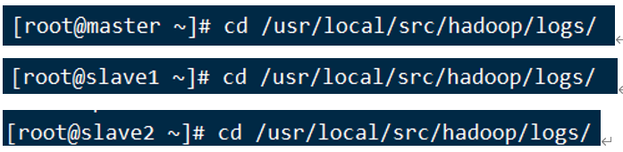


找到出错的节点的日志文件，比如我们现在的master、slave1、slave2的DataNode无法启动，我们就来查看对应的日志文件

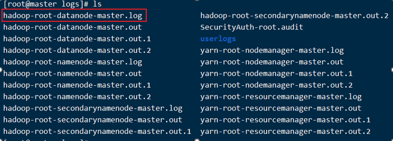

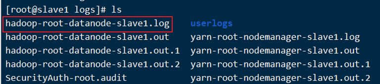

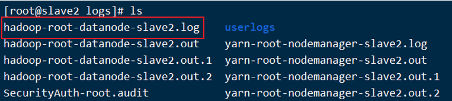


以slave1的为例，查看对应的日志文件

```shell
vi /usr/local/src/hadoop/logs/hadoop-root-datanode-slave1.log
```

大写G跳到文件最后一行，找到错误原因

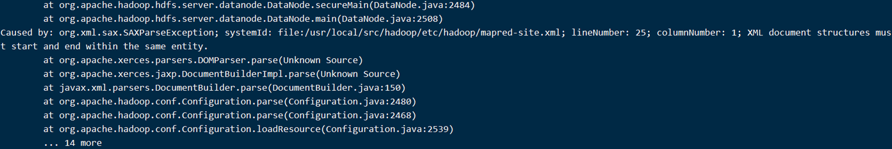

**[ps：遇到不知道报错原因的情况下，找到Error，Fatal，Exception等单词，把对应的句子复制到百度寻找答案]()**


这里提供最基本的查找方法

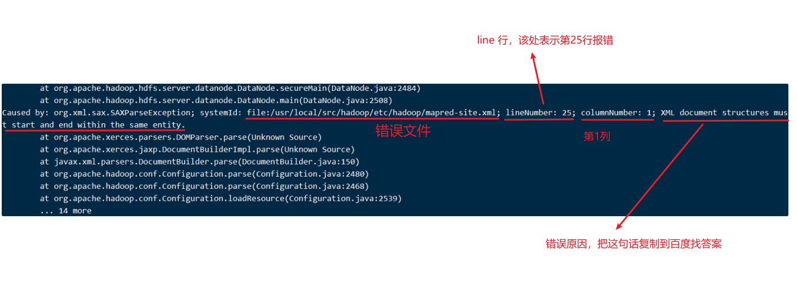

问题是mapred-site.xml文件的第25行，第1列有问题，不符合xml格式


### 3.4.2 解决问题

修改错误文件，注意三台都需要进行检查

注意：检查三台机子的文件是否都出错了

 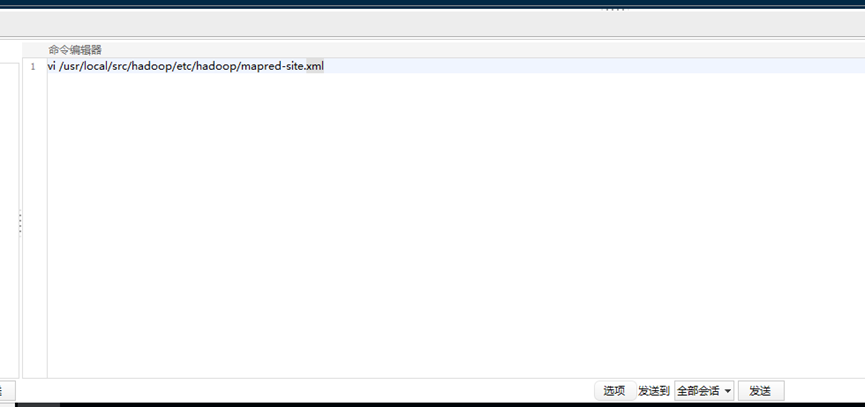

找到错误并修改错误


错误文件

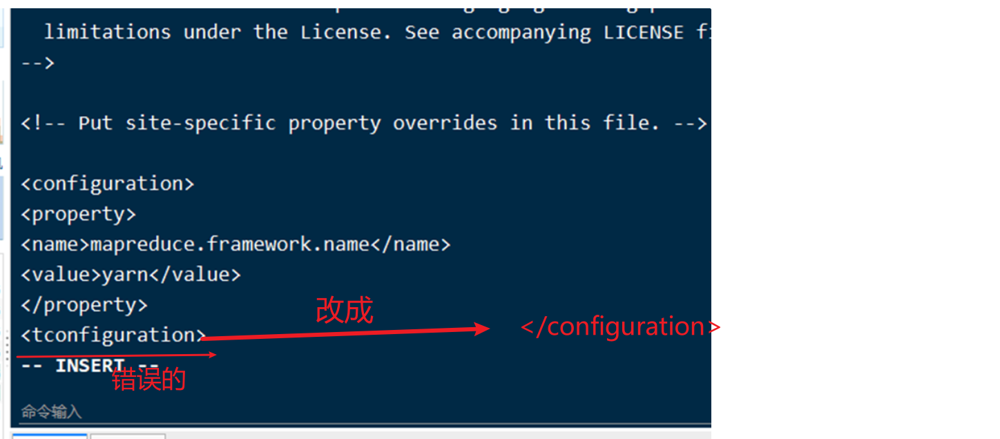


### 3.4.3 重新初始化

**[注意：这个方法是下策，真正的处理方法是重启后修改每个集群的cluster-id]()**


**① 关闭服务（在master上执行命令）**

```shell
stop-all.sh
```


**② 删除三台机子的数据和元数据**

```shell
rm -rf /usr/local/src/hadoop/dfs
```


**③ 重新初始化 (在master上执行)**

```shell
hdfs namenode -format
```

 

 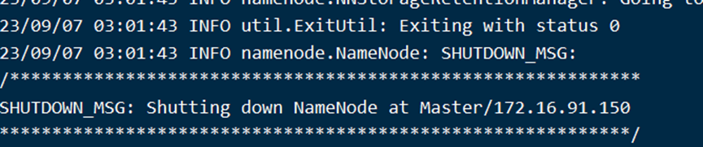


**④ 启动服务 (在master上执行)**

```shell
start-all.sh
```


## 3.5 Hadoop更多运维命令

hadoop的系统命令都是存放[/usr/local/src/hadoop/sbin](/usr/local/src/hadoop/sbin)目录下的，我们用的[start-all.sh]()以及[stop-all.sh]()也是放在该目录下

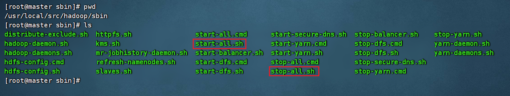


除了开启所有服务和关闭所有服务的命令以外，我们还有很多更加特定的运维命令


### 3.5.1 开启/关闭dfs服务

|     命令     |                 功能                 |
| :----------: | :----------------------------------: |
| start-dfs.sh | 启动namenode，datanode，启动文件系统 |
| stop-dfs.sh  |             关闭文件系统             |

#### 练习1：关闭所有dfs服务

#### 练习2：开启所有dfs服务


### 3.5.2 开启/关闭yarn服务

|     命令      |                 功能                 |
| :-----------: | :----------------------------------: |
| start-yarn.sh | 启动namenode，datanode，启动文件系统 |
| stop-yarn.sh  |             关闭文件系统             |

#### 练习1：关闭所有yarn服务

#### 练习2：开启所有yarn服务


### 3.5.3 单独启动NameNode或DataNode

#### ① hadoop-daemon.sh

**[启动/关闭单节点的Namenode或DataNode]()**

```shell
hadoop-daemon.sh start 或 stop  namenode（datanode）
```

 

```shell
[root@master ~] hadoop-daemon.sh start namenode  # 启动master上的namenode

[root@slave1 ~] hadoop-daemon.sh stop datanode  # 启动slave1上的datanode
```


#### ② hadoop-daemons.sh

**[启动/关闭所有节点的Namenode或DataNode]()**

```shell
hadoop-daemons.sh start 或 stop  namenode（datanode）
```


只需要在master上执行

```shell
hadoop-daemons.sh start datanode  # 启动所有节点上的namenode
```


#### 练习1：关闭master的namenode

#### 练习2：开启master的namenode

#### 练习3：关闭slave2的datanode

#### 练习4：启动所有节点的datanode


### 3.5.4 hdfs系统检查工具fsck

|          命令           |              功能               |
| :---------------------: | :-----------------------------: |
|     hdfs fsck -move     |    移动受损文件到/lost+found    |
|    hdfs fsck -delete    |         删除受损文件。          |
| hdfs fsck -openforwrite |      打印出写打开的文件。       |
|    hdfs fsck -files     |     打印出正被检查的文件。      |
|    hdfs fsck -blocks    |       打印出块信息报告。        |
|  hdfs fsck -locations   |    打印出每个块的位置信息。     |
|    hdfs fsck -racks     | 打印出data-node的网络拓扑结构。 |


#### 练习1：打印文件的文件信息，块信息，块位置

先将word.txt文件上传hdfs系统上的/mytest/目录

输入命令

```shell
hdfs fsck /mytest/word.txt -files -blocks -locations
```


## 3.6 Hadoop集群扩容

现根据业务需要，需要在原有的3台完全分布式的节点增设一台新的服务器节点，本章节就介绍了在原有的完全分布hadoop中增设新节点的部署。

### 3.6.1 前置工作

准备工作：空闲服务器（虚拟机）一台，并将jkd8在该服务器安装完毕(环境变量的添加等工作)，并将该服务器的的ip映射配置完毕
环境要求： hadoop2.7.3版本环境安装包 。


### 3.6.2 修改主机名

```
[root@localhost ~]# hostnamectl set-hostname slave3
```


### 3.6.3 修改hosts文件及免密登录

#### 1.将新加节点信息补充至多台服务器的/etc/hosts中（包含新增节点自己这台服务器）

```
[root@master ~]# vi /etc/hosts
```

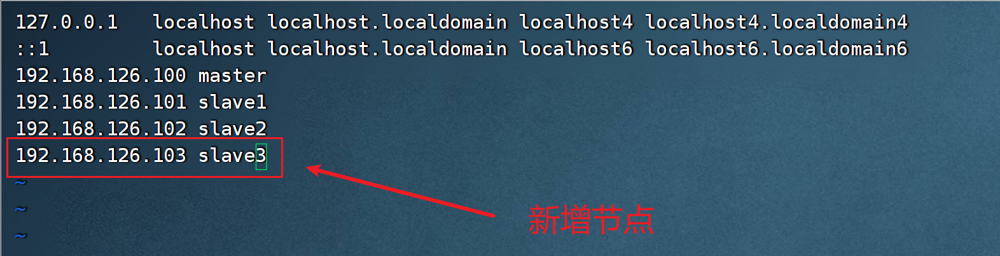


#### 2.对slave3进行免密登录

```
[root@master ~]# ssh-copy-id slave3
```

将新的ssh密钥发送给slave1，slave2，slave3

```
[root@master ~]# scp -r  ~/.ssh slave1:~/
[root@master ~]# scp -r  ~/.ssh slave2:~/
[root@master ~]# scp -r  ~/.ssh slave3:~/
```


### 3.6.4 同步文件到slave3

发送java和hadoop到slave3

```
[root@master ~]# scp -r /usr/local/src/* slave3:/usr/local/src/
```

发送环境变量文件到slave3

```
[root@master ~]# scp /etc/profile slave3:/etc/
```

在slave3上让环境变量生效

```
[root@slave3 ~]# source /etc/profile
[root@slave3 ~]# hadoop version
```


### 3.6.5 修改四台主机的slaves文件

```
vi $HADOOP_HOME/etc/hadoop/slaves
```

 


### 3.6.6 热增加节点

在多台服务器都在运行的环境中[热增加节点]()，可以不用关闭集群重新启动

直接在slave3上启动datanode，nodemanager

```
[root@slave3 ~]# hadoop-daemon.sh start datanode
```


### 3.6.7 启动数据同步命令（重点）

```
[root@slave3 ~]# start-balancer.sh 
```

执行这行命令以后，如果其余三台服务器上都有大量的冗余数据，会导致同时回写新增节点hadoop132,这时有可能会造成资源竞争问题，导致新节点阻塞而不能正常提供服务。

提示：可以通过设置回写带宽来调整回写速度，这样在既保证了提供服务的情况下，还可以一边回写数据。


启动nodemanager

```
[root@slave3 ~]# yarn-daemon.sh start nodemanager
```


## 3.7 HDFS的Java Api操作


### 3.7.1 开发环境搭建

#### 1.安装maven3.6.0

(1)将maven3.6.0程序包放在D盘maven目录下

说明：路径自定义，本例放在D:\maven\apache-maven-3.6.0

 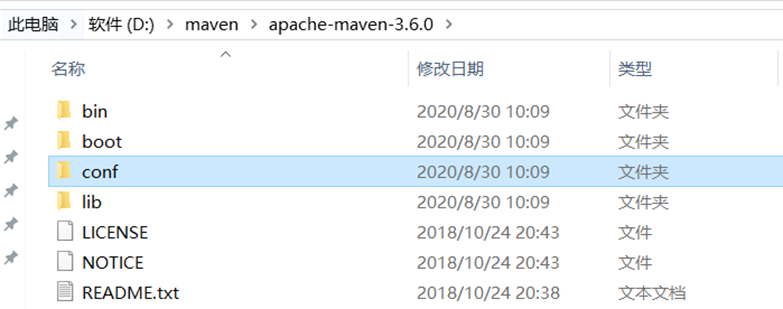

(2)编辑D:\maven\apache-maven-3.6.0\conf\ settings.xml文件

①配置本地仓库的路径（保存所有下载过的jar文件）

[特别提示：该仓库可以放在移动磁盘，每次到学校机房都可以编辑该配置文件映射到移动磁盘，这样不用每次都重新在网上下载。]()

```xml
<localRepository>E:/maven/repository</localRepository>
```

说明：E:/maven/repository表示本地仓库的地址，这个目录可以根据本机电脑情况修改，配置图如下。

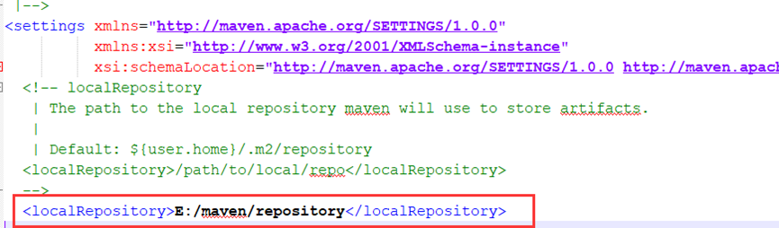

②配置代理

提示：如果不配置代理，默认是从国外下载，这样速度很慢，可以改动从国内下载。

在<mirrors> </mirrors>标签里面加入如下代码

```xml
<!--阿里云仓库-->
<mirror>
	<id>alimaven</id>
	<name>aliyun maven</name>
	<url>http://maven.aliyun.com/nexus/content/groups/public/</url>
	<mirrorOf>central</mirrorOf>
</mirror>

 <!-- <mirror>
	<id>nexus-aliyun</id>
	<mirrorOf>central</mirrorOf>
	<name>Nexus aliyun</name>
	<url>https://maven.aliyun.com/repository/public</url>
</mirror> -->

<mirror>
	<id>uk</id>
	<mirrorOf>central</mirrorOf>
	<name>Human Readable Name for this Mirror.</name>
	<url>http://uk.maven.org/maven2/</url>
</mirror>

<mirror>
	<id>CN</id>
	<name>OSChina Central</name>
	<url>http://maven.oschina.net/content/groups/public/</url>
	<mirrorOf>central</mirrorOf>
</mirror>

<mirror>
	<id>nexus</id>
	<name>internal nexus repository</name>
	<!-- <url>http://192.168.1.100:8081/nexus/content/groups/public/</url>-->
	<url>http://repo.maven.apache.org/maven2</url>
	<mirrorOf>central</mirrorOf>
</mirror>
```

(3)在windows配置环境变量

①选择电脑属性，然后在“高级”选项卡点击“环境变量”按钮

 

②在系统变量添加MAVEN_HOME变量，指向maven的安装路径

如下图

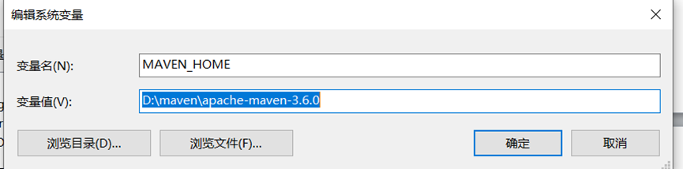

③在系统变量path中添加%MAVEN_HOME%\bin，使maven命令能在本机任意地方使用。

如下图

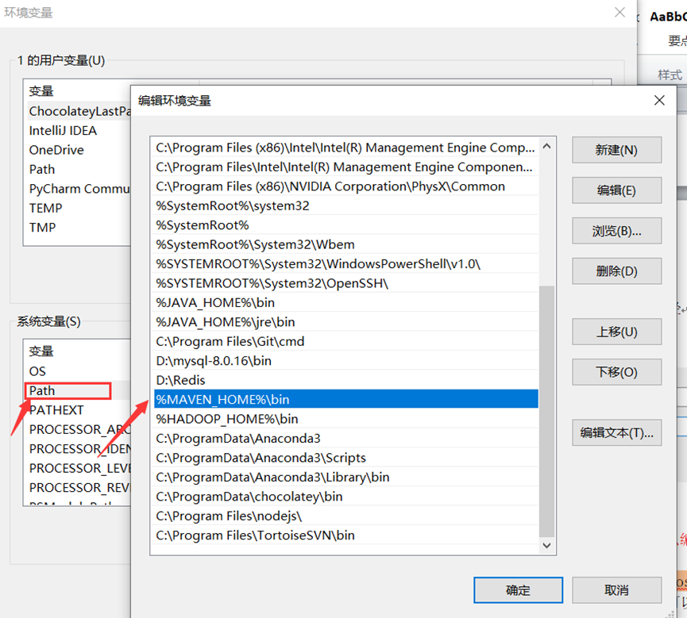

③在系统变量path中添加%MAVEN_HOME%\bin，使maven命令能在本机任意地方使用。

如下图


(4)检查maven是否配置成功

在命令窗口中，输入下述命令，查看maven版本号

```bash
mvn –version
```

如果能够显示版本号，基本上配置成功

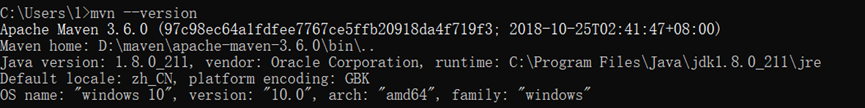


### 3.7.2 在Idea中配置本地maven

(1)选择Configure->setting菜单

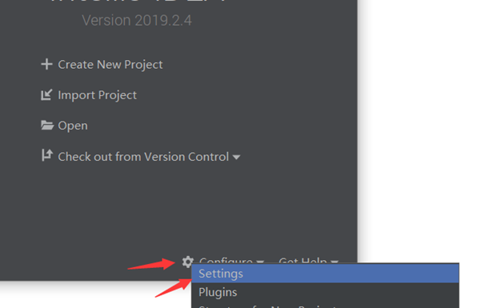

(2)在settings对话框中设置maven配置

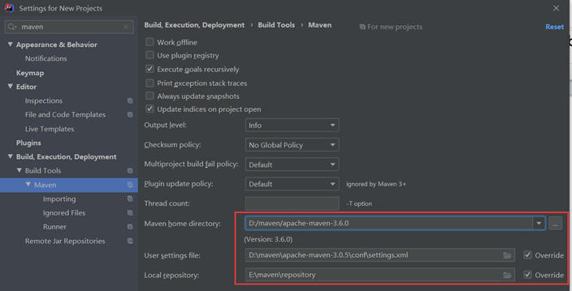


### 3.7.3 本地hadoop运行环境准备

在web项目和大数据项目中，我们写的程序都应该打成JAR包上传的服务器中，但是我们一开始学习想要看到效果，可以先选择本地运行hadoop程序。

想要本地运行hadoop程序，需要把本地准备hadoop环境。

（1）找到资料包路径下的Windows依赖文件夹，拷贝hadoop-2.7.1到非中文路径（比如d:\）。


（2）配置HADOOP_HOME环境变量

**[注意：我们上课用的版本是hadoop-2.7.1，不要照着图片上的设置]()**


（3）配置Path环境变量。

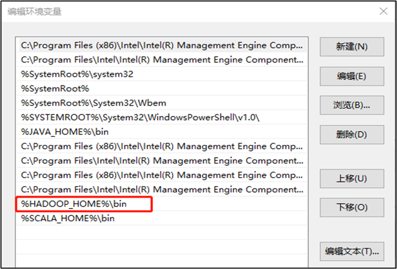


**注意：如果环境变量不起作用，可以重启电脑试试。**


### 3.7.4 在Idea中创建HDFS操作的工程

#### 1.在idea中创建maven工程

**①选择New Project，然后在左侧菜单选择“maven”**

 


如果要创建web工程，则选择下面的“[maven archetype-webapp]()”

 


**②输入组织名称和项目名称**

 

说明：

- GroupId：组织名，表示项目是哪个组织的，一般用com.***表示。
- ArtifactId：项目名称。
- Version：版本号，一般不改变


③输入项目所在路径


说明：一般修改Project location即可。

Project location：项目在本地保存的路径，建议修改，放到自己常用的项目开发目录中，使用英文路径


**④创建成功后，在右下角对话框中根据自己喜好选择导入配置**

 

说明：

- Import Changes：手动导入包，以后每次配置变动都会再次出现该对话框。
- Enable Auto-Import：自动导入，以后配置变动也不会再出现改对话框


#### 2.在工程项目pom.xml中加入hadoop的maven地址

 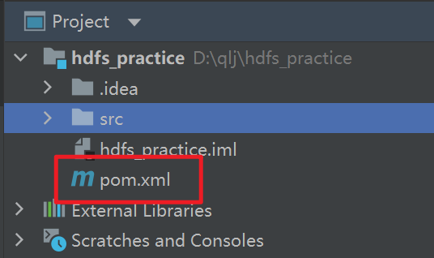

在pom文件中增加依赖

代码如下：

```xml
<properties>
<hadoop.version>2.7.1</hadoop.version>
</properties>
```

```xml
<dependencies>
<dependency>
    <groupId>org.apache.hadoop</groupId>
    <artifactId>hadoop-client</artifactId>
    <version>${hadoop.version}</version>
</dependency>
<dependency>
    <groupId>org.apache.hadoop</groupId>
    <artifactId>hadoop-common</artifactId>
    <version>${hadoop.version}</version>
</dependency>
<dependency>
    <groupId>org.apache.hadoop</groupId>
    <artifactId>hadoop-hdfs</artifactId>
    <version>${hadoop.version}</version>
</dependency>
<dependency>
    <groupId>junit</groupId>
    <artifactId>junit</artifactId>
    <version>4.11</version>
    <scope>test</scope>
</dependency>

</dependencies>
```

添加效果如下图：


#### 3.测试能否运行hdfs命令

**①在项目test->java的测试目录新建包: com.lcvc.hdfs_practice**

 

**②在com.lcvc.hdfs_pratice包下创建测试类**

代码如下：

```java
import org.apache.hadoop.conf.Configuration;
import org.apache.hadoop.fs.FileSystem;
import org.apache.hadoop.fs.Path;
import org.junit.Test;

public class HdfsTest1 {

    //在hdfs上创建空目录，测试是否连接成功
    @Test
    public void initTest() throws Exception {
        //构造一个配置参数对象，设置一个参数：要访问的HDFS的URI
        Configuration configuration = new Configuration();
        //指定要访问的HDFS地址（本例指向伪分布模式的虚拟机）
        configuration.set("fs.defaultFS","hdfs://master:9000");
        //设置身份信息，用于访问linux。否则会默认以windows的管理员访问，导致没有权限操作
        System.setProperty("HADOOP_USER_NAME","root");
        //获取文件系统的客户端对象
        FileSystem fileSystem = FileSystem.get(configuration);
        //执行文件操作，在hafs上创建一个目录测试
        fileSystem.mkdirs(new Path("/idea_test1"));
        fileSystem.close();//关闭文件系统
    }
}
```


**④在initTest上点击鼠标右键，选择“Run ‘initTest’”执行**

 


此时打开网站可以看到目录已经成功创建

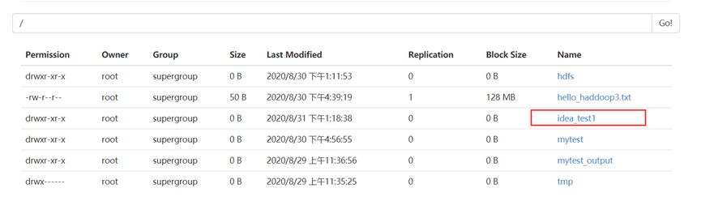


#### 4.常见失败原因

**①找不到对应的主机**

说明：例如下图提示的，master2并不存在

 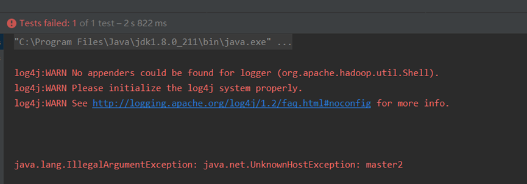


解决办法：首先检查linux中有没有做该主机名的映射，并且关闭linux防火墙；其次，在windows的hosts文件中，有没有做IP地址和主机的映射，如下图

 


**②没有操作权限**

说明：如下图所示，提示账户1（windows账户）没有操作权限。

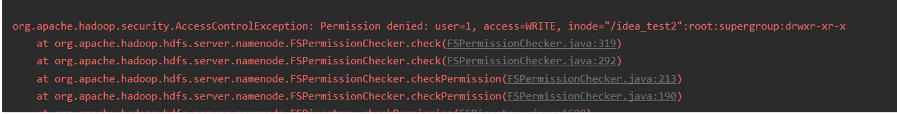


解决办法：首先要在linux中设定一个拥有hdfs操作权限的账户，如root；其次，在java代码中要加上下述代码：

```java
System.setProperty("HADOOP_USER_NAME","root");
```

以有hdfs操作权限的账户（如root）去执行代码中的请求。


### 3.7.5 HDFS的Java Api

#### 1.FileSystem类常用Api

**①public boolean mkdirs(Path f) throws IOException**

​	一次性新建所有目录（包括父目录）， f是完整的目录路径。

相当于[hadoop fs -mkdir]()


**②public FSOutputStream create(Path f) throws IOException**

​	创建指定path对象的一个文件，返回一个用于写入数据的输出流

​	create()有多个重载版本，允许我们指定是否强制覆盖已有的文件、文件备份数量、写入文件缓冲区大小、文件块大小以及文件权限。


**③public boolean copyFromLocal(Path src, Path dst) throws IOException**

​	将本地文件拷贝到文件系统


**④public boolean exists(Path f) throws IOException**

​	检查文件或目录是否存在


**⑤public boolean delete(Path f, Boolean recursive)**

​	永久性删除指定的文件或目录，如果f是一个空目录或者文件，那么recursive的值就会被忽略。只有recursive＝true时，一个非空目录及其内容才会被删除。

​	注意：public boolean delete(Path f)函数可以直接删除非空目录，但是该函数已经被官方文档建议取消，建议不用该方法。

相当于[hadoop fs -rm]()


**⑥public boolean rename(Path src1, Path src2) throws IOException**

​	将文件src1移动到src2，或者重命名文件

相当于[hadoop fs -mv]()


#### 案例准备工作

在[com.lcvc.hdfs_practice]()包中创建[TestHdfsControl]()类

 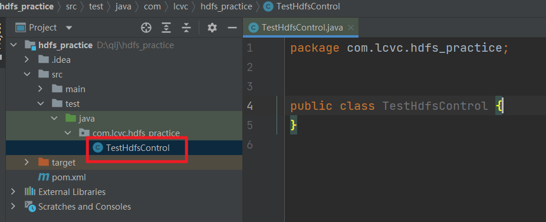

接下来我们的测试方法都写在该类中


#### 2.案例一：判断hdfs上的文件是否存在

```java
//在hdfs上创建空目录，测试是否连接成功。
@Test
public void testExists() throws Exception {
    //构造一个配置参数对象，设置一个参数：要访问的HDFS的URI
    Configuration configuration = new Configuration();
    //指定要访问的HDFS地址（本例指向伪分布模式的虚拟机）
    configuration.set("fs.defaultFS","hdfs://master:9000");
    //设置身份信息，用于访问linux。否则ew会默认以windows的管理员访问，导致没有权限操作
    System.setProperty("HADOOP_USER_NAME","root");
    //获取文件系统的客户端对象
    FileSystem fileSystem = FileSystem.get(configuration);
    //判断hdfs上的目录是否存在
    boolean result=fileSystem.exists(new Path("/mytest"));
    System.out.println(result);
    fileSystem.close();//关闭文件系统
}
```


#### 3.案例二：在hdfs上创建目录

```java
//在hdfs上创建空目录，相当于hadoop fs -mkdir指令
@Test
public void testMkdirs() throws Exception {
    //构造一个配置参数对象，设置一个参数：要访问的HDFS的URI
    Configuration configuration = new Configuration();
    //指定要访问的HDFS地址（本例指向伪分布模式的虚拟机）
    configuration.set("fs.defaultFS","hdfs://master:9000");
    //设置身份信息，用于访问linux。否则ew会默认以windows的管理员访问，导致没有权限操作
    System.setProperty("HADOOP_USER_NAME","root");
    //获取文件系统的客户端对象
    FileSystem fileSystem = FileSystem.get(configuration);
    //判断hdfs上的目录是否存在
    boolean result=fileSystem.mkdirs(new Path("/mytest"));
    System.out.println(result);
    fileSystem.close();//关闭文件系统
}
```


#### 4.案例三：删除hdfs上的文件

```java
//删除文件，相当于hadoop fs -rm指令
@Test
public void testDelete() throws Exception {
    //构造一个配置参数对象，设置一个参数：要访问的HDFS的URI
    Configuration configuration = new Configuration();
    //指定要访问的HDFS地址（本例指向伪分布模式的虚拟机）
    configuration.set("fs.defaultFS","hdfs://master:9000");
    //设置身份信息，用于访问linux。否则会默认以windows的管理员访问，导致没有权限操作
    System.setProperty("HADOOP_USER_NAME","root");
    //获取文件系统的客户端对象
    FileSystem fileSystem = FileSystem.get(configuration);
    System.out.println(fileSystem.delete(new Path("/windows"),true));//true表示如果是非空目录也删除；如果是false则不删除
}
```


#### 5.案例四：剪切或重命名hdfs上的文件

```java
//重命名或剪切文件，相当于hdfs fs -mv指令
@Test
public void testRename() throws Exception {
    //构造一个配置参数对象，设置一个参数：要访问的HDFS的URI
    Configuration configuration = new Configuration();
    //指定要访问的HDFS地址（本例指向伪分布模式的虚拟机）
    configuration.set("fs.defaultFS","hdfs://master:9000");
    //设置身份信息，用于访问linux。否则会默认以windows的管理员访问，导致没有权限操作
    System.setProperty("HADOOP_USER_NAME","root");
    //获取文件系统的客户端对象
    FileSystem fileSystem = FileSystem.get(configuration);
    //true表示如果重命名成功，false表示重命名失败
    System.out.println(fileSystem.rename(new Path("/mytest1"),new Path("/mytest2")));
    //将mytest文件夹剪切粘贴到windows文件夹下。要求windows目录必须存在,并且剪切后mytest下的所有文件也将跟着移动过去，类似windows的文件夹千切。
    System.out.println(fileSystem.rename(new Path("/mytest"),new Path("/windows/")));
    //将mytest2文件夹剪切粘贴到windows文件夹下并重命名为mytest1。要求windows目录必须存在
    System.out.println(fileSystem.rename(new Path("/mytest2"),new Path("/windows/mytest1")));
}
```


#### 6.案例五：查看hdfs上的文件内容（一般指文本）

```java
//查看文件内容，，相当于hadoop fs -cat指令
@Test
public void testView() throws Exception{
    //构造一个配置参数对象，设置一个参数：要访问的HDFS的URI
    Configuration configuration = new Configuration();
    //指定要访问的HDFS地址（本例指向伪分布模式的虚拟机）
    configuration.set("fs.defaultFS","hdfs://master:9000");
    //设置身份信息，用于访问linux。否则会默认以windows的管理员访问，导致没有权限操作
    System.setProperty("HADOOP_USER_NAME","root");
    //获取文件系统的客户端对象
    FileSystem fileSystem = FileSystem.get(configuration);
    Path path = new Path("/mytest/hello1.txt");//获取文件路径
    FSDataInputStream fsDataInputStream = fileSystem.open(path);
    int c;
    while((c = fsDataInputStream.read()) != -1){//如果文件流没有到末尾
        System.out.print((char)c);
    }
    fsDataInputStream.close();
}
```


#### 7.案例六：上传本地文件到hdfs上

```java
//上传本地文件到hdfs上，相当于hadoop fs -put指令
@Test
public void testPut() throws Exception {
    //构造一个配置参数对象，设置一个参数：要访问的HDFS的URI
    Configuration configuration = new Configuration();
    //指定要访问的HDFS地址（本例指向伪分布模式的虚拟机）
    configuration.set("fs.defaultFS","hdfs://master:9000");
    //设置身份信息，用于访问linux。否则会默认以windows的管理员访问，导致没有权限操作
    System.setProperty("HADOOP_USER_NAME","root");
    //获取文件系统的客户端对象
    FileSystem fileSystem = FileSystem.get(configuration);
    fileSystem.mkdirs(new Path("/mytest"));//创建/mytest目录
    //执行文件操作:将本地文件d:/hello_windows.txt上传到hdfs的/mytest目录里
    fileSystem.copyFromLocalFile(new Path("d:/hello_windows.txt"),new Path("/mytest"));
    //执行文件操作:将本地文件d:/hello_windows.txt上传到hdfs的/mytest目录里,并重命名为hello1.txt
    fileSystem.copyFromLocalFile(new Path("d:/hello_windows.txt"),new Path("/mytest/hello1.txt"));
    //关闭文件系统
    fileSystem.close();
}
```


#### 8.案例七：从hdfs上下载文件到本地

```java
//下载文件到本地，相当于hadoop fs -get指令，两种方法
@Test
public void testDownload() throws Exception{
    //构造一个配置参数对象，设置一个参数：要访问的HDFS的URI
    Configuration configuration = new Configuration();
    //指定要访问的HDFS地址（本例指向伪分布模式的虚拟机）
    configuration.set("fs.defaultFS","hdfs://master:9000");
    //获取文件系统的客户端对象
    FileSystem fileSystem = FileSystem.get(configuration);
    //设置身份信息，用于访问linux。否则会默认以windows的管理员访问，导致没有权限操作
    System.setProperty("HADOOP_USER_NAME","root");
    /**
     * 拷贝方法1：直接用自带的API文档，只能下载到本地，如果没特殊要求优先使用
     */
    fileSystem.copyToLocalFile(new Path("/mytest/hello1.txt"),new Path("E:///hello2.txt"));
    /**
     * 拷贝方法2：使用流文件拷贝,自由度更高
     */
    InputStream in = fileSystem.open(new Path("/mytest/hello1.txt"));//选择hadoop平台上要上传的文件，并返回InputStream流
    OutputStream out = new FileOutputStream("E://下载/hello.txt");//下载到本地的路径（必须填写文件名，类似浏览器中下载的选择）
    //拷贝文件
    IOUtils.copyBytes(in, out, 4096, true);//4096表示用来拷贝的buffer大小（buffer是缓冲区）--缓冲区大小; true - 是否关闭数据流，如果是false，就在finally里关掉
}
```


#### 9.案例八：在hdfs平台上执行复制文件（略难）

```java
/**
 *  文件复制，相当于hadoop fs -cp指令
 * org.apache.hadoop.fs.FileUtil文档：http://hadoop.apache.org/docs/stable/api/org/apache/hadoop/fs/FileUtil.html
 */
@Test
public void testCopy() throws Exception{
    //构造一个配置参数对象，设置一个参数：要访问的HDFS的URI
    Configuration configuration = new Configuration();
    //指定要访问的HDFS地址（本例指向伪分布模式的虚拟机）
    configuration.set("fs.defaultFS","hdfs://master:9000");
    //设置身份信息，用于访问linux。否则ew会默认以windows的管理员访问，导致没有权限操作
    System.setProperty("HADOOP_USER_NAME","root");
    //获取文件系统的客户端对象
    FileSystem fileSystem = FileSystem.get(configuration);
    //fileSystem.get(new URI("hdfs://master"),configuration,"root");
    //拷贝文件
    //参数2：要拷贝的文件源；参数4：要拷贝到的路径；第五个参数：拷贝结束后是否删除源文件，false表示不删除
    FileUtil.copy(fileSystem,new Path("/mytest/hello1.txt"),fileSystem,new Path("/mytest/hello2.txt"),false,configuration);
}
```


#### 10.案例九：在hdfs平台上显示目录下的所有文件（不包含目录）

```java
/**
 * 显示指定路径下的所有文件（不包括文件夹），类似于hadoop fs -ls命令，但有区别，因为不显示目录
 */
@Test
public void testListFiles() throws Exception{
    //构造一个配置参数对象，设置一个参数：要访问的HDFS的URI
    Configuration configuration = new Configuration();
    //指定要访问的HDFS地址（本例指向伪分布模式的虚拟机）
    configuration.set("fs.defaultFS","hdfs://master:9000");
    //设置身份信息，用于访问linux。否则会默认以windows的管理员访问，导致没有权限操作
    System.setProperty("HADOOP_USER_NAME","root");
    //获取文件系统的客户端对象
    FileSystem fileSystem = FileSystem.get(configuration);
    //获取指定目录下的所有文件。第一个参数表示要遍历的路径，第二个参数true表示递归查询所有文件
    RemoteIterator<LocatedFileStatus> listFiles = fileSystem.listFiles(new Path("/mytest"), true);
    while (listFiles.hasNext()) {//如果数组还有下一个文件（含目录）
        LocatedFileStatus fileStatus = listFiles.next();
        System.out.print(fileStatus.getPath() + "\t");//获取该文件的路径，如hdfs://master:9000/mytest/hello1.txt
        System.out.print(fileStatus.getPath().getName() + "\t");//获取文件名字
        System.out.print(fileStatus.getBlockSize() + "\t");//文件块的大小
        System.out.print(fileStatus.getPermission() + "\t");///文件权限信息
        System.out.print(fileStatus.getReplication() + "\t");//Replication，副本数,通过java api默认上传的是3份，可以通过这里。
        System.out.println(fileStatus.getLen());//文件大小，实际大小
    }
}
```


#### 11.案例十：在hdfs平台上显示目录下的所有文件（非递归，不包含子目录里的文件）

```java
/**
 * 显示指定路径下的所有文件（非递归），同hadoop fs -ls命令
 */
@Test
public void testListStatus() throws Exception{
    //构造一个配置参数对象，设置一个参数：要访问的HDFS的URI
    Configuration configuration = new Configuration();
    //指定要访问的HDFS地址（本例指向伪分布模式的虚拟机）
    configuration.set("fs.defaultFS","hdfs://master:9000");
    //设置身份信息，用于访问linux。否则会默认以windows的管理员访问，导致没有权限操作
    System.setProperty("HADOOP_USER_NAME","root");
    //获取文件系统的客户端对象
    FileSystem fileSystem = FileSystem.get(configuration);
    //获取指定目录下的所有文件。第一个参数表示要遍历的路径，第二个参数true表示递归查询所有文件
    FileStatus[] fileStatuses = fileSystem.listStatus(new Path("/mytest"));
    for(FileStatus fileStatus:fileStatuses){//遍历所有文件
        System.out.print(fileStatus.getPath() + "\t");//获取该文件的路径，如hdfs://master:9000/mytest/hello1.txt
        System.out.print(fileStatus.getPath().getName() + "\t");//获取文件名字
        System.out.print(fileStatus.getBlockSize() + "\t");//文件块的大小
        System.out.print(fileStatus.getPermission() + "\t");///文件权限信息
        System.out.print(fileStatus.getReplication() + "\t");//Replication，副本数,通过java api默认上传的是3份，可以通过这里。
        System.out.println(fileStatus.getLen());//文件大小，实际大小
    }
}
```


#### 12.案例十一：在hdfs平台上显示目录下的所有文件（递归，包含子目录里的文件）

```java
/**
 * 显示指定路径下的所有文件（递归），同hadoop fs -ls -R命令
 */
private void listStatus2Recursive(String path) throws Exception{
    //构造一个配置参数对象，设置一个参数：要访问的HDFS的URI
    Configuration configuration = new Configuration();
    //指定要访问的HDFS地址（本例指向伪分布模式的虚拟机）
    configuration.set("fs.defaultFS","hdfs://master:9000");
    //设置身份信息，用于访问linux。否则会默认以windows的管理员访问，导致没有权限操作
    System.setProperty("HADOOP_USER_NAME","root");
    //获取文件系统的客户端对象
    FileSystem fileSystem = FileSystem.get(configuration);
    //获取指定目录下的所有文件和目录
    FileStatus[] fileStatuses = fileSystem.listStatus(new Path(path));
    for(FileStatus fileStatus:fileStatuses){//遍历所有文件
        if(fileStatus.isDirectory()){//如果是目录
            listStatus2Recursive(fileStatus.getPath().toString());//递归调用
        }else{//如果是文件，则输出文件信息
            System.out.print(fileStatus.getPath() + "\t");//获取该文件的路径，如hdfs://master:9000/mytest/hello1.txt
            System.out.print(fileStatus.getPath().getName() + "\t");//获取文件名字
            System.out.print(fileStatus.getBlockSize() + "\t");//文件块的大小
            System.out.print(fileStatus.getPermission() + "\t");///文件权限信息
            System.out.print(fileStatus.getReplication() + "\t");//Replication，副本数,通过java api默认上传的是3份，可以通过这里。
            System.out.println(fileStatus.getLen());//文件大小，实际大小
        }
    }
}

//测试递归目录
@Test
public void testListStatus2Recursive () throws Exception{
    listStatus2Recursive("/mytest");
}
```


#### 13.综合案例：FileSystem类创建、删除目录，上传文件

**①需求**

1. 在hdfs上分别创建目录：/windows/test/test1，/windows/test/test2。
2. 将hdfs上的/windows/test/test2目录重命名为test3目录
3. 将本地windows下的d:/hello_windows.txt文件上传到hdfs上的/windows/test目录下的test1目录和test3目录
4. 删除/windows/test/test3目录

**②参考代码**

```java
**
 * 综合案例：基本文件操作
 * 需求
 * a.在hdfs上分别创建目录：/windows/test/test1，/windows/test/test2。
 * b.将hdfs上的/windows/test/test2目录重命名为test3目录
 * c.将本地windows下的d:/hello_windows.txt文件上传到hdfs上的/windows/test目录下的test1目录和test3目录
 * d.删除/windows/test/test3目录
 */
```


第一步，在src/main/java中创建com.lcvc.Controller

 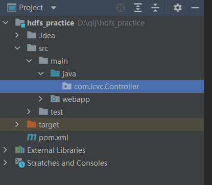


创建FileSystemController类

 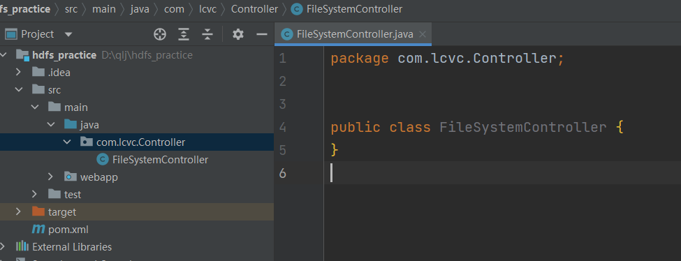


参考代码

```java
package com.lcvc.Controller;


import org.apache.hadoop.conf.Configuration;
import org.apache.hadoop.fs.FileSystem;
import org.apache.hadoop.fs.Path;

import java.io.IOException;

public class FileSystemController {

    // 获取FileSystem
    public FileSystem getFileSystem() throws IOException {
        Configuration configuration = new Configuration();
        configuration.set("fs.defaultFS", "hdfs://master:9000");
        System.setProperty("HADOOP_USER_NAME", "root");
        return FileSystem.get(configuration);
    }

    // 创建文件夹
    public void makeDirectory(String pathName) throws IOException {
        // 获取文件系统
        FileSystem fs = getFileSystem();
        // 判断文件/目录是否存在，如果不存在执行创建操作
        if (!fs.exists(new Path(pathName))){
            fs.mkdirs(new Path(pathName));
        } else {
            System.out.println(pathName + "已经存在！");
        }

        fs.close(); // 关闭系统
    }

    // 重命名
    public void fileRename(String oldPathName, String newPathName) throws IOException {
        // 获取文件系统
        FileSystem fs = getFileSystem();
        // 判断文件是否存在，如果存在执行移动操作
        if (!fs.exists(new Path(oldPathName))){
            System.out.println(oldPathName + "不存在！");
        } else{
            fs.rename(new Path(oldPathName), new Path(newPathName));
        }
        fs.close(); // 关闭系统
    }

    // 上传本地文件到hdfs系统
    public void copyFromLocal(String localPathName, String hdfsPathName) throws IOException {
        // 获取文件系统
        FileSystem fs = getFileSystem();
        // 上传文件
        fs.copyFromLocalFile(new Path(localPathName), new Path(hdfsPathName));
        // 关闭系统
        fs.close();
    }

    // 下载hdfs文件到本地
    public void copyToLocal(String hdfsPathName, String localPathName) throws IOException {
        // 获取文件系统
        FileSystem fs = getFileSystem();
        // 下载文件
        fs.copyToLocalFile(new Path(hdfsPathName), new Path(localPathName));
        // 关闭系统
        fs.close();
    }


    // 删除hdfs上的文件
    public void deleteFile(String pathName) throws IOException {
        // 获取文件系统
        FileSystem fs = getFileSystem();
        // 判断文件是否存在，如果存在执行删除操作
        if (!fs.exists(new Path(pathName))){
            System.out.println(pathName + "不存在！");
        } else{
            fs.delete(new Path(pathName), true);
        }
        // 关闭系统
        fs.close();
    }

    public static void main(String[] args) throws IOException {
        // 实例化FileSystemController，测试
        FileSystemController fileSystemControl = new FileSystemController();
        // 第1题：在hdfs上分别创建目录：/windows/test/test1，/windows/test/test2.
        fileSystemControl.makeDirectory("/windows/test/test1/");
        fileSystemControl.makeDirectory("/windows/test/test2/");

        // 第2题：将hdfs上的/windows/test/test2目录重命名为test3目录
        fileSystemControl.fileRename("/windows/test/test2", "/windows/test/test3");

        // 第3题：将本地windows下的d:/hello_windows.txt文件上传到hdfs上的/windows/test目录下的test1目录和test3目录
        fileSystemControl.copyFromLocal("d:/hello_windows.txt", "/windows/test/test1");
        fileSystemControl.copyFromLocal("d:/hello_windows.txt", "/windows/test/test3");

        // 第4题：删除/windows/test/test3目录
        fileSystemControl.deleteFile("/windows/test/test3/");

    }
}
```


### 3.7.6 搭建操作HDFS的Java Web系统（难度高）

