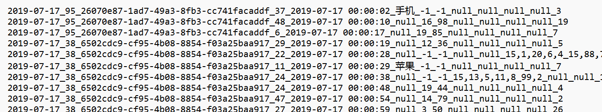
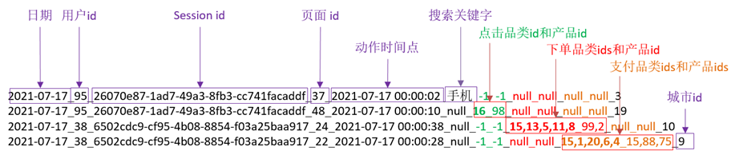

# 第4章 MapReduce计算引擎

MapReduce的服务节点为集群的以下节点：

 

 

 

## 4.1 MapReduce概述

### 4.1.1 MapReduce定义

​	MapReduce是一个[分布式运算程序]()的编程框架，是用户开发“基于Hadoop的数据分析应用”的核心框架。

​	MapReduce核心功能是将[用户编写的业务逻辑代码]()和[自带默认组件]()整合成一个完整的分布式运算程序，并发运行在一个Hadoop集群上。

### 4.1.2 MapReduce优缺点

#### ① 优点

**1）MapReduce易于编程**

​	它简单的实现一些接口，就可以完成一个分布式程序，这个分布式程序可以分布到大量廉价的PC机器上运行。也就是说你写一个分布式程序，跟写一个简单的串行程序是一模一样的。就是因为这个特点使得MapReduce编程变得非常流行。

**2）良好的扩展性**

​	当你的计算资源不能得到满足的时候，你可以通过简单的增加机器来扩展它的计算能力。

**3）高容错性**

​	MapReduce设计的初衷就是使程序能够部署在廉价的PC机器上，这就要求它具有很高的容错性。比如其中一台机器挂了，它可以把上面的计算任务转移到另外一个节点上运行，不至于这个任务运行失败，而且这个过程不需要人工参与，而完全是由Hadoop内部完成的。

**4）适合PB级以上海量数据的离线处理**

​	可以实现上千台服务器集群并发工作，提供数据处理能力。

#### ② 缺点

**1）不擅长实时计算**

​	MapReduce无法像MySQL一样，在毫秒或者秒级内返回结果。

**2）不擅长流式计算**

​	流式计算的输入数据是动态的，而MapReduce的输入数据集是静态的，不能动态变化。这是因为MapReduce自身的设计特点决定了数据源必须是静态的。

**3）不擅长DAG（有向无环图）计算**

​	多个应用程序存在依赖关系，后一个应用程序的输入为前一个的输出。在这种情况下，MapReduce并不是不能做，而是使用后，每个MapReduce作业的输出结果都会写入到磁盘，会造成大量的磁盘IO，导致性能非常的低下。


### 4.1.3 MapReduce两大过程

​	MapReduce计算海量数据时，每个MapReduce程序被初始化为一个工作任务，这个工作任务在运行时会经历[Map过程]()和[Reduce过程]()。


​	MapReduce的执行过程如下：


### 4.1.4 MapReduce编程模型

​	MapReduce是一种编程模型，用于处理大规模数据集的[并行计算]()。使用MapReduce执行处理大规模数据集计算任务的时候，计算任务主要经历两个过程，分别是[Map过程]()和[Reduce过程]()，

​	其中Map过程用于对[原始数据]()进行处理；

​	Reduce过程用于对[Map过程处理后的数据]()进行汇总，得到最终结果。


#### ① map()方法

1. map()方法接收格式为键值对（<Key,Value>）的数据。
2. 其中键（Key）是指每行数据的起始偏移量，也就是每行数据开头的字符所在的位置。
3. 值（Value）是指文本文件中的每行数据。
4. 使用map()方法处理后的数据，会被映射为新的键值对作为reduce()方法的输入；

#### ② reduce()方法

默认会将每个键值对中键相同的值进行合并，当然也可以根据实际需求调整合并规则。


#### ③ 数据处理过程


1. MapReduce通过特定的规则将原始数据解析成键值对<Key1,Value1>的形式。
2. 解析后的键值对<Key1,Value1>会作为map()方法的输入，map()方法根据映射规则将<Key1,Value1>映射为新的键值对<Key2,Value2>。
3. 新的键值对<Key2,Value2>作为reduce()方法的输入，reduce()方法将具有相同键的值合并在一起，生成最终的键值对<Key3,Value3>。


#### ④ 编程模型

​	在MapReduce中，对于一些数据的计算可能不需要Reduce过程，也就是说MapReduce的简易模型的数据处理过程可能只有Map过程，由Map过程处理后的数据直接输出到目标文件。

​	但是，对于大多数数据的计算来说，都是需要Reduce过程的，并且由于数据计算繁琐，需要设定多个Reduce过程。


### 4.1.5 HashMap的键值对类型

我们现在有这么一个需求，需要将班级上所有学生的成绩存储到一个集合中，并且能快速找到该数据。

比如

| 姓名 | 成绩 |
| :--: | :--: |
| 小明 | 90.5 |
| 小红 |  60  |
| 小蓝 | 71.5 |

在我们以前的学习中，我们在Java中学习过数组，我们用数组存储成绩。

```java
        // 成绩列表
        double[] scores = new double[] {90.5, 60, 71.5};
```

这样成绩是存储完成了，但是我们并不能知道成绩都是谁的成绩，比如我们想要找到小红的成绩，得知道小红的索引。

因此我们必须创建一个同名顺序的姓名数组。

```java
        // 姓名数组
        String[] names = new String[] {"小明", "小红", "小蓝"};
```

就通过查找小红在数组的索引实现查找小红成绩。


实现代码如下：

```java
public class ArrayTest {
    public static void main(String[] args) {

        // 成绩列表
        double[] scores = new double[] {90.5, 60, 71.5};
        // 姓名数组
        String[] names = new String[] {"小明", "小红", "小蓝"};

        // 查找小红的成绩

        // 1.先查找小红的索引
        int idx = -1;
        for (int i = 0; i < names.length; i++) {
            if (names[i].equals("小红")) {
                idx = i;
            }
        }

        // 2.输出小红的成绩
        System.out.println(scores[idx]);

    }
}
```


但我们发现其实中间的索引是完全不需要的，我们其实只需要知道小明对应90.5，小红对应60，小蓝对应71.5就行了。


也就是

- 小明-->90.5
- 小红-->60
- 小蓝-->71.5

这样的结构我们称之为[键值对结构]()，也就是[Key-->Value]()结构。

而存储键值对结构的集合我们称之为[Map类型]()。

#### ① 键值对结构和Map类型

#### ② 使用Map类型实现WordCount词频统计

```java
/**
 * 用java的常规方法来编写wordcount的实现方法
 */
import java.util.HashMap;
import java.util.Map;

public class WordCountDemo {
    public static void main(String[] args) {
        String text="hello,world,hello,hello,world,hello,mapreduce";
        String [] spString = text.split(",");//  \s+表示匹配一个或多个空格
        Map<String,Integer> map=new HashMap<String,Integer>();//用map记录每个单词的出现次数，如hello->2
        for(String s:spString){
            if(map.containsKey(s)){//如果该单词已经在集合中存在，即已经统计过单词个数
                map.put(s,map.get(s)+1);//让该单词的数+1
            }else{//如果该单词在集合中不存在，即第一次统计该单词
                map.put(s,1);//让该单词的值为1
            }
        }
        //输出每个单词的出现次数
        for (String key : map.keySet()){
            System.out.println(key + ":\t" + map.get(key));
        }
    }
}

```


## 4.2 MapReduce实现简单词频统计

### 4.2.1 需求和准备工作

在master上准备两个文本文件test1.txt和文件test2.txt。

**test1.txt**

```
Hello World
Hello Hadoop
Hello itcast
```

**test2.txt**

```
Hadoop MapReduce
MapReduce Spark
```


使用MapReduce程序统计文件test1.txt和test2.txt中每个单词出现的次数，实现词频统计的流程。


### 4.2.2 创建项目

#### ① 在idea中创建项目

 


#### ② 在pom文件中添加MR依赖

```xml
  <properties>
    <hadoop.version>2.7.1</hadoop.version>
  </properties>

  <dependencies>
    <dependency>
      <groupId>org.apache.hadoop</groupId>
      <artifactId>hadoop-client</artifactId>
      <version>${hadoop.version}</version>
    </dependency>
  </dependencies>
```


#### ③ 在项目文件夹中创建两个txt文件

在hdfs目录下创建一个/mytest目录。


上传test1.txt和文件test2.txt到/mytest目录中

test1.txt

```
Hello World
Hello Hadoop
Hello itcast
```

test2.txt

```
Hadoop MapReduce
MapReduce Spark
```


结果如下：


### 4.2.3 编写MR代码（本地运行版）

在[src/main/java](src/main/java)目录创建[com.lcvc.mr.wordcount]()包

 


#### ① 编写Mapper类

```java
import org.apache.hadoop.io.IntWritable;
import org.apache.hadoop.io.LongWritable;
import org.apache.hadoop.io.Text;
import org.apache.hadoop.mapreduce.Mapper;

import java.io.IOException;

public class WordCountMapper extends Mapper<LongWritable, Text, Text, IntWritable> {

    Text k = new Text(); // KeyOut
    IntWritable v = new IntWritable(1); // KeyIn

    @Override
    protected void map(LongWritable key, Text value, Context context) throws IOException, InterruptedException {

        // 1.获取一行
        String line = value.toString();
        // 2.切割
        String[] words = line.split(" ");
        // 3.写入context
        for (String word: words) {
            k.set(word);
            context.write(k, v);
        }
    }
}
```

#### ② 编写Reduce类

```java
import org.apache.hadoop.io.IntWritable;
import org.apache.hadoop.io.Text;
import org.apache.hadoop.mapreduce.Reducer;

import java.io.IOException;

public class WordCountReducer extends Reducer<Text, IntWritable, Text, IntWritable> {
    int sum;
    IntWritable v = new IntWritable();

    @Override
    protected void reduce(Text key, Iterable<IntWritable> values, Context context) throws IOException, InterruptedException {
        // 1.累加求和
        sum = 0;
        for (IntWritable v: values){
            sum += v.get();
        }
        // 2.输出到context
        v.set(sum);
        context.write(key, v);
    }
}
```

#### ③ 编写driver类

```java
import org.apache.hadoop.conf.Configuration;
import org.apache.hadoop.fs.Path;
import org.apache.hadoop.io.IntWritable;
import org.apache.hadoop.io.Text;
import org.apache.hadoop.mapreduce.Job;
import org.apache.hadoop.mapreduce.lib.input.FileInputFormat;
import org.apache.hadoop.mapreduce.lib.output.FileOutputFormat;


import java.io.IOException;

public class WordCountDriver {
    public static void main(String[] args) throws IOException, InterruptedException, ClassNotFoundException {
        // 1.获取配置信息以及获取Job对象
        Configuration conf = new Configuration();
        // 添加hdfs通信地址
        conf.set("fs.defaultFS","hdfs://master:9000");
        //设置身份信息，用于访问linux。否则会默认以windows的管理员访问，导致没有权限操作
        System.setProperty("HADOOP_USER_NAME","root");

        //配置MR运行模式，使用local表示本地模式，默认也是本地模式，可以省略
        conf.set("mapreduce.framework.name","local");

        // 获取Job对象
        Job job = Job.getInstance(conf);

        // 2.关联本Driver程序的Jar
        job.setJarByClass(WordCountDriver.class);

        // 3.关联Mapper的Jar和Reduce的Jar
        job.setMapperClass(WordCountMapper.class);
        job.setReducerClass(WordCountReducer.class);

        // 4.设置Mapper的输出的key和Value的类型
        job.setMapOutputKeyClass(Text.class);
        job.setMapOutputValueClass(IntWritable.class);

        // 5.设置最终输出的key和value的类型
        job.setOutputKeyClass(Text.class);
        job.setOutputValueClass(IntWritable.class);

        /**
         * 6.设置输入和输出路径
         * 在本地运行,如果在本地运行测试请使用下面代码
         */
        FileInputFormat.setInputPaths(job,"/mytest/");
        FileOutputFormat.setOutputPath(job, new Path("/output/"));

        // 7.提交任务
        boolean result = job.waitForCompletion(true);

        // 提示
        if (result) {
            System.out.println("执行完成");
        }

        System.exit(result ? 0 : 1);//0表示正常退出，其他值表示非正常退出。
    }
}
```


如果遇到如下报错


把[hadoop.dll]()放在[c盘windows\system32]()里面。


### 4.2.4 编写MR代码（Jar运行版）

在[src/main/java](src/main/java)目录创建[com.lcvc.mr.wordcountonline]()包

 


**Mapper类和Reduce类的代码还是一样的**

#### ① 编写Mapper类

```java
import org.apache.hadoop.io.IntWritable;
import org.apache.hadoop.io.LongWritable;
import org.apache.hadoop.io.Text;
import org.apache.hadoop.mapreduce.Mapper;

import java.io.IOException;

public class WordCountOnlineMapper extends Mapper<LongWritable, Text, Text, IntWritable> {

    Text k = new Text();
    IntWritable v = new IntWritable(1);

    @Override
    protected void map(LongWritable key, Text value, Context context) throws IOException, InterruptedException {

        // 1.获取一行
        String line = value.toString();
        // 2.切割
        String[] words = line.split(" ");
        // 3.写入context
        for (String word: words) {
            k.set(word);
            context.write(k, v);
        }
    }
}
```

#### ② 编写Reduce类

```java
import org.apache.hadoop.io.IntWritable;
import org.apache.hadoop.io.Text;
import org.apache.hadoop.mapreduce.Reducer;

import java.io.IOException;

public class WordCountOnlineReducer extends Reducer<Text, IntWritable, Text, IntWritable>{
    int sum;
    IntWritable v = new IntWritable();

    @Override
    protected void reduce(Text key, Iterable<IntWritable> values, Context context) throws IOException, InterruptedException {
        // 1.累加求和
        sum = 0;
        for (IntWritable v: values){
            sum += v.get();
        }
        // 2.输出到context
        v.set(sum);
        context.write(key, v);
    }
}
```


#### ③ 编写Driver类

```java
import org.apache.hadoop.conf.Configuration;
import org.apache.hadoop.fs.Path;
import org.apache.hadoop.io.IntWritable;
import org.apache.hadoop.io.Text;
import org.apache.hadoop.mapreduce.Job;
import org.apache.hadoop.mapreduce.lib.input.FileInputFormat;
import org.apache.hadoop.mapreduce.lib.output.FileOutputFormat;

import java.io.IOException;

public class WordCountOnlineDriver {
    public static void main(String[] args) throws IOException, InterruptedException, ClassNotFoundException {
        // 1.获取配置信息以及获取Job对象
        Configuration conf = new Configuration();
        // 添加hdfs通信地址
        conf.set("fs.defaultFS","hdfs://master:9000");
        //配置MR运行模式，使用yarn作为集群模式
        conf.set("mapreduce.framework.name","yarn");
        //指定MR可以在远程集群运行
        conf.set("mapreduce.app-submission.cross-platform", "true");
        //指定yarn resourceManager的位置
        conf.set("yarn.resourcemanager.hostname", "master");
        // 获取Job对象
        Job job = Job.getInstance(conf);

        // 2.关联本Driver程序的Jar
        job.setJarByClass(WordCountOnlineDriver.class);

        // 3.关联Mapper的Jar和Reduce的Jar
        job.setMapperClass(WordCountOnlineMapper.class);
        job.setReducerClass(WordCountOnlineReducer.class);

        // 4.设置Mapper的输出的key和Value的类型
        job.setMapOutputKeyClass(Text.class);
        job.setMapOutputValueClass(IntWritable.class);

        // 5.设置最终输出的key和value的类型
        job.setOutputKeyClass(Text.class);
        job.setOutputValueClass(IntWritable.class);

        // 6.设置输入和输出路径

        FileInputFormat.setInputPaths(job,new Path(args[0]));
        FileOutputFormat.setOutputPath(job, new Path(args[1]));

        // 7.提交任务
        boolean result = job.waitForCompletion(true);

        // 自动退出任务
        System.exit(result ? 0 : 1); //0表示正常退出，其他值表示非正常退出。
    }

}
```


#### ④ 打成Jar包

​	**设置构造格式**

 


 

 

 

 

 


​	**根据设置好的包格式进行打包**

 

 


 


#### ⑤ 把Jar包上传到master服务器，并运行


**执行以下命令，运行Jar包**

```shell
hadoop jar /opt/software/MapReduceDemo.jar com.lcvc.mr.wordcountonline.WordCountOnlineDriver /mytest /output2
```


注意一下：MR的集群计算模式的计算时间非常长，是取决于它的计算原理，它的计算是用在大规模数据集上的。

正常来说，是需要几分钟的。


我们可以去[master:9000]()以及[master:8088]()上查看运行结果


## 4.3 MapReduce工作原理（了解）

MapReduce编程模型开发简单且功能强大，专门为并行处理大规模数据量而设计。

### 4.3.1 MapReduce的工作过程


### 4.3.2 MapTask处理数据的流程


### 4.3.3 ReduceTask处理数据的流程


### 4.4.4 Shuffle的工作流程


## 4.4 MapReduce应用案例

为展示方便，案例编写的方式都是本地运行模式，请同学们自己改写成Jar模式


在MR大数据分析中，处理的大部分数据是文本数据（HDFS上），这些数据会以固定的逻辑结构进行存储，比如日志文件，销售记录，点击记录等，他们会遵循一定的格式。

比如：

       





对于这样的数据，我们首先要通过**数据字典**去了解我们的**数据的定义方式及分解结构**，比如对上面数据的分解结构




### 案例一：超市商品销售额统计

在[src/main/java](src/main/java)目录创建[com.lcvc.mr.salecount]()包。


把准备的数据集[sale.csv]()放到[src/main/resources/sale](src/main/resources/sale)目录中：

 


首先我们要了解数据的分解结构，[sale.csv](src/main/resources/sale)数据集的结构是

每一行是单次销售记录，对于每一行的数据分解结构如下：

```
商品名称,销售数量,商品单价
```


理解为表结构，就是：

 


对数据结构的分析，我们知道行记录依次为**商品名称**,**销售数量**,**商品单价**，字段之间用逗号分割，根据分析，我们可以涉及程序。

1. 按行读取数据
2. 根据逗号进行split()操作
3. 计算每行记录的  **销售额 = 销售数量 * 商品单价**
4. 汇总所有记录的销售额


实现代码如下：

#### ① 编写Mapper类

**SaleCountMapper类**

```java
package com.lcvc.mr.salecount;


import org.apache.hadoop.io.FloatWritable;
import org.apache.hadoop.io.LongWritable;
import org.apache.hadoop.io.Text;
import org.apache.hadoop.mapreduce.Mapper;

import java.io.IOException;

public class SaleCountMapper extends Mapper<LongWritable, Text, Text, FloatWritable> {

    // KeyOut
    Text keyOut = new Text();
    // ValueOut
    FloatWritable valueOut = new FloatWritable();

    @Override
    protected void map(LongWritable key, Text value, Mapper<LongWritable, Text, Text, FloatWritable>.Context context) throws IOException, InterruptedException {
        // 分割语义
        // 商品类,销售量,单价

        String[] temp = value.toString().split(",");

        if (temp.length == 3) {
            // 商品类
            String goodType = temp[0];
            // 销售量
            float volume = Float.parseFloat(temp[1]);
            // 单价
            float unitPrice = Float.parseFloat(temp[2]);
            // 销售额
            float sales = volume * unitPrice;

            // 设置KeyOut, ValueOut
            keyOut.set(goodType);
            valueOut.set(sales);

            // 提交输出
            context.write(keyOut, valueOut);
        }
    }

}
```


#### ② 编写Reducer类

**SaleCountReducer类**

```java
package com.lcvc.mr.salecount;


import org.apache.hadoop.io.FloatWritable;
import org.apache.hadoop.io.Text;
import org.apache.hadoop.mapreduce.Reducer;

import java.io.IOException;

public class SaleCountReducer extends Reducer<Text, FloatWritable, Text, FloatWritable> {
    // 设置keyOut，valueOut
    Text keyOut = new Text();
    FloatWritable valueOut = new FloatWritable();
    float sum;

    @Override
    protected void reduce(Text key, Iterable<FloatWritable> values, Reducer<Text, FloatWritable, Text, FloatWritable>.Context context) throws IOException, InterruptedException {
        // 每次清空
        sum = 0;

        // 遍历相加
        for (FloatWritable value: values) {
            sum += value.get();
        }
        // 设置输出
        keyOut.set(key);
        valueOut.set(sum);

        // 提交输出
        context.write(keyOut, valueOut);
    }
}

```


#### ③ 编写Driver类

**SaleCountDriver类**

```java
package com.lcvc.mr.salecount;


import org.apache.hadoop.conf.Configuration;
import org.apache.hadoop.fs.Path;
import org.apache.hadoop.io.FloatWritable;
import org.apache.hadoop.io.Text;

import org.apache.hadoop.mapreduce.Job;
import org.apache.hadoop.mapreduce.lib.input.FileInputFormat;
import org.apache.hadoop.mapreduce.lib.output.FileOutputFormat;

import java.io.IOException;

public class SaleCountDriver {
    public static void main(String[] args) throws IOException, InterruptedException, ClassNotFoundException {
        // 1.获取Configuration
        Configuration configuration = new Configuration();
        // 2.获取Job对象
        Job job = Job.getInstance(configuration);

        // 3.关联主程序
        job.setJarByClass(SaleCountDriver.class);

        // 4.关联Mapper和Reduce
        job.setMapperClass(SaleCountMapper.class);
        job.setReducerClass(SaleCountReducer.class);

        // 5.设置输出类型
        job.setMapOutputKeyClass(Text.class);
        job.setOutputValueClass(FloatWritable.class);

        // 6.设置输出路径
        FileInputFormat.setInputPaths(job,"src/main/resources/sale");
        FileOutputFormat.setOutputPath(job,new Path("/outputsales"));

        // 7.提交任务
        boolean result = job.waitForCompletion(true);

        // 退出
        System.exit(result ? 0:1);
    }
}

```


### 案例二：处理带缺省值的超市商品数据

在案例一中，我们已经实现了对超市商品数据的销售额统计，但是在真实数据中，往往会存在大量的缺失值，有的是**记录缺失**，有的是**值缺失**，我们首先需要处理一下这部分数据。

                 


我们对原始数据的处理和大部分的计算都是在**Map过程**，相应的功能代码需要在**Mapper类实现**

对于缺失值的处理有很多方法，我们这里采用最简单的**删除缺失值**的办法。


我们首先要设计一个判断缺失值的方法。

根据逗号进行split()操作，对于正常记录和缺失记录会分别得到以下结果：


对于有缺失值的记录，会存在切割出[""]()空字符串的情况，我们只要判断split()操作的结果数组中是否含有[""]()空字符串，就能判断是否有缺失值。

功能实现代码：

```java
    /**
     * 判断数组是否包含null
     * @return  true or false
     */
    public boolean isContainerNull(String[] temp) {
        for (String s: temp) {
            if (s.isEmpty()){
                return false;
            }
        }
        return true;    // 遍历后不包含null时返回true
    }
```


把它应用到**Mapper类**中：

```java
import org.apache.hadoop.io.FloatWritable;
import org.apache.hadoop.io.LongWritable;
import org.apache.hadoop.io.Text;
import org.apache.hadoop.mapreduce.Mapper;

import java.io.IOException;

public class SaleCountMapper extends Mapper<LongWritable, Text, Text, FloatWritable> {

    // KeyOut
    Text keyOut = new Text();
    // ValueOut
    FloatWritable valueOut = new FloatWritable();

    @Override
    protected void map(LongWritable key, Text value, Mapper<LongWritable, Text, Text, FloatWritable>.Context context) throws IOException, InterruptedException {
        // 分割语义
        // 商品类,销售量,单价

        String[] temp = value.toString().split(",");

        if (temp.length == 3 && isContainerNull(temp)) {
            // 商品类
            String goodType = temp[0];
            // 销售量
            float volume = Float.parseFloat(temp[1]);
            // 单价
            float unitPrice = Float.parseFloat(temp[2]);
            // 销售额
            float sales = volume * unitPrice;

            // 设置KeyOut, ValueOut
            keyOut.set(goodType);
            valueOut.set(sales);

            // 提交输出
            context.write(keyOut, valueOut);
        }
    }

    /**
     * 判断数组是否包含null
     * @return  true or false
     */
    public boolean isContainerNull(String[] temp) {
        for (String s: temp) {
            if (s.isEmpty()){
                return false;
            }
        }
        return true;    // 遍历后不包含null时返回true
    }
}
```


### 案例三：TopN（难度较高）

```java
package com.lcvc.mr.TopN;
import org.apache.hadoop.io.IntWritable;
import org.apache.hadoop.io.LongWritable;
import org.apache.hadoop.io.NullWritable;
import org.apache.hadoop.io.Text;
import org.apache.hadoop.mapreduce.Mapper;
import java.util.TreeMap;
public class TopNMapper extends Mapper<LongWritable, Text, NullWritable, IntWritable> {
        private TreeMap<Integer, String> repToRecordMap = new TreeMap<Integer, String>();
        @Override
        public void map(LongWritable key, Text value, Context context){
            String line = value.toString();
            String[] nums = line.split(" ");
            for (String num : nums){
                repToRecordMap.put(Integer.parseInt(num), " ");
                if (repToRecordMap.size() > 5){
                    repToRecordMap.remove(repToRecordMap.firstKey());
                }
            }
        }
        @Override
        protected void cleanup(Context context){
            for (Integer i : repToRecordMap.keySet()){
                try {
                    context.write(NullWritable.get(), new IntWritable(i));
                }catch (Exception e){
                    e.printStackTrace();
                }
            }
        }

    }
```


```java
package com.lcvc.mr.TopN;
import org.apache.hadoop.io.IntWritable;
import org.apache.hadoop.io.NullWritable;
import org.apache.hadoop.mapreduce.Reducer;
import java.io.IOException;
import java.util.Comparator;
import java.util.TreeMap;

public class TopNReducer extends Reducer<NullWritable, IntWritable,
        NullWritable, IntWritable> {
    private TreeMap<Integer, String> repToRecordMap = new TreeMap<Integer,
            String>(new Comparator<Integer>() {
        public int compare(Integer o1, Integer o2) {
            return o2 - o1;
           /*返回正数表示：o1小于o2
             返回0表示：o1和o2相等
             返回负数表示：01大于o2
            */
        }
    });
    public void reduce(NullWritable key, Iterable<IntWritable>values,
                       Context context)throws IOException, InterruptedException{
        for (IntWritable value : values){
            repToRecordMap.put(value.get(), " ");
            if (repToRecordMap.size() > 5){
                repToRecordMap.remove(repToRecordMap.firstKey());
            }
        }
        for (Integer i : repToRecordMap.keySet()){
            context.write(NullWritable.get(), new IntWritable(i));
        }
    }
}

```


```java
package com.lcvc.mr.TopN;

import org.apache.hadoop.conf.Configuration;
import org.apache.hadoop.fs.Path;
import org.apache.hadoop.io.IntWritable;
import org.apache.hadoop.io.NullWritable;
import org.apache.hadoop.mapreduce.Job;
import org.apache.hadoop.mapreduce.lib.input.FileInputFormat;
import org.apache.hadoop.mapreduce.lib.output.FileOutputFormat;

public class TopNDriver {
    public static void main(String[] args) throws Exception{
        Configuration conf = new Configuration();
        Job job = Job.getInstance(conf);
        job.setJarByClass(TopNDriver.class);
        job.setMapperClass(TopNMapper.class);
        job.setReducerClass(TopNReducer.class);
        job.setNumReduceTasks(1);
        job.setMapOutputKeyClass(NullWritable.class);
        job.setMapOutputValueClass(IntWritable.class);
        job.setOutputKeyClass(NullWritable.class);
        job.setOutputValueClass(IntWritable.class);
        FileInputFormat.setInputPaths(job, new Path("/TopN/input"));
        FileOutputFormat.setOutputPath(job, new Path("/TopN/output"));
        boolean res = job.waitForCompletion(true);
        System.exit(res ? 0 : 1);
    }
}
```


