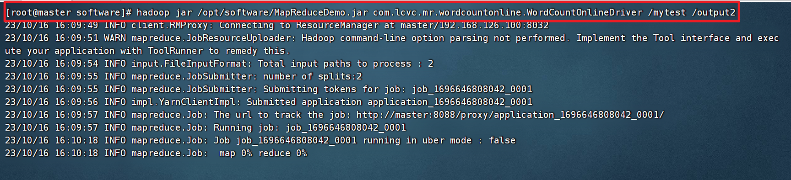

# 第4章 MapReduce计算引擎

MapReduce的服务节点为集群的以下节点：

 

 

 

## 4.1 MapReduce概述

### 4.1.1 MapReduce定义

​	MapReduce是一个[分布式运算程序]()的编程框架，是用户开发“基于Hadoop的数据分析应用”的核心框架。

​	MapReduce核心功能是将[用户编写的业务逻辑代码]()和[自带默认组件]()整合成一个完整的分布式运算程序，并发运行在一个Hadoop集群上。

### 4.1.2 MapReduce优缺点

#### ① 优点

**1）MapReduce易于编程**

​	它简单的实现一些接口，就可以完成一个分布式程序，这个分布式程序可以分布到大量廉价的PC机器上运行。也就是说你写一个分布式程序，跟写一个简单的串行程序是一模一样的。就是因为这个特点使得MapReduce编程变得非常流行。

**2）良好的扩展性**

​	当你的计算资源不能得到满足的时候，你可以通过简单的增加机器来扩展它的计算能力。

**3）高容错性**

​	MapReduce设计的初衷就是使程序能够部署在廉价的PC机器上，这就要求它具有很高的容错性。比如其中一台机器挂了，它可以把上面的计算任务转移到另外一个节点上运行，不至于这个任务运行失败，而且这个过程不需要人工参与，而完全是由Hadoop内部完成的。

**4）适合PB级以上海量数据的离线处理**

​	可以实现上千台服务器集群并发工作，提供数据处理能力。

#### ② 缺点

**1）不擅长实时计算**

​	MapReduce无法像MySQL一样，在毫秒或者秒级内返回结果。

**2）不擅长流式计算**

​	流式计算的输入数据是动态的，而MapReduce的输入数据集是静态的，不能动态变化。这是因为MapReduce自身的设计特点决定了数据源必须是静态的。

**3）不擅长DAG（有向无环图）计算**

​	多个应用程序存在依赖关系，后一个应用程序的输入为前一个的输出。在这种情况下，MapReduce并不是不能做，而是使用后，每个MapReduce作业的输出结果都会写入到磁盘，会造成大量的磁盘IO，导致性能非常的低下。


### 4.1.3 MapReduce工作原理

​	MapReduce计算海量数据时，每个MapReduce程序被初始化为一个工作任务，这个工作任务在运行时会经历[Map过程]()和[Reduce过程]()。


​	MapReduce的执行过程如下：


### 4.1.4 MapReduce编程模型

​	MapReduce是一种编程模型，用于处理大规模数据集的[并行计算]()。使用MapReduce执行处理大规模数据集计算任务的时候，计算任务主要经历两个过程，分别是[Map过程]()和[Reduce过程]()，

​	其中Map过程用于对[原始数据]()进行处理；

​	Reduce过程用于对[Map过程处理后的数据]()进行汇总，得到最终结果。


#### ① map()方法

1. map()方法接收格式为键值对（<Key,Value>）的数据。
2. 其中键（Key）是指每行数据的起始偏移量，也就是每行数据开头的字符所在的位置。
3. 值（Value）是指文本文件中的每行数据。
4. 使用map()方法处理后的数据，会被映射为新的键值对作为reduce()方法的输入；

#### ② reduce()方法

默认会将每个键值对中键相同的值进行合并，当然也可以根据实际需求调整合并规则。


#### ③ 数据处理过程


1. MapReduce通过特定的规则将原始数据解析成键值对<Key1,Value1>的形式。
2. 解析后的键值对<Key1,Value1>会作为map()方法的输入，map()方法根据映射规则将<Key1,Value1>映射为新的键值对<Key2,Value2>。
3. 新的键值对<Key2,Value2>作为reduce()方法的输入，reduce()方法将具有相同键的值合并在一起，生成最终的键值对<Key3,Value3>。


#### ④ 编程模型

​	在MapReduce中，对于一些数据的计算可能不需要Reduce过程，也就是说MapReduce的简易模型的数据处理过程可能只有Map过程，由Map过程处理后的数据直接输出到目标文件。

​	但是，对于大多数数据的计算来说，都是需要Reduce过程的，并且由于数据计算繁琐，需要设定多个Reduce过程。


## 4.2 MapReduce实现简单词频统计

### 4.2.1 需求和准备工作

在master上准备两个文本文件test1.txt和文件test2.txt。

**test1.txt**

```
Hello World
Hello Hadoop
Hello itcast
```

**test2.txt**

```
Hadoop MapReduce
MapReduce Spark
```


使用MapReduce程序统计文件test1.txt和test2.txt中每个单词出现的次数，实现词频统计的流程。


### 4.2.2 创建项目

#### ① 在idea中创建项目

 


#### ② 在pom文件中添加MR依赖

```xml
  <properties>
    <hadoop.version>2.7.1</hadoop.version>
  </properties>

  <dependencies>
    <dependency>
      <groupId>org.apache.hadoop</groupId>
      <artifactId>hadoop-client</artifactId>
      <version>${hadoop.version}</version>
    </dependency>
  </dependencies>
```


#### ③ 在项目文件夹中创建两个txt文件

在hdfs目录下创建一个/mytest目录。


上传test1.txt和文件test2.txt到/mytest目录中

test1.txt

```
Hello World
Hello Hadoop
Hello itcast
```

test2.txt

```
Hadoop MapReduce
MapReduce Spark
```


结果如下：


### 4.2.3 编写MR代码（本地运行版）

在[src/main/java](src/main/java)目录创建[com.lcvc.mr.wordcount]()包

 


#### ① 编写Mapper类

```java
import org.apache.hadoop.io.IntWritable;
import org.apache.hadoop.io.LongWritable;
import org.apache.hadoop.io.Text;
import org.apache.hadoop.mapreduce.Mapper;

import java.io.IOException;

public class WordCountMapper extends Mapper<LongWritable, Text, Text, IntWritable> {

    Text k = new Text(); // KeyOut
    IntWritable v = new IntWritable(1); // KeyIn

    @Override
    protected void map(LongWritable key, Text value, Context context) throws IOException, InterruptedException {

        // 1.获取一行
        String line = value.toString();
        // 2.切割
        String[] words = line.split(" ");
        // 3.写入context
        for (String word: words) {
            k.set(word);
            context.write(k, v);
        }
    }
}
```

#### ② 编写Reduce类

```java
import org.apache.hadoop.io.IntWritable;
import org.apache.hadoop.io.Text;
import org.apache.hadoop.mapreduce.Reducer;

import java.io.IOException;

public class WordCountReducer extends Reducer<Text, IntWritable, Text, IntWritable> {
    int sum;
    IntWritable v = new IntWritable();

    @Override
    protected void reduce(Text key, Iterable<IntWritable> values, Context context) throws IOException, InterruptedException {
        // 1.累加求和
        sum = 0;
        for (IntWritable v: values){
            sum += v.get();
        }
        // 2.输出到context
        v.set(sum);
        context.write(key, v);
    }
}
```

#### ③ 编写driver类

```java
import org.apache.hadoop.conf.Configuration;
import org.apache.hadoop.fs.Path;
import org.apache.hadoop.io.IntWritable;
import org.apache.hadoop.io.Text;
import org.apache.hadoop.mapreduce.Job;
import org.apache.hadoop.mapreduce.lib.input.FileInputFormat;
import org.apache.hadoop.mapreduce.lib.output.FileOutputFormat;


import java.io.IOException;

public class WordCountDriver {
    public static void main(String[] args) throws IOException, InterruptedException, ClassNotFoundException {
        // 1.获取配置信息以及获取Job对象
        Configuration conf = new Configuration();
        // 添加hdfs通信地址
        conf.set("fs.defaultFS","hdfs://master:9000");
        //设置身份信息，用于访问linux。否则会默认以windows的管理员访问，导致没有权限操作
        System.setProperty("HADOOP_USER_NAME","root");

        //配置MR运行模式，使用local表示本地模式，默认也是本地模式，可以省略
        conf.set("mapreduce.framework.name","local");

        // 获取Job对象
        Job job = Job.getInstance(conf);

        // 2.关联本Driver程序的Jar
        job.setJarByClass(WordCountDriver.class);

        // 3.关联Mapper的Jar和Reduce的Jar
        job.setMapperClass(WordCountMapper.class);
        job.setReducerClass(WordCountReducer.class);

        // 4.设置Mapper的输出的key和Value的类型
        job.setMapOutputKeyClass(Text.class);
        job.setMapOutputValueClass(IntWritable.class);

        // 5.设置最终输出的key和value的类型
        job.setOutputKeyClass(Text.class);
        job.setOutputValueClass(IntWritable.class);

        /**
         * 6.设置输入和输出路径
         * 在本地运行,如果在本地运行测试请使用下面代码
         */
        FileInputFormat.setInputPaths(job,"/mytest/");
        FileOutputFormat.setOutputPath(job, new Path("/output/"));

        // 7.提交任务
        boolean result = job.waitForCompletion(true);

        // 提示
        if (result) {
            System.out.println("执行完成");
        }

        System.exit(result ? 0 : 1);//0表示正常退出，其他值表示非正常退出。
    }
}
```


如果遇到如下报错


把[hadoop.dll]()放在[c盘windows\system32]()里面，前提是环境变量都配好


### 4.2.4 编写MR代码（Jar运行版）

在[src/main/java](src/main/java)目录创建[com.lcvc.mr.wordcountonline]()包

 


**Mapper类和Reduce类的代码还是一样的**

#### ① 编写Mapper类

```java
import org.apache.hadoop.io.IntWritable;
import org.apache.hadoop.io.LongWritable;
import org.apache.hadoop.io.Text;
import org.apache.hadoop.mapreduce.Mapper;

import java.io.IOException;

public class WordCountOnlineMapper extends Mapper<LongWritable, Text, Text, IntWritable> {

    Text k = new Text();
    IntWritable v = new IntWritable(1);

    @Override
    protected void map(LongWritable key, Text value, Context context) throws IOException, InterruptedException {

        // 1.获取一行
        String line = value.toString();
        // 2.切割
        String[] words = line.split(" ");
        // 3.写入context
        for (String word: words) {
            k.set(word);
            context.write(k, v);
        }
    }
}
```

#### ② 编写Reduce类

```java
import org.apache.hadoop.io.IntWritable;
import org.apache.hadoop.io.Text;
import org.apache.hadoop.mapreduce.Reducer;

import java.io.IOException;

public class WordCountOnlineReducer extends Reducer<Text, IntWritable, Text, IntWritable>{
    int sum;
    IntWritable v = new IntWritable();

    @Override
    protected void reduce(Text key, Iterable<IntWritable> values, Context context) throws IOException, InterruptedException {
        // 1.累加求和
        sum = 0;
        for (IntWritable v: values){
            sum += v.get();
        }
        // 2.输出到context
        v.set(sum);
        context.write(key, v);
    }
}
```


#### ③ 编写Driver类

```java
import org.apache.hadoop.conf.Configuration;
import org.apache.hadoop.fs.Path;
import org.apache.hadoop.io.IntWritable;
import org.apache.hadoop.io.Text;
import org.apache.hadoop.mapreduce.Job;
import org.apache.hadoop.mapreduce.lib.input.FileInputFormat;
import org.apache.hadoop.mapreduce.lib.output.FileOutputFormat;

import java.io.IOException;

public class WordCountOnlineDriver {
    public static void main(String[] args) throws IOException, InterruptedException, ClassNotFoundException {
        // 1.获取配置信息以及获取Job对象
        Configuration conf = new Configuration();
        // 添加hdfs通信地址
        conf.set("fs.defaultFS","hdfs://master:9000");
        //配置MR运行模式，使用yarn作为集群模式
        conf.set("mapreduce.framework.name","yarn");
        //指定MR可以在远程集群运行
        conf.set("mapreduce.app-submission.cross-platform", "true");
        //指定yarn resourceManager的位置
        conf.set("yarn.resourcemanager.hostname", "master");
        // 获取Job对象
        Job job = Job.getInstance(conf);

        // 2.关联本Driver程序的Jar
        job.setJarByClass(WordCountOnlineDriver.class);

        // 3.关联Mapper的Jar和Reduce的Jar
        job.setMapperClass(WordCountOnlineMapper.class);
        job.setReducerClass(WordCountOnlineReducer.class);

        // 4.设置Mapper的输出的key和Value的类型
        job.setMapOutputKeyClass(Text.class);
        job.setMapOutputValueClass(IntWritable.class);

        // 5.设置最终输出的key和value的类型
        job.setOutputKeyClass(Text.class);
        job.setOutputValueClass(IntWritable.class);

        // 6.设置输入和输出路径

        FileInputFormat.setInputPaths(job,new Path(args[0]));
        FileOutputFormat.setOutputPath(job, new Path(args[1]));

        // 7.提交任务
        boolean result = job.waitForCompletion(true);

        // 自动退出任务
        System.exit(result ? 0 : 1); //0表示正常退出，其他值表示非正常退出。
    }

}
```


#### ④ 打成Jar包

​	**设置构造格式**

 


 

 

 

 

 


​	**根据设置好的包格式进行打包**

 

 


 


#### ⑤ 把Jar包上传到master服务器，并运行


**执行以下命令，运行Jar包**

```shell
hadoop jar /opt/software/MapReduceDemo.jar com.lcvc.mr.wordcountonline.WordCountOnlineDriver /mytest /output2
```




注意一下：MR的集群计算模式的计算时间非常长，是取决于它的计算原理，它的计算是用在大规模数据集上的。

正常来说，是需要几分钟的。


我们可以去[master:9000]()以及[master:8088]()上查看运行结果


## 4.3 MapReduce框架原理（待续）


## 4.4 MapReduce应用案例（待续）
