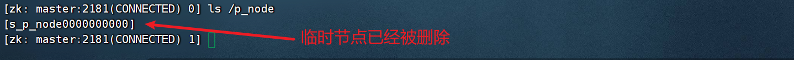

# 第5章 zookeeper分布式协调服务

## 5.1 ZooKeeper简介

### 5.1.1 ZooKeeper特性

ZooKeeper是一个开源的分布式协调服务，它为分布式应用提供了高效且可靠的**分布式协调服务**，并且是分布式应用保证数据一致性的解决方案。

分布式应用可以基于ZooKeeper实现诸如：

- 数据发布/订阅
- 负载均衡
- 命名服务
- 分布式协调/通知
- 集群管理
- Master选举
- 分布式锁
- 分布式队列


### 5.1.2 ZooKeeper集群架构


## 5.2 ZooKeeper组件部署

### 5.2.1 上传zookeeper压缩包

将zookeeper-3.4.8.tar.gz从windows拷贝到master节点/opt/software目录下，如下图：


### 5.2.2 解压zookeeper压缩包

- 在master节点上，解压/opt/software目录下的压缩包zookeeper-3.4.8.tar.gz到/usr/local/src目录下：

  ```shell
  tar -zxvf /opt/software/zookeeper-3.4.8.tar.gz -C /usr/local/src/
  ```


### 5.2.3 重命名操作

- 在master节点上，将目录名为zookeeper-3.4.8，重命名为zookeeper

```
mv /usr/local/src/zookeeper-3.4.8/ /usr/local/src/zookeeper
```


### 5.2.4 添加环境变量

- 在master节点上，编辑/etc/profile文件，输入以下命令

```
vi /etc/profile
(注意：通过快捷建shift + gg，可以快速到达文件最末端。通过快捷键shift+zz快速保存)
```

- 添加zookeeper的环境变量，如下图所示

```shell
export ZOOKEEPER_HOME=/usr/local/src/zookeeper
export PATH=$PATH:$ZOOKEEPER_HOME/bin
```


### 5.2.5 使环境变量生效

- 输入命令

```shell
source /etc/profile
#使zookeeper环境变量生效
```


### 5.2.6 验证zookeeper环境变量是否成功

- 输入命令

```shell
echo $ZOOKEEPER_HOME
```


### 5.2.7 编辑zookeeper配置文件

#### ① myid文件

```shell
#在zookeeper安装目录下创建data目录
mkdir /usr/local/src/zookeeper/data
```


```shell
#进入到data目录下
cd /usr/local/src/zookeeper/data/
#创建myid文件
vi myid
#myid文件中写入编号1，如下图所示：
```


```shell
#说明：myid文件用来标识服务器/节点的编号，必须填写且不同节点不能重复，在后续的zoo.cfg中需要用到。本例约定master是1，slave1是2，slave2是3。
```

#### ② zoo.cfg文件

在master节点修改zookeeper配置文件zoo.cfg文件

```shell
#首写，复制zoo_sample.cfg配置文件，改为zoo.cfg
cp /usr/local/src/zookeeper/conf/zoo_sample.cfg /usr/local/src/zookeeper/conf/zoo.cfg
```


```shell
#编辑zoo.cfg文件
vi /usr/local/src/zookeeper/conf/zoo.cfg
```


**参数说明：**

- tickTime：心跳间隔，毫秒每次，时间单元。ZK中所有时间都是以这个时间单元为基础，进行整数倍配置的。。客户端与服务器或者服务器与服务器之间维持心跳，也就是每个tickTime时间就会发送一次心跳。通过心跳不仅能够用来监听机器的工作状态，还可以通过心跳来控制Flower跟Leader的通信时间，默认情况下FL的会话时常是心跳间隔的两倍。

- initLimit：集群中的follower服务器(F)与leader服务器(L)之间初始连接时能容忍的最多心跳数（tickTime的数量），如果超过这个次数还没连接上，则认为F不在线。Follower在启动过程中，会从Leader同步所有最新数据，然后确定自己能够对外服务的起始状态。Leader允许F在 initLimit 时间内完成这个工作。通常情况下，我们不用太在意这个参数的设置。如果ZK集群的数据量确实很大了，F在启动的时候，从Leader上同步数据的时间也会相应变长，因此在这种情况下，有必要适当调大这个参数了。(No Java system property)

- syncLimit：集群中flower服务器（F）跟leader（L）服务器之间的请求和答应最多能容忍的心跳数，如果超过整个次数，则认为F不在线。在运行过程中，Leader负责与ZK集群中所有机器进行通信，例如通过一些心跳检测机制，来检测机器的存活状态。如果L发出心跳包在syncLimit之后，还没有从F那里收到响应，那么就认为这个F已经不在线了。注意：不要把这个参数设置得过大，否则可能会掩盖一些问题。

- dataDir：存储快照文件snapshot的目录，本例需要配置。默认情况下，事务日志也会存储在这里。建议同时配置参数dataLogDir, 事务日志的写性能直接影响zk性能。

- dataLogDir：事务日志输出目录，本例需要配置。尽量给事务日志的输出配置单独的磁盘或是挂载点，这将极大的提升ZK性能。

- clientPort：客户端连接server的端口，即对外服务端口，一般设置为2181。zookeeper会监听这个端口，接收客户端的请求访问！
- maxClientCnxns：单个客户端与单台服务器之间的连接数的限制，是ip级别的，默认是60，如果设置为0，那么表明不作任何限制。请注意这个限制的使用范围，仅仅是单台客户端机器与单台ZK服务器之间的连接数限制，不是针对指定客户端IP，也不是ZK集群的连接数限制，也不是单台ZK对所有客户端的连接数限制。
- autopurge.purgeInterval：3.4.0及之后版本，ZK提供了自动清理事务日志和快照文件的功能，这个参数指定了清理频率，单位是小时，需要配置一个1或更大的整数，默认是0，表示不开启自动清理功能。
- autopurge.snapRetainCount：这个参数和上面的参数搭配使用，这个参数指定了需要保留的文件数目。默认是保留3个。

- server.x=[hostname]:nnnnn[:nnnnn]：这里的x是一个数字，与myid文件中的id是一致的。右边可以配置两个端口，第一个端口用于F和L之间的数据同步和其它通信，默认是2888;第二个端口用于Leader选举过程中投票通信,默认是3888。

```shell
#在zoo.cfg中添加并更改如下配置
#修改原有参数，需要手动创建指定目录
dataDir=/usr/local/src/zookeeper/data
#增加dataLogDir参数，需要手动创建指定目录
dataLogDir=/usr/local/src/zookeeper/logs
#增加通信的节点
server.1=master:2888:3888
server.2=slave1:2888:3888
server.3=slave2:2888:3888
#说明：server.2和server.3中的数字2,3约定分别代表slave1和slave2，后续的操作需要手动修改slave1和slave2的myid文件。
配置完后的zoo.cfg参数如下图
```


```shell
#根据上面配置文件内容，手动创建logs目录
mkdir /usr/local/src/zookeeper/logs
```

### 5.2.8 分发zookeeper目录

1. 将master节点上的/etc/profile文件分发给slave1节点、slave2节点上

```shell
#复制给slave1
scp /etc/profile slave1:/etc/
#复制给slave2
scp /etc/profile slave2:/etc/
```


2. 将master节点上的zookeeper目录分发给slave1节点、slave2节点

```shell
#复制给slave1
scp -r /usr/local/src/zookeeper/ slave1:/usr/local/src/
#复制给slave2
scp -r /usr/local/src/zookeeper/ slave2:/usr/local/src/
```

### 5.2.9 slave节点/etc/profile生效

```shell
#在slave1上使环境变量生效,输入以下命令
source /etc/profile
#在slave2上使环境变量生效,输入以下命令
source /etc/profile
```

### 5.2.10 修改slave节点myid文件

```shell
#在slave1上更改myid文件
vi /usr/local/src/zookeeper/data/myid 
```


```shell
#在slave2上更改myid文件
vi /usr/local/src/zookeeper/data/myid 
```


### 5.2.11 关闭防火墙

```shell
#分别关闭三台虚拟机的防火墙
#在master节点上关闭防火墙
systemctl stop firewalld
#在slave1节点上关闭防火墙
systemctl stop firewalld
#在slave2节点上关闭防火墙
systemctl stop firewalld
```

### 5.2.12 启动zookeeper集群

```shell
#分别在三台虚拟机
#在master节点输入启动命令：
zkServer.sh start
#在slave1节点输入启动命令：
zkServer.sh start
#在slave2节点输入启动命令：
zkServer.sh start
```

出现如下图表示**zookeeper集群搭建成功**，**一个leader**，**两个follower**。

```shell
#分别在三台虚拟机
#在maser节点输入状态产看命令：
zkServer.sh status
#在slave1节点输入状态产看命令：
zkServer.sh status
#在slave2节点输入状态产看命令：
zkServer.sh status
```


## 5.3 Zookeeper工作原理

### 5.3.1 Zookeeper数据模型

​	Zookeeper的数据结构和标准的Unix文件系统（也就是`Linux文件结构`）非常类似

​     

​	但没有引入Unix文件系统中目录和文件的相关概念，而是使用了其特有的`“数据节点”`概念，称之为`ZNode`。

​	ZNode是ZooKeeper中数据的`最小单元`，每个ZNode默认能够保存`1MB`的数据，同时还可以`挂载子节点`，**挂载的子节点也可以单独看作是ZNode**，从而构成了一个层次化的命名空间，我们称之为树。


### 5.3.2 ZNode的分类

1. **持久节点（PERSISTENT）**

   `持久节点`是ZooKeeper中最常见的一种ZNode类型，它的生命周期取决于`用户何时进行删除操作`，持久节点被创建后，便会一直存在于ZooKeeper中，除非主动删除持久节点。

2. **临时节点（EPHEMERAL）**

   与持久节点有所不同，`临时节点`的`生命周期`取决于`客户端会话`。所谓客户端会话是指，客户端与ZooKeeper成功建立连接后所创建的会话，若此时在ZooKeeper中创建临时节点，则`客户端与ZooKeeper断开连接时`，`临时节点`便会被`自动清理掉`。需要注意的是，`临时节点`不能`挂载子节点`，只能`存储数据`。

3. **顺序节点（SEQUENTIAL）**

   `顺序节点`基于`持久节点`和`临时节点`所创建，可以将顺序节点分为`持久顺序节点`和`临时顺序节点`这两种类型。在创建顺序节点时，默认会在顺序节点的基础上添加一个不断增加的序号，该序号对于当前顺序节点的父节点来说是唯一的，这样便于记录父节点中每个子节点创建的先后顺序。

   序号的格式由10位数字组成，起始序号为0000000000，例如在名称为“/node”的ZNode下先后创建了3个顺序节点，那么这3个顺序节点的序号分别是“0000000000”“000000001”和“0000000002”。


### 5.3.3 Zookeeper应用场景

​	随着近年来互联网系统规模的不断扩大，大数据时代飞速到来，越来越多的分布式应用将ZooKeeper作为核心组件使用，如`Hadoop`、`HBase`和`Kafka`等，正确理解ZooKeeper的应用场景，对于ZooKeeper的使用者来说，显得尤为重要。

#### ① 数据发布/订阅

​	`数据发布/订阅`，顾名思义就是发布者将数据`发布`到ZooKeeper的`一个或一系列ZNode`上，供订阅者进行`数据订阅`，达到动态获取数据的目的，实现`配置信息的集中式管理`和数据的`动态更新`。

​	在数据发布/订阅中应用ZooKeeper时，订阅者会向ZooKeeper指定的ZNode注册一个`Watcher`进行监听，一旦该ZNode的数据发生变化，那么ZooKeeper就会向相应的订阅者发送`事件通知`，当订阅者接收到这个通知后，便会主动到ZooKeeper指定的Znode中获取最新的数据。

#### ② 命名服务

​	`命名服务`也是分布式系统中比较常见的一类应用场景，它是`分布式应用`最基础的`公共服务`之一。在分布式应用中，被命名的实体通常可以是`集群中的服务器`、`提供服务的地址`或`远程对象`等，这些实体我们都可以统称为`命名空间`（NameSpace），其中较为常见的就是一些分布式服务框架（如RPC、RMI）中的服务地址列表，通过命名服务，客户端能够根据指定名字从ZooKeeper来获取资源的实体、服务地址和提供者等信息。

#### ③ 分布式锁

​	分布式锁是控制分布式应用之间`同步访问共享资源`的一种方式。

​	如果不同的应用或是同一应用的不同主机之间共享资源，那么访问这些资源的时候，往往需要通过一些互斥手段来防止彼此之间的干扰，以保证一致性，在这种情况下，就需要使用分布式锁。分布式锁的类型主要分为`排他锁`和`共享锁`。

​	


### 5.3.4 Zookeeper的Watch机制

​	`ZooKeeper在实现数据发布/订阅时`，订阅者会在ZooKeeper指定的ZNode注册Watcher进行监听，一旦该ZNode的数据发生变化，ZooKeeper就会向相应的订阅者发送事件通知，这一过程是通过ZooKeeper的Watcher机制实现。

​	ZooKeeper的`Watcher机制`允许客户端向ZooKeeper注册Watcher监听指定事件，一旦Watcher监听的事件被触发，ZooKeeper便会向客户端发送一个`事件通知`。


​	ZooKeeper的Watcher机制依赖于其特性实现数据发布、订阅的功能。接下来，介绍几个特性。

#### ① 一次性

​	`一次性`指的是`Watcher`所监听的`事件`一旦被`触发`，该`Watcher`就会被`移除`，Watcher需要反复注册才能使用。可以有效地减轻ZooKeeper的压力。

#### ② 客户端串行执行

​	`客户端Watcher`回调的过程是一个串行同步的过程，`客户端`接收到ZooKeeper发送的`事件通知`时会通过回调实现对事件的处理，并且所有Watcher的回调不会并发执行，按照回调顺序一个一个执行。如果某个客户端Watcher回调的处理逻辑过于复杂，那么将影响其他客户端的Watcher回调。

#### ③ 轻量级

​	WatchedEvent是Watcher机制的最小事件通知单元，它的数据结构中只包含三部分内容。

​	分别是`通知状态`、`事件类型`和`节点路径`。接下来，分别介绍常见的通知状态和事件类型。


### 5.3.5 Zookeeper选举机制

​	`ZooKeeper的选举机制`是指从ZooKeeper集群的多个服务器中选举出一个服务器作为`Leader`。为了确保ZooKeeper能够成功选举出Leader，ZooKeeper集群的服务器数量要满足`2N+1`（N 为正整数），即ZooKeeper集群最少需要3台服务器。

​	ZooKeeper触发选举机制的情况共有`两种`。

​	一种是`启动`ZooKeeper集群时，通过触发选举机制选举Leader；

​	另一种是ZooKeeper集群运行期间，如果`Leader宕机`，那么可以通过触发选举机制选举新的Leader。


**PS:触发选举机制进行选举Leader的过程中，ZooKeeper的myid和zxid会直接影响最终的选举结果。**

#### ① myid

​	`myid`可以称之为`服务器ID`，它是用户在部署ZooKeeper集群时，为每台服务器运行的ZooKeeper服务指定的编号，编号的`值越大`，则ZooKeeper服务被选举为Leader的`权重越高`。

​	需要注意的是，用户为每个ZooKeeper服务指定的编号不能重复。

#### ② zxid

​	zxid可以称之为事务ID，它是一个Long类型的64位整数，其中低32位可以看作是一个简单的单调递增的计数器，用于记录ZooKeeper服务`处理事务请求的次数`。

​	每处理一次事务请求，计数器便会加1；高32位表示时间戳，用于记录Leader周期的编号，每当选举产生一个新的Leader，便会将时间戳加1，并且重置计数器为0。


#### ③ 启动时选举

​	假设某个ZooKeeper集群由5台服务器构成，这5台服务器的myid按照1~5编号，从服务器1开始，依次启动每台服务器的ZooKeeper服务，从而启动ZooKeeper集群，选举Leader的过程如下。

​	第1步：`服务器1启动ZooKeeper服务`，ZooKeeper服务启动后，先投票给自己，并将投票信息发送给其他服务器启动的ZooKeeper服务。

​	第2步：`服务器2启动ZooKeeper服务`，当ZooKeeper服务启动后，先投票给自己，然后将投票信息发送给其他服务器启动的ZooKeeper服务，服务器2的ZooKeeper服务接收到服务器1的ZooKeeper服务发送的投票信息之后，会比较两者投票信息中的zxid和myid。

​	第3步：`服务器1`中的ZooKeeper服务接收到`服务器2`中ZooKeeper服务的投票信息之后，同样会比较两者投票信息中的zxid和myid。

​	第4步：`服务器3启动ZooKeeper服务`，当ZooKeeper服务启动后，先投票给自己，然后将投票信息发送给其他服务器启动的ZooKeeper服务，并接收其他服务器发送的投票信息，当服务器3的ZooKeeper服务接收到服务器1和服务器2的ZooKeeper服务发送的投票信息之后，会依次比较三者投票信息中的zxid和myid。

​	第5步：`服务器1`和`服务器2`中的ZooKeeper服务接收到`服务器3`中ZooKeeper服务的投票信息之后，同样会比较两者投票信息中的zxid和myid。

​	第6步：服务器1和服务器2已经启动的ZooKeeper服务，以及后续服务器4和服务器5启动的ZooKeeper服务都会成为`Follower`。


#### ④ 运行期间出现Leader宕机的选举

​	对于正常运行的ZooKeeper集群，一旦Leader角色的ZooKeeper服务中途宕机，需要从其他角色为Follower的ZooKeeper服务中重新选举出一个新的Leader。假设，运行的ZooKeeper集群由5台服务器构成，服务器3中ZooKeeper服务的角色为Leader，当服务器3中的ZooKeeper服务宕机时，选举Leader的过程如下。

​	第1步：ZooKeeper服务的角色为Follower的`服务器1`、`服务器2`、`服务器4`和`服务器5`会将自己的状态变为`Looking`（竞选状态）。

​	第2步：服务器1、服务器2、服务器4和服务器5的ZooKeeper服务会`先给自己投票`，然后分别将`自身的投票信息`发送给`其他`服务器的ZooKeeper服务。

​	第3步：服务器1、服务器2、服务器4和服务器5的ZooKeeper服务接收来自`各个服务器`的投票信息，并且将自身的投票信息与其他服务器中ZooKeeper服务发送的投票信息进行比较。

​	第4步：由于`服务器2`和`服务器5`中ZooKeeper服务的zxid大于服务器1和服务器4中ZooKeeper服务的zxid，所以服务器1和服务器4的ZooKeeper服务会退出竞选，将角色变更为Follower。

​	第5步：当服务器1和服务器4的ZooKeeper服务接收到服务器2和服务器5的ZooKeeper服务发送的投票信息后，最终都会将票投给`服务器5`的ZooKeeper服务。

​	第6步：服务器2的ZooKeeper服务退出竞选，将角色变更为Follower。


## 5.4 Zookeeper的shell操作

​	掌握ZooKeeper的Shell操作，能够熟练使用客户端工具`zkCli`对ZooKeeper集群进行操作


### 5.4.1 启动zkCli

命令格式

```shell
zkCli.sh [-server ip:port]
```

•参数-server：为可选，用于指定连接ZooKeeper服务的地址。

•参数值ip：用于指定ZooKeeper服务所在的服务器IP地址或主机名。

•参数值port：用于指定ZooKeeper服务与客户端连接时使用的端口。


启动zkCli

```shell
zkCli.sh -server master:2181
```


进入ZK的Shell控制台


使用`zkCli`操作`ZooKeeper集群`的常用命令如下表。


### 5.4.2 create命令

`create`命令用于在ZooKeeper集群`创建一个ZNode`，并且为ZNode指定数据内容，通过create命令默认创建的ZNode类型是持久节点，语法格式如下。


```shell
create [-s] [-e] path [data]
```

•-s参数：为可选，指定ZNode的类型为`顺序节点`。

•-e参数：为可选，指定ZNode的类型为`临时节点`。

•path：指定创建的Znode。

•data：为可选，指定ZNode的数据内容。


接下来我们将使用create命令

​	创建持久节点p_node，并在持久节点中挂载3个子节点。

​	这3个子节点分别是持久顺序节点`s_p_node`、临时节点`e_node`和临时顺序节点`s_e_node`。


#### ① 创建持久节点p_node

​	在ZooKeeper集群创建持久节点`p_node`，指定持久节点的数据内容为apple。

```shell
create /p_node apple
```


#### ② 创建持久顺序节点s_p_node

​	在ZooKeeper集群创建持久顺序节点`s_p_node`，指定持久顺序节点的数据内容为pear。

```shell
create -s /p_node/s_p_node pear
```


#### ③ 创建临时节点e_node

​	在ZooKeeper集群创建临时节点e_node，指定临时节点的数据内容为banana。	

```
create -e /p_node/e_node banana
```


#### ④ 创建临时顺序节点s_e_node

​	在ZooKeeper集群创建临时顺序节点s_e_node，指定临时顺序节点的数据内容为orange。

```
create -s -e /p_node/s_e_node orange
```


### 5.4.3 ls命令

`	ls命令`主要用于查看指定ZNode的子节点或属性。

`ls命令`还可以向指定ZNode注册Watcher监听ZNode的变化，语法格式如下:

```
ls path [watch]
ls2 path [watch]
```


#### ① 查看zookeeper节点

zookeeper节点是在创建zookeeper集群时，配置给集群所需要的信息，并监听集群的变化


```
ls /zookeeper
```


#### ② 查看持久节点

 查看持久节点persistent_node的子节点。

```
ls /p_node
```


#### ③ 退出zkCli查看持久节点

​	退出zkCli

```
quit
```


​	

​	再次进入zkCli

```
zkCli.sh -server master:2181
```


​	再次查看持久节点persistent_node的子节点。

```
ls /p_node
```




#### ④ 查看持久节点属性

 查看持久节点p_node的属性。

```
ls2 /p_node
```


•cZxid：表示ZNode创建时分配的事务ID。

•ctime：表示ZNode创建的时间。

•mZxid：表示最后一次修改ZNode时分配的事务ID。

•mtime：表示最后一次修改ZNode的时间。

•pZxid：表示ZNode的子节点列表最后一次添加或删除时分配的事务ID。

•cversion：表示ZNode子节点的版本号，子节点每修改一次，版本号就会加1。

•dataVersion：表示ZNode数据内容的版本号，数据内容每修改一次，版本号就会加1。

•aclVersion：表示ZNode权限的版本号，权限每修改一次，版本号就会加1。

•ephemeralOwner：表示临时节点和临时顺序节点的会话ID，ZNode的类型为持久节点或持久顺序节点，该属性的值为0x0。

•dataLength：表示ZNode数据内容的长度。

•numChildren：表示ZNode的子节点数量。


#### ⑤ 监听Znode的变化

​	向持久节点 p_node 注册 Watcher，监听该 ZNode 的变化。

```
ls /p_node watch
```


​	节点若发生改变，Wathcer会记录变换，如下图：


#### 拓展：zookeeper3.7.x的命令改变

```
ls [-s] [-w] [-R] path
```

•参数-s：为可选，用于查看指定ZNode的属性。

•参数-w：为可选，用于向指定ZNode注册Watcher。

•参数-R：为可选，用于递归显示指定ZNode包含的所有子节点。


### 5.4.4 get命令

#### ① 使用get命令查看持久节点p_node的数据内容

```
get /p_node
```


#### ② 使用get命令为p_node注册Watcher

```

```


#### 拓展：zookeeper3.7.x版本的命令改变

```
get [-s] [-w] path
```

•参数-s：为可选，用于查看指定ZNode的属性。

•参数-w：为可选，用于向指定ZNode注册Watcher。


### 5.4.5 set命令

​	set命令主要用于修改ZNode的数据内容，不管ZNode的数据内容在修改前后是否发生变化，其属性dataVersion的属性值都会加1，语法格式如下:

```
set path data
```

​	参数data：用于指定修改后的数据内容，该数据内容不允许出现空格。


#### ① 使用set命令修改持久节点p_node的数据内容为Green

```
set /p_node Green
```


### 5.4.6 delete命令

​	delete命令用于删除指定的ZNode，如果删除的ZNode存在子节点则无法删除，会出现“Node not empty”的提示信息，表示删除的ZNode不是空的，语法格式如下：

```
delete path
```


#### ① 使用delete命令删除持久节点p_node的子节点s_p_node

```
delete /p_node/s_node0000000000
```

​	


### 5.4.7  rmr命令

​	`rmr命令`同样可以删除指定的ZNode，与delete命令不同的是，rmr命令可以在删除指定ZNode的同时，`递归删除该ZNode包含的所有子节点`，rmr命令需要谨慎使用，语法格式如下。

```
rmr path
```


#### ① 递归删除p_node及其所有的子节点

```
rmr /p_node
```


## 5.5 Zookeeper的Java Api操作

​	使用Java应用程序操作ZooKeeper集群时，需要在Java应用程序中指定连接的ZooKeeper服务创建会话。Java API提供了用于创建会话的`ZooKeeper类`，用户可以通过实例化ZooKeeper类的方式创建会话。

```java
ZooKeeper zooKeeper = new ZooKeeper(zkServer, sessiontimeout,watcher);
```

•zkServer：用于指定ZooKeeper服务列表，可以指定单个ZooKeeper服务，也可以指定多个ZooKeeper服务，多个ZooKeeper服务通过逗号“,”进行分隔。

•sessiontimeout：用于指定会话连接超时时间，单位为毫秒。

•watcher：用于指定事件通知的处理器，该事件通知处理器是接口Watcher的实现类对象，通过重写Watcher接口的process()方法指定处理事件的逻辑。


### 5.5.1 添加依赖

```xml
<dependency>
    <groupId>org.apache.zookeeper</groupId>
    <artifactId>zookeeper</artifactId>
    <version>3.4.8</version>
</dependency>
```


### 5.5.2 连接Zookeeper服务

​	在HadoopDemo项目中创建包com.lcvc.zookeeper，在该包中创建ZooKeeperDemo类，该类用于实现创建会话和操作ZooKeeper。

​	第1步：创建main()方法调用getConnect()方法，测试Java应用程序是否可以连接指定ZooKeeper服务创建会话。

```java
  public static void main(String[] args) 
               throws IOException, InterruptedException {
    getConnect();
  }
```

​	第2步：创建getConnect()方法，实现连接指定ZooKeeper服务创建会话，并指定ZooKeeper服务的地址为master:2181。

```java
public static ZooKeeper getConnect() throws IOException,InterruptedException {
    String zkServer = "master:2181";
    CountDownLatch countDownLatch = new CountDownLatch(1);
	ZooKeeper zooKeeper = new ZooKeeper(zkServer, 3000, new Watcher() {
    @Override
     public void process(WatchedEvent watchedEvent) {
        System.out.println("通知状态："+watchedEvent.getState() + "\t"
                + "事件类型：" + watchedEvent.getType() + "\t"
                + "节点路径：" + watchedEvent.getPath());
        if (Event.KeeperState.SyncConnected == watchedEvent.getState()){
                    countDownLatch.countDown();
                }
            }
        });
        countDownLatch.await();
        return zooKeeper;
        }
	}
```

​	运行ZooKeeperDemo类。


### 5.5.3 ZooKeeper的Java API操作

​	Java应用程序可以对ZNode进行创建、查看、删除等操作，这些操作可以通过ZooKeeper类提供的方法实现。

|             **方法**             |                           **描述**                           |
| :------------------------------: | :----------------------------------------------------------: |
| create(path,data,acl,createMode) | 用于创建ZNode，并且指定ZNode的数据内容，参数path表示ZNode的节点路径；参数data表示ZNode的数据内容；参数acl表示ZNode的权限策略。参数createMode表示ZNode的类型。 |
|       exists  (path,watch)       | 判断指定ZNode是否存在，参数path表示ZNode的节点路径；参数watch表示向指定ZNode注册Watcher监听ZNode的变化，包括ZNode被创建、删除或者数据内容发生变化，可选值为true或false，其中true表示注册；false表示不注册。 |
|    getData  (path,watch,stat)    | 获取指定ZNode的数据内容，参数path表示ZNode的节点路径；参数watch表示向指定ZNode注册Watcher监听ZNode数据内容的变化；参数stat表示Sata类的对象，即ZNode的属性，参数值可以为null。 |
|    setData(path,data,version)    | 修改指定ZNode的数据内容，参数path表示ZNode的节点路径；参数data表示修改后的数据内容；参数version表示ZNode中数据内容的版本号，用于修改指定版本的数据内容，若该参数值为-1，则跳过版本号匹配。 |
|     getChildren(path,watch)      | 查看指定ZNode的子节点列表，参数path表示ZNode的节点路径；参数watch表示向指定ZNode注册Watcher监听ZNode子节点发生变化。 |
|      delete (path,version)       | 删除指定ZNode，若ZNode存在子节点则无法删除，参数path表示ZNode的节点路径；参数version表示ZNode中数据内容的版本号，用于修改指定版本的数据内容，若该参数值为-1，则跳过版本号匹配。 |


#### ① 使用create()方法创建ZNode

​	第1步：在ZooKeeperDemo类中创建createNode()方法用于创建持久节点zkapi，并且在持久节点zkapi中挂载子节点zkChild，该子节点的ZNode类型为持久节点，createNode()方法的代码如下。

```java
public static void createNode()throws IOException, InterruptedException, KeeperException {
   ZooKeeper connect = getConnect();
   connect.create(
	   "/zkapi",
	   "fruit".getBytes(),
	   ZooDefs.Ids.OPEN_ACL_UNSAFE,
	   CreateMode.PERSISTENT);
  connect.create(
	   "/zkapi/zkChild",
	   "apple".getBytes(),
	   ZooDefs.Ids.OPEN_ACL_UNSAFE,
	   CreateMode.PERSISTENT);	
}

```

​	第2步：测试createNode()方法是否可以在ZooKeeper集群中创建ZNode，main()方法修改完成后的代码如下。

```java
public static void main(String[] args) 
               throws IOException, InterruptedException, KeeperException {
       createNode();
}
```


#### ② 使用exists()方法判断ZNode是否存在

​	第1步：在ZooKeeperDemo类中创建existsNode()方法，该方法用于判断持久节点zkapi是否存在，existsNode()方法的代码如下所示。

```java
public static Stat existsNode() throws IOException, InterruptedException, KeeperException {
	ZooKeeper connect = getConnect();
	Stat exists = connect.exists("/zkapi", true);
	return exists;
}
```

​	第2步：修改ZooKeeperDemo类的main()方法，测试existsNode()方法是否可以判断指定ZNode是否存在，main()方法修改完成后的代码如下。

```java
public static void main(String[] args)throws IOException, InterruptedException, KeeperException{
	Stat stat = existsNode();
	if (stat != null){
		System.out.println("已存在");
	}else {
		System.out.println("不存在");
	}
}
```


#### ③ 使用getData()方法获取ZNode的数据内容

​	第1步：在类ZooKeeperDemo中创建getNode()方法，该方法用于获取持久节点zkapi的数据内容，getNode()方法的代码如下所示。

```java
public static byte[] getNode() throws IOException, InterruptedException, KeeperException {
	ZooKeeper connect = getConnect();
	byte[] data = connect.getData("/zkapi", true, null);
	return data;
}	
```

​	第2步：修改类ZooKeeperDemo的main()方法，测试getNode()方法是否可以获取持久节点zkapi的数据内容，main()方法修改完成后的代码如下。

```java
public static void main(String[] args)throws IOException, InterruptedException, KeeperException {
    byte[] nodeData = getNode();
    System.out.println("持久节点zkapi的数据内容为："+new String(nodeData));
}	
```


#### ④ 使用setData()方法修改ZNode的数据内容

​	在ZooKeeperDemo类中创建updateNode()方法，该方法用于将持久节点zkapi的数据内容修改为fruit_new，updateNode()方法的代码如下。

```java
public static Stat updateNode()throws IOException, InterruptedException, KeeperException {
    ZooKeeper connect = getConnect();
    Stat stat = connect.setData(
            "/zkapi",
            “fruit_new".getBytes(),
            -1);
    return stat;
}
```

​	修改类ZooKeeperDemo的main()方法，测试updateNode()方法是否可以将持久节点zkapi的数据内容修改为fruit_new，将main()方法内的代码修改为如下内容。

​	第1步：查看持久节点zkapi修改数据前的数据版本号、长度和数据内容。

```java
   Stat beforeStat = existsNode();
   System.out.println("持久节点zkapi修改数据内容前的数据版本号："
           +beforeStat.getVersion());
   System.out.println("持久节点zkapi修改数据内容前的数据内容长度："
           +beforeStat.getDataLength());
   byte[] beforeNode = getNode();
   System.out.println("持久节点zkapi修改数据内容前的数据内容："
            +new String(beforeNode));	
```

​	第2步：查看持久节点zkapi修改数据内容后的数据版本号、长度和数据内容。

```java
System.out.println("持久节点zkapi修改数据内容后的数据版本号："
            +afterStat.getVersion());
    System.out.println("持久节点zkapi修改数据内容后的数据内容长度："
            +afterStat.getDataLength());
    byte[] afterNode = getNode();
    System.out.println("持久节点zkapi修改数据内容后的数据内容："
            +new String(afterNode));
```

​	第3步：运行ZooKeeperDemo类。


#### ⑤ 使用getChildren()方法查看ZNode的子节点列表

​	第1步：在类ZooKeeperDemo中创建getChildNode()方法，该方法用于查看持久节点zkapi的子节点列表，getChildNode()方法的代码如下。

```java
public static List<String> getChildNode()
        throws IOException, InterruptedException, KeeperException {
    ZooKeeper connect = getConnect();
    List<String> nodeList = connect.getChildren("/zkapi", false);
    return nodeList;
}
```

​	第2步：修改类ZooKeeperDemo的main()方法，测试getChildNode()方法是否可以查看持久节点zkapi的子节点列表，main()方法修改完成后的代码如下。

```java
public static void main(String[] args)
        throws IOException, InterruptedException, KeeperException {
    List<String> childNodes = getChildNode();
    for (String childNode : childNodes) {
        System.out.println("持久节点zkapi的子节点:"+childNode);
    }
}
```


#### ⑥ 使用delete()方法删除ZNode

​	第1步：在类ZooKeeperDemo中创建deleteNode()方法，该方法用于删除持久节点zkapi的子节点zkChild，deleteNode()方法的代码如下。

```java
public static void deleteNode()
        throws IOException, InterruptedException, KeeperException {
    ZooKeeper connect = getConnect();
    connect.delete("/zkapi/zkChild",-1);
}
```

​	第2步：修改类ZooKeeperDemo的main()方法，测试deleteNode()方法是否可以删除持久节点zkapi的子节点zkChild，main()方法修改完成后的代码如下。

```java
public static void main(String[] args)
        throws IOException, InterruptedException, KeeperException {
    deleteNode();
    List<String> childNodes = getChildNode();
    for (String childNode : childNodes) {
        System.out.println("持久节点zkapi的子节点:"+childNode);
  		}
	}
```

