# 第6章 Flume日志采集系统

## 6.1 Flume组件安装

### 6.1.1 上传Flume压缩包

将apache-flume-1.9.0-bin.tar.gz从windows拷贝到master节点/opt/software目录下，如下图：


### 6.1.2 解压Flume压缩包

- 在master节点上，解压/opt/software目录下的压缩包apache-flume-1.9.0-bin.tar.gz到/usr/local/src目录下：

  ```shell
   tar -zxvf apache-flume-1.9.0-bin.tar.gz -C /usr/local/src
  ```


### 6.1.3 重命名操作

- 在master节点上，将目录名为apache-flume-1.9.0-bin，重命名为flume

```
mv /usr/local/src/apache-flume-1.9.0-bin/ /usr/local/src/flume
```


### 6.1.4 添加环境变量

- 在master节点上，编辑/etc/profile文件，输入以下命令

```
vi /etc/profile
(注意：通过快捷建shift + gg，可以快速到达文件最末端。通过快捷键shift+zz快速保存)
```

- 添加flume的环境变量，如下图所示

```shell
#flume 环境变量
export FLUME_HOME=/usr/local/src/flume
export PATH=$PATH:$FLUME_HOME/bin
```


### 6.1.5 使环境变量生效

- 输入命令

```shell
source /etc/profile
#使flume环境变量生效
```


### 6.1.6 验证flume是否安装成功

- 输入命令

```shell
flume-ng version
```


## 6.2 Flume框架

### 6.2.1 Flume概述

Flume是一个高可用的、高可靠的`日志采集系统`，它能够将不同数据源的海量日志进行高效采集、汇总和移动，最终将这些日志存储到指定的存储系统（HDFS、HBase等）。Flume在实际应用过程中，不仅仅用于日志的采集，由于Flume采集的数据源是可定制的，所谓数据源可定制是指用户可以根据实际应用场景指定Flume采集的数据，所以Flume还可以用于传输大量的网络流量数据、社交媒体生成的数据和电子邮件等。


### 6.2.2 Flume模型

#### ① 简单模型

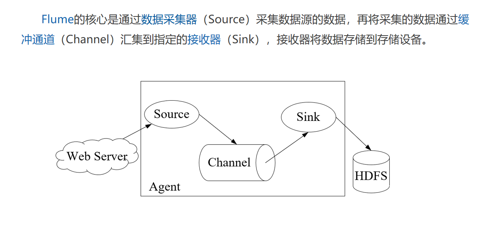

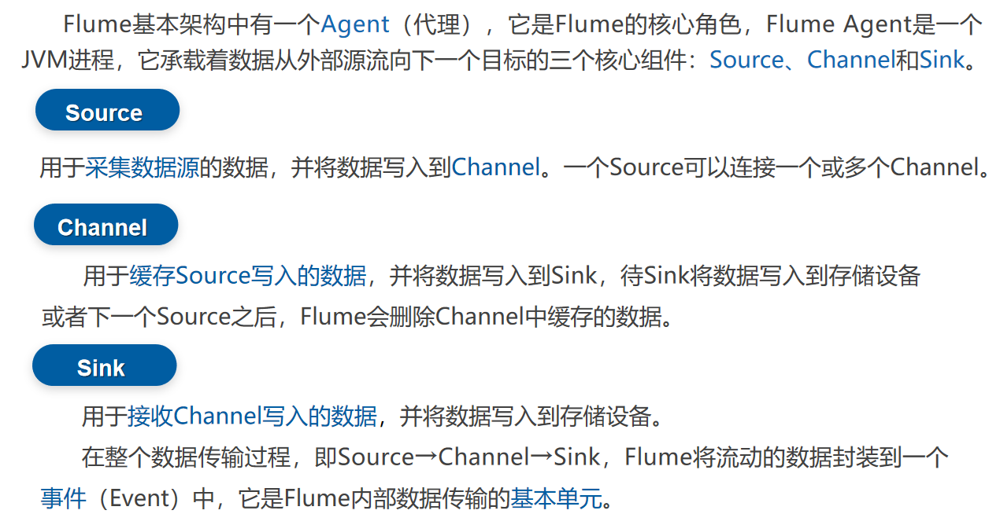


#### ② 多Agent结构

​	Flume复杂结构--多Agent：

​	在某些实际应用场景中，Flume日志采集系统需要采集数据的数据源分布在不同的服务器上，可以再分配一个Agent来采集其他Agent从Web Server采集的日志，对这些日志进行汇总后写入到存储系统。

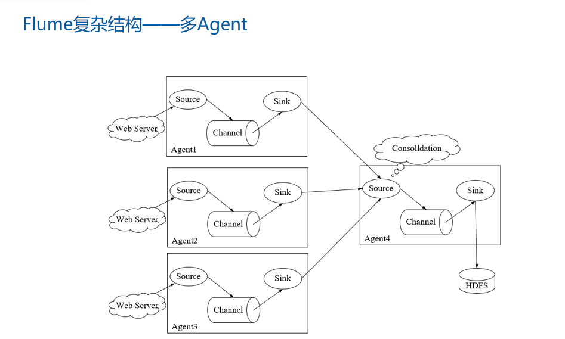


#### ③ 多路复用流

​	Flume复杂结构--多路复用流：

​	在某些实际应用场景中，还有可能遇到一对多的存储形式，即一个数据源采集的数据存储到不同存储系统，这种存储形式在Flume中被称为多路复用流。

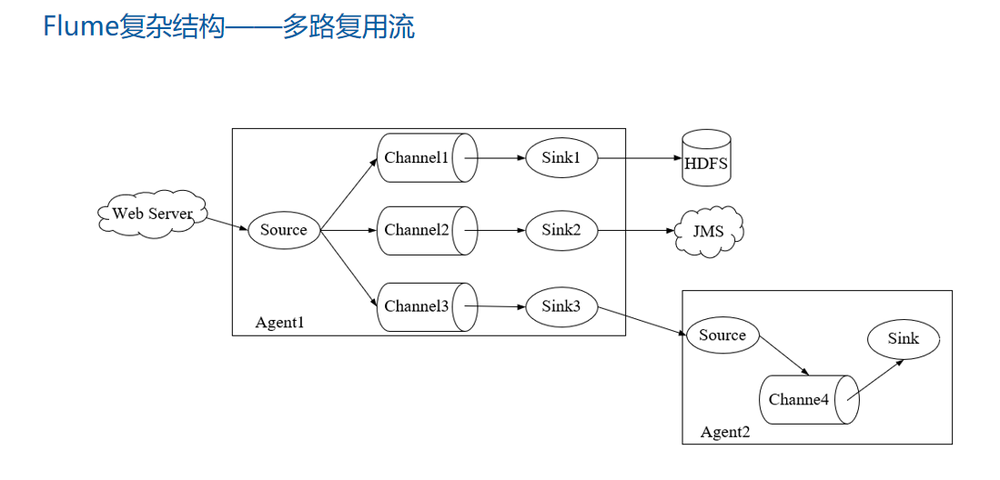


## 6.3 Flume三大组件的类型

### 6.3.1 Source类型

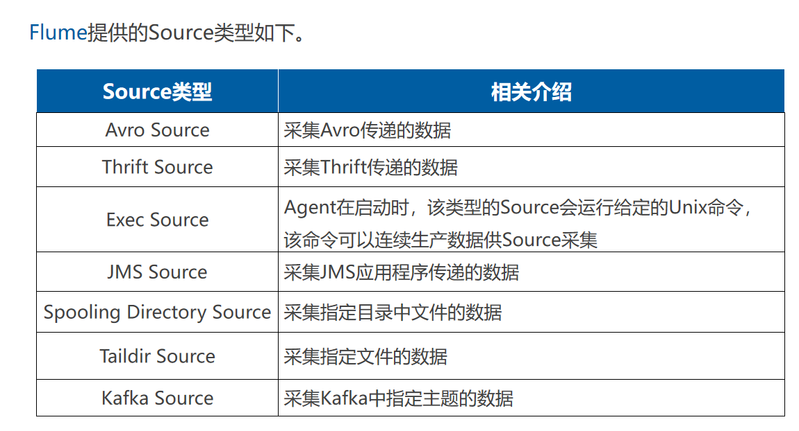

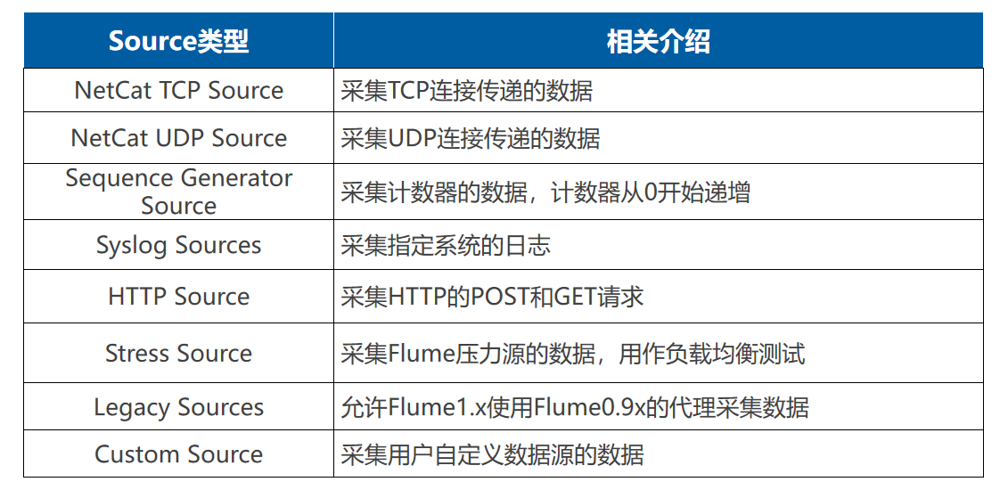


### 6.3.2 Channel类型

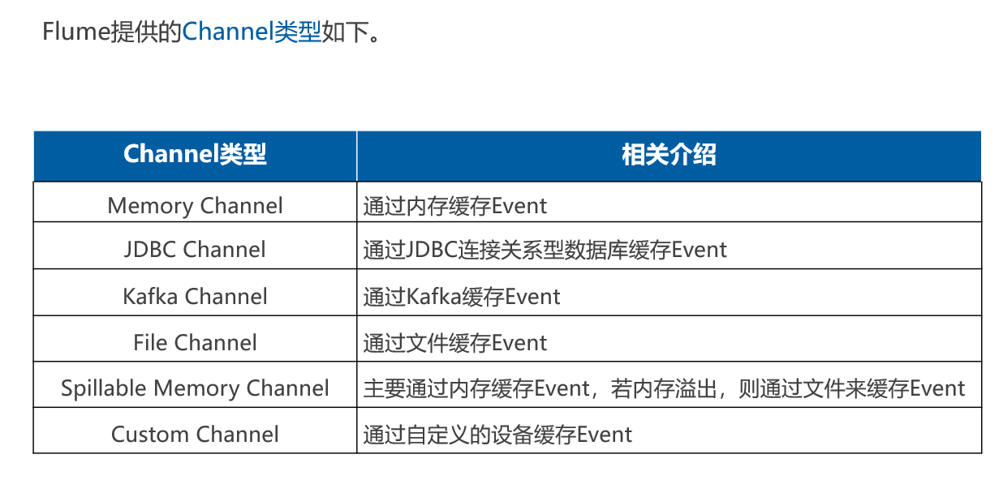


其中比较常用的Channel是[Memory Channel]()和File Channel

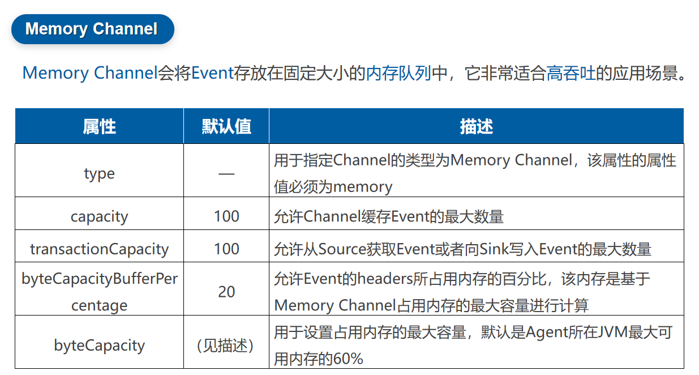

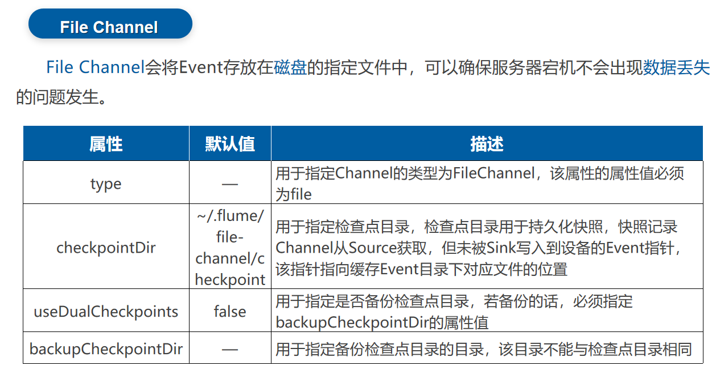

### 6.3.3 Sink类型

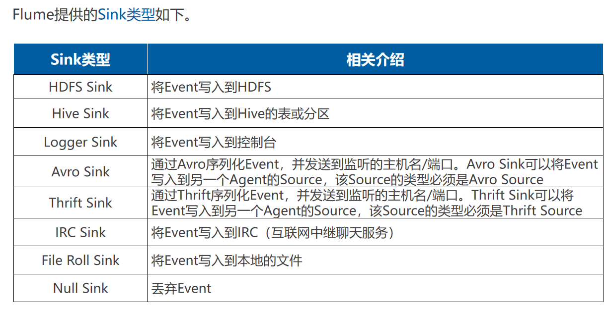

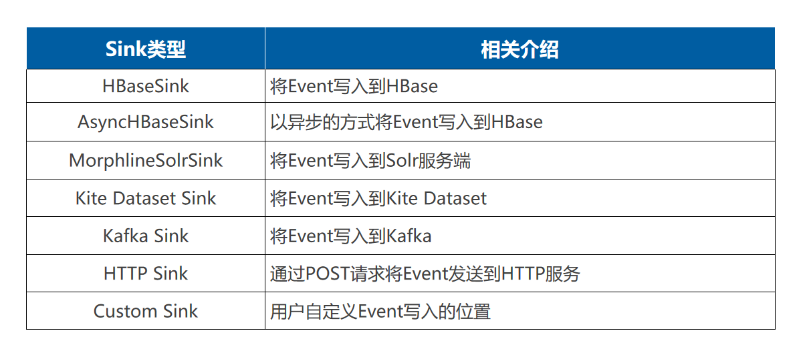


## 6.4 Flume的使用

​	本节的目标是熟悉Flume的基本使用，能够使用[指定采集方案启动Agent实现采集数据]()4

### 6.4.0 Flume采集步骤

使用Flume进行数据采集时：

1. 需要先自定义配置文件来指定采集方案

   （采集方案的内容包含Source采集数据的数据源、Channel缓存数据的设备，以及Sink写入数据的存储设备等）

2. 然后通过自定义的配置文件启动Agent实现数据采集


### 6.4.1 案例1：Flume采集natcat端口数据

#### ① 安装netcat工具

netcat工具说明

```tex
Netcat 号称 TCP/IP 的瑞士军刀，以体积小（可执行 200KB）功能灵活而著称，可以用来做很多网络相关的工作，例如信息传输。这里用来配合 flume 实现网络传输
```

1. 工具安装

```shell
#分别在master、slave1、slave2节点执行下面命令进行工具安装。
yum install -y nc
```


2.工具测试

**在master节点和slave1节点，尝试使用netcat工具进行通信**。

```shell
(1)首先在master节点输入以下命令，master作为通信服务端，端口号为44444
nc -localhost 44444
```


如图所示，master服务端一直等待客户端接入。

```shell
(2)在slave1节点输入以下命令，slave1作为通信的客户端，去连接服务端master
nc master 44444
```


如图所示，slave1客户端等待用户输入通信内容。

```shell
(3)尝试在slave1上输入以下内容发送到master上
hello,java
```


**在master节点上查看，是否有信息传输过来，如下图所示。**


```shell
(4)尝试在master节点输入以下内容发送到slave1上
hello,hadoop
```


**在slave1节点上查看，是否有信息传输过来，如下图所示。**


**通过测试，可知工具netcat能成功进行通信。**

#### ② 关闭netcat服务

```shell
键盘 ctrl+C 可以中止netcat服务
```

#### ③ Flume采集端口数据

```
案例说明：
flume 的 source 组件使用 netcat 来接收 44444 端口接收信息，并将 channel 设计为内存类型，然后 sink 在控制台输出接收到的信息。
```

1. 在Flume安装目录下创建一个工作目录“job”，主要用来存放flume采集的所有任务

```shell
mkdir /usr/local/src/flume/job
```


2. 在job目录下创建flume采集工作的**任务文件**

```shell
(1)创建任务文件netcat_flume_logger.conf，名字自定义。例如本案例，采集的数据源是从netcat来的，采集到的数据发送到控制台上。因此任务文件如此设计。
vi /usr/local/src/flume/job/netcat_flume_logger.conf
```

在netcat_flume_logger.conf文件中添加如下信息：

```shell
#配置数据源source
a1.sources = r1                              #给sources组件起别名r1
a1.sources.r1.type = netcat                  #指定数据源从netcat中采集
a1.sources.r1.bind = master                  #指定数据源的主机
a1.sources.r1.port = 44444                   #指定数据源主机的端口号，表明数据从master主机上netcat工具的44444                                              #端口采集数据

#配置 channel 通道
a1.channels = c1                             #给channels组件起别名c1
a1.channels.c1.type = memory                 #指定 channels 的类型为内存
a1.channels.c1.capacity = 1000               #指定 channels 一次传输的最大数量
a1.channels.c1.transactionCapacity = 100     #指定 channels 一次传输的数量，但是值要小于capacity

#配置sink 输出
a1.sinks = k1                                #给sinks组件起别名k1
a1.sinks.k1.type = logger                    #指定数据发送到控制台

#配置整个数据的流向
a1.sources.r1.channels = c1                  #source组件采集到的数据发送到channel通道里
a1.sinks.k1.channel = c1                     #sink组件获取channel通道的数据，最终sink组件将数据发送到指定地方
```


3.启动flume采集任务

```shell
输入以下命令启动flume采集任务：
flume-ng agent -c /usr/local/src/flume/job/ -f /usr/local/src/flume/job/netcat_flume_logger.conf -n a1 -Dflume.root.logger=info,console
```


[flume-ng启动Agent命令]()的解释

flume-ng agent：表示通过命令行工具flume-ng启动Agent。

•参数-n：指定Agent的唯一标识符，与采集方案中指定Agent的唯一标识符保持一致。

•参数-c：指定Flume配置文件的路径。

•参数-f：指定采集方案的文件。

•参数-Dflume.root.logger=INFO,console：指定Agent运行过程中输出到控制台的日志级别。


### 6.4.2 案例2：Flume采集文件数据（Unix命令版）


#### ① 案例说明 

​	flume 的 source 组件接收指定文件内容，并将 channel 设计为内存类型，然后 sink 在控制台输出接收到的信息。
[在案例1的基础上，只需要修改source组件的数据源即可]()


#### ② 创建任务文件

在job目录下创建flume采集工作的**任务文件**

```shell
(1)创建任务文件file_flume_logger.conf
vi /usr/local/src/flume/job/file_flume_logger.conf
```


#### ③ 设置采集方案

在[file_flume_logger.conf]()文件中添加如下信息：

```shell
#配置数据源source
a1.sources = r1                              #给sources组件起别名r1
a1.sources.r1.type = exec                    #表示使用shell指令
a1.sources.r1.command = tail -F /opt/software/flume_test1.log                  #采集文件数据


#配置 channel 通道
a1.channels = c1                             #给channels组件起别名c1
a1.channels.c1.type = memory                 #指定 channels 的类型为内存
a1.channels.c1.capacity = 1000               #指定 channels 一次传输的最大数量
a1.channels.c1.transactionCapacity = 100     #指定 channels 一次传输的数量，但是值要小于capacity

#配置sink 输出
a1.sinks = k1                                #给sinks组件起别名k1
a1.sinks.k1.type = logger                    #指定数据发送到控制台

#配置整个数据的流向
a1.sources.r1.channels = c1                  #source组件采集到的数据发送到channel通道里
a1.sinks.k1.channel = c1                     #sink组件获取channel通道的数据，最终sink组件将数据发送到指定地方
```


#### ④ 创建目标文件

在/opt/software下面创建flume_test1.log文件

```shell
vi /opt/software/flume_test1.log
#并随机输入以下内容
```


#### ⑤ 启动flume采集任务

```shell
输入以下命令启动flume采集任务：
flume-ng agent -c /usr/local/src/flume/job/ -f /usr/local/src/flume/job/file_flume_logger.conf -n a1 -Dflume.root.logger=info,console
```


#### ⑥ 继续向文件中添加数据

```shell
重新开启一个master的终端，继续往flume_test1.log中添加数据，查看flume的采集情况，如下图重新打开一个master终端
```


```shell
#编辑flume_test1.log文件
vi /opt/software/flume_test1.log
#并随机在文件末尾添加以下内容
```


```
检查flume的采集情况，如下图所示
```


### 6.4.3 案例3：Flume采集数据保存到HDFS


​	[HDFS Sink]()会将Event写入到HDFS的文件中进行存储，文件的形式可以是文本文件或者序列化文件，并且还可以对文件进行压缩。

​	HDFS Sink的基本属性如下：


​	对于HDFS Sink来说，可以设置转义字符和时间格式


#### ① 案例说明

案例说明：
	flume 的 source 组件接收指定文件内容，并将 channel 设计为内存类型，然后 sink端将[接受到的数据保存到HDFS上面]()。
	[在案例2的基础上，只需要修改HDFS组件的保存地方即可。]()


#### ② 创建任务文件

```shell
vi /usr/local/src/flume/job/dir_flume_hdfs.conf
```


#### ③ 设置采集方案

```shell
#指定 sources 的别名 
a1.sources = r1
#指定 sinks 的别名
a1.sinks = k1
#指定 channels的别名
a1.channels = c1

a1.sources.r1.type = exec                    #表示使用shell指令
a1.sources.r1.command = tail -F /opt/software/flume_test1.log                  #采集文件数据


#指定 sinks 的类型为hdfs类型
a1.sinks.k1.type = hdfs

#hdfs上传的路径,根据hadoop配置（core-site.xml中的<name>fs.defaultFS</name>对应的value值）决定。路径名称按照 "hdfs://mycluster/flume/test/年月日/小时"动态保存
#其中%Y表示当前的年份，%m表示当前的月份，%表示当前的日,%H表示当前的小时（24小时制）
a1.sinks.k1.hdfs.path = hdfs://master:9000/flume/test/%Y-%m-%d/%H

#上传文件的前缀，即上传的文件都以"logs-"开始
a1.sinks.k1.hdfs.filePrefix=logs-


#是否按照时间滚动文件夹（这里的前提是目录是在a1.sinks.k1.hdfs.path设置了动态的路径名"%Y%m%d/%H"，即文件夹名称随时间变化，否则即使这里设置了true也会因目录名相同而覆盖），round设置了true后，后面的roundValue、roundUnit这些设置才会生效
a1.sinks.k1.hdfs.round=true
#间隔多久创建一个新的文件夹，时间单位在下面的a1.sinks.k1.hdfs.roundUnit中定义
a1.sinks.k1.hdfs.roundValue=1
#重新定义事件单位为小时，默认是秒。这里可以设置为second,minute,hour
a1.sinks.k1.hdfs.roundUnit=hour

#是否使用本地时间戳，默认不使用。因为上面设置的文件夹的滚动时要依据时间创建新的文件夹，所以就需要配置这个属性为true。
a1.sinks.k1.hdfs.useLocalTimeStamp=true

# Flume采集数据，在生成的HDFS文件中，总是有“SEQ!org.apache.hadoop.io.LongWritable"org.apache.hadoop.io.BytesWritablesɧÿ577ĂwОn=찅”信息
# hdfs.fileType默认为SequenceFile，修改为DataStream解决乱码问题
a1.sinks.k1.hdfs.fileType=DataStream

#配置channel通道
#指定 channels 的类型为内存，这样速度快，但是关机后可能会丢失
a1.channels.c1.type = memory
#指定 channels 的通道的容量/大小，单位为事件
a1.channels.c1.capacity = 1000
#指定 channels一次传输的的数量，单位为事件
a1.channels.c1.transactionCapacity = 100

#指定channels和那几个source连接，注意source可以是多个
a1.sources.r1.channels = c1
a1.sinks.k1.channel = c1
```


#### ④ 启动flume采集任务

​	先移除之前案例在HDFS生成的flume文件（以免影响本案例测试结果）

```shell
hadoop fs -rm -r /mytest2
```

​	启动采集任务

```shell
flume-ng agent -n a1  -c /usr/local/src/flume/job/ -f /usr/local/src/flume/job/dir_flume_hdfs.conf 
```

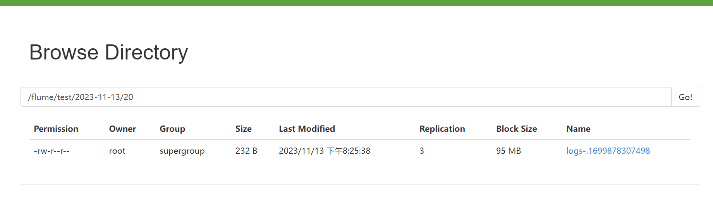

#### ⑤ 继续向文件中添加数据

```shell
重新开启一个master的终端，继续往flume_test1.log中添加数据，到HDFS上查看flume的采集情况
```


### 6.4.4 案例4：Flume监听指定目录


[Spooling Directory Source]()负责监控磁盘的指定目录是否有新增的文件。

若存在新增文件，则采集该文件内的数据。

当该文件内的数据全部处理完成后，[Spooling Directory Source]()可以重命名该文件或者删除该文件。

需要注意的是，如果文件放入到[Spooling Directory Source]()监控的目录之后，**还在进行写入数据的操作，那么Flume会打印错误日志，并且停止采集该文件的数据。**


[Spooling Directory Source]()的常用属性


#### ① 案例说明 

​	flume 的 source 组件接收指定文件内容，并将 channel 设计为内存类型，然后 sink 在hdfs输出接收到的信息。
[在案例1的基础上，只需要修改source组件的数据源即可]()

​	主要修改source端为监听一个目录。

​	但是监听目录的时候，只监听目录内文件数量的增加（默认500毫秒扫描一次），即文件内容如果追加了内容，不会被采集进去。


#### ② 创建任务文件

在job目录下创建flume采集工作的**任务文件**

```shell
(1)创建任务文件file_flume_logger.conf
vi /usr/local/src/flume/job/dir_flume_logger.conf
```


#### ③ 设置采集方案

在[file_flume_logger.conf]()文件中添加如下信息：

```shell
#指定 sources 的别名 
a1.sources = r1
#指定 sinks 的别名
a1.sinks = k1
#指定 channels的别名
a1.channels = c1

#配置source采集器
#指定 sources 的类型为spooldir，表示要监控文件夹。
a1.sources.r1.type = spooldir
#指定要扫描的目录，linux上的路径。但是监控文件夹后，只扫描文件是否增加，不再监听文件的变化，即文件内容变化也不会再被采集。
a1.sources.r1.spoolDir= /opt/demo/flume/dir
#默认也是COMPLETED，如果不改变可以不填该选项。该选项的作用表示当采集器扫描过指定文件目录下的文件，并将里面的内容采集后，会自动为该文件增加一个后缀名（如a.txt扫描后变为a.txt.COMPLETED），拥有了后缀名的文件就不会再次被扫描采集信息，因此文件内容及时发生变化flume也不会采集。
#说明，如果是放入一个文件b.txt.COMPLETED，那么该文件不会被flume认为是新的文件而采集。因此可以根据需要设定这个后缀名的名称，保证不与放进来的文件后缀名重名。
a1.sources.r1.fileSuffix= .COMPLETED
#以正则表达式配置扫描目录内哪些文件默认不采集（这里正则表达式设置为：tmp后缀的文件不进行采集
#为什么设定这个？因为文件夹监控不会采集动态变化的文件，因此可以假设场景，如果一个日志文件还在不断追加当中，可以先设置为tmp后缀，即不进行采集，等日志完成后再去掉tmp后缀，由flume采集，这样就保证了日志业务的需求。这个案例会在后面会进行练习。
a1.sources.r1.ignorePattern=([^ ]*\.tmp)


#指定 sinks 的类型为hdfs类型
a1.sinks.k1.type = hdfs
#hdfs上传的路径,根据hadoop配置（core-site.xml中的<name>fs.defaultFS</name>对应的value值）决定。路径名称按照 "hdfs://mycluster/flume/test/年月日/小时"动态保存
#其中%Y表示当前的年份，%m表示当前的月份，%表示当前的日,%H表示当前的小时（24小时制）
a1.sinks.k1.hdfs.path = hdfs://master:9000/flume/mytest/
#上传文件的前缀，即上传的文件都以"logs-"开始
a1.sinks.k1.hdfs.filePrefix=logs-
# Flume采集数据，在生成的HDFS文件中，总是有“SEQ!org.apache.hadoop.io.LongWritable"org.apache.hadoop.io.BytesWritablesɧÿ577ĂwОn=찅”信息
# hdfs.fileType默认为SequenceFile，修改为DataStream解决乱码问题
a1.sinks.k1.hdfs.fileType=DataStream


#配置channel通道
#指定 channels 的类型为内存，这样速度快，但是关机后可能会丢失
a1.channels.c1.type = memory
#指定 channels 的通道的容量/大小，单位为事件
a1.channels.c1.capacity = 1000
#指定 channels一次传输的的数量，单位为事件
a1.channels.c1.transactionCapacity = 100

#指定channels和那几个source连接，注意source可以是多个
a1.sources.r1.channels = c1
a1.sinks.k1.channel = c1
```


#### ④ 创建要扫描的目录

​	在/opt/software下面创建flume_test1.log文件

```shell
mkdir -p /opt/demo/flume/dir
```

​	在创建的dir目录下创建一个测试文件

```shell
vi /opt/demo/flume/dir/a.txt
# 自己顺便写点东西
```


#### ⑤ 启动flume采集任务

​	移除之前的测试目录

```shell
hadoop fs -rm -r /mytest2
```

​	启动任务

```shell
输入以下命令启动flume采集任务：
flume-ng agent -c /usr/local/src/flume/job/  -f /usr/local/src/flume/job/dir_flume_hdfs.conf  -n a1
```


#### ⑥ 继续在目录新建文件夹

```shell
重新开启一个master的终端，继续往flume_test1.log中添加数据，查看flume的采集情况，如下图重新打开一个master终端
```

```shell
vi /opt/demo/flume/dir/b.txt
vi /opt/demo/flume/dir/c.txt
vi /opt/demo/flume/dir/d.txt
# 自己随便写些东西
```


#### 拓展：用MR词频统计计算Flume收集到数据

​	Flume已经完成了大数据项目中的数据采集工作，将文件夹监控的数据采集到HDFS平台中，那么有了原始数据之后，我们就可以通过计算程序（MapReduce）进行计算。

​	词频统计WordCountDriver代码（其余两部分代码略）

```java
package com.lcvc.wordcount;

import org.apache.hadoop.conf.Configuration;
import org.apache.hadoop.fs.Path;
import org.apache.hadoop.io.IntWritable;
import org.apache.hadoop.io.Text;
import org.apache.hadoop.mapreduce.Job;
import org.apache.hadoop.mapreduce.lib.input.FileInputFormat;
import org.apache.hadoop.mapreduce.lib.output.FileOutputFormat;


import java.io.FileOutputStream;
import java.io.IOException;

public class WordCountDriver {
    public static void main(String[] args) throws IOException, ClassNotFoundException, InterruptedException {
        // 1.创建configuration类
        Configuration configuration = new Configuration();
        // 2.配置通信地址
        configuration.set("fs.defaultFS", "hdfs://master:9000");
        // 3.配置MapReduce运行模型
        // local 本地 单机模式
        // yarn 集群模式 通过资源调度器，调度给集群所有的机子进行计算
        configuration.set("mapreduce.framework.name", "local");  // 集群运行模式

        System.setProperty("HADOOP_USER_NAME", "root");
        // configuration.set("mapreduce.framework.name", "local");  // 本地运行模式


        // 4.创建Job类
        Job job = Job.getInstance(configuration);

        /**
         *  job要关联所有的类
         */

        // 5.job关联主程序类
        job.setJarByClass(WordCountDriver.class);

        // 6.job关联Mapper类和Reduce
        job.setMapperClass(WordCountMapper.class);
        job.setReducerClass(WordCountReducer.class);

        // 7.job设置输出类型
        job.setOutputKeyClass(Text.class);    // 设置输出值的键类型
        job.setOutputValueClass(IntWritable.class);  // 设置输出值的值类型


        // 8.设置输入输出路径
        FileInputFormat.setInputPaths(job, new Path("/flume/test"));
        FileOutputFormat.setOutputPath(job, new Path("/output_flume1/"));

        // 9.提交任务
        boolean result = job.waitForCompletion(true);  // 成功返回ture， 失败返回false


        // 10.当任务结束时退出程序
        System.exit(result ? 0 : 1);  // 失败返回1
    }
}
```

​	统计出来的结果

​	


​	这样就实现了从数据采集--->数据存储-->数据计算的简单流程。

### 6.4.5 案例5：多数据源（以采集文件数据为例）

​	在我们的实际应用中，不止会向单一数据源进行数据采集，假如这样一个应用场景，服务器在实时地产生日志，日志主要存储在日志文件[/opt/software/flume_t1.log](/opt/software/flume_t1.log)和[/opt/software/flume_t2.log](/opt/software/flume_t2.log)。

​	也就是存在[多个source]()的情况。

#### ① 案例说明

[在案例2的基础上，增加source组件的数据源]()，从采集单个文件的数据，增加到采集多个文件的数据

#### ② 创建任务文件

在job目录下创建flume采集工作的**任务文件**

```shell
(1)创建任务文件file_flume_logger.conf
vi /usr/local/src/flume/job/file_multi_flume_logger.conf
```

#### ③ 设置采集方案

在[file_multi_flume_logger.conf]()文件中添加如下信息：

```shell
#配置数据源source
a1.sources = r1 r2                           # 两个数据源 r1和r2
a1.sources.r1.type = exec                    #表示使用shell指令
a1.sources.r1.command = tail -F /opt/software/flume_t1.log                  #采集文件数据
a1.sources.r2.type = exec                    #表示使用shell指令
a1.sources.r2.command = tail -F /opt/software/flume_t2.log                  #采集文件数据

#配置 channel 通道
a1.channels = c1                             #给channels组件起别名c1
a1.channels.c1.type = memory                 #指定 channels 的类型为内存
a1.channels.c1.capacity = 1000               #指定 channels 一次传输的最大数量
a1.channels.c1.transactionCapacity = 100     #指定 channels 一次传输的数量，但是值要小于capacity

#配置sink 输出
a1.sinks = k1                                #给sinks组件起别名k1
a1.sinks.k1.type = logger                    #指定数据发送到控制台

#配置整个数据的流向
a1.sources.r1.channels = c1                  #source组件采集到的数据发送到channel通道里 r1
a1.sources.r2.channels = c1					 #source组件采集到的数据发送到channel通道里 r
a1.sinks.k1.channel = c1                     #sink组件获取channel通道的数据，最终sink组件将数据发送到指定地方
```

#### ④ 创建目标文件

在/opt/software下面创建flume_test1.log文件

```shell
vi /opt/software/flume_t1.log
vi /opt/software/flume_t2.log
#并随机输入以下内容
```


#### ⑤ 启动flume采集任务

```shell
输入以下命令启动flume采集任务：
flume-ng agent -c /usr/local/src/flume/job/ -f /usr/local/src/flume/job/file_multi_flume_logger.conf -n a1 -Dflume.root.logger=info,console
```


#### ⑥ 继续向文件中添加数据

```shell
重新开启一个master的终端，继续往flume_test1.log中添加数据，查看flume的采集情况，如下图重新打开一个master终端
```


```shell
#编辑flume_t1.log文件
vi /opt/software/flume_t1.log
#编辑flume_t2.log文件
vi /opt/software/flume_t2.log
```


​	


## 6.5 Flume拦截器

​	学习目标：掌握Flume拦截器，能够灵活使用拦截器修改Event

​	Flume拦截器（[Interceptors]()）是Flume提供的一个插件式组件，它[应用于Source组件]()，可以根据开发人员执行的规则将Source写入Channel的Event进行[修改]()。

​	每个Source可以指定多个拦截器，并且指定多个拦截器的顺序就是修改Event的顺序。


### 6.5.0 Event事件

​	**[Event]()：**agent中的事件，Flume数据传输的基本单元，[以Event的形式将数据从源头送至目的地]()。

​	如果案例1控制台的输出：


​	这就是一个Event


​	[Event]()的格式如下：


**特点：**Event由**Header**和**Body**两部分组成，

​	**① Header**：用来存放该event的一些属性，为K-V结构

​	**② Body**：用来存放该条数据，形式为字节数组。


而拦截器的功能就是去拦截并修改[Event]()


### 6.5.1 拦截器类型

​	Flume提供了多种类型的拦截器供用户使用，具体如下：

|           **拦截器**            |                           **介绍**                           |
| :-----------------------------: | :----------------------------------------------------------: |
|     Timestamp  Interceptor      | 时间戳拦截器，用于向Event的headers中添加时间戳，时间戳精确到毫秒。 |
|        Host  Interceptor        | 主机拦截器，用于向Event的headers中添加当前Agent所在服务器的主机名或IP地址。 |
|       Static  Interceptor       |    静态拦截器，用于向Event的headers中添加自定义的键值对。    |
|   Remove  Header Interceptor    |   移除属性拦截器，用于删除Event中headers的单个或多个属性。   |
|        UUID  Interceptor        |        唯一识别码拦截器，用于为Event添加唯一标识码。         |
|     Morphline  Interceptor      | Morphline拦截器，可以通过morphline配置文件过滤Event，该文件中定义了一系列转换命令，可以将Event从一个命令传递到另一个命令。 |
| Search  and Replace Interceptor | 查询和替换拦截器，可以基于正则表达式查询Event中body的数据信息，并对body的数据信息进行替换。 |
|  Regex  Filtering Interceptor   | 正则过滤器，可以基于正则表达式匹配Event中body的数据信息，并根据匹配结果选择丢弃或保留Event。 |
|  Regex  Extractor Interceptor   | 正则提取拦截器，可以基于正则表达式匹配Event中body的数据信息，并将匹配的数据信息以键值对的形式添加到Event的headers中，其中键需要用户自定义；值是body的数据信息。 |


### 6.5.2 时间戳拦截器

​	[Timestamp Interceptor]()用于向Event的headers添加记录时间戳的属性，其中属性的键默认为timestamp，不过可以通过Timestamp Interceptor提供的属性进行自定义，属性的值为当前系统的时间戳。

|       属性       |  默认值   |                             描述                             |
| :--------------: | :-------: | :----------------------------------------------------------: |
|       type       |     —     | 用于指定过滤器的类型为Timestamp Interceptor，该属性的属性值必须为timestamp。 |
|    headerName    | timestamp |     用于向Event的headers添加时间戳的属性时指定键的名称。     |
| preserveExisting |   false   |    是否保留headers中属性的键与时间戳属性的键相同的属性。     |

​	在案例1的基础上增加时间戳拦截器（按照案例1步骤操作，操作步骤略）	

​	创建采集方案	

```shell
vi /usr/local/src/flume/job/netcat_time_flume_logger.conf
```

​	在netcat_time_flume_logger.conf文件中添加如下信息：

```shell
#配置数据源source
a1.sources = r1                              #给sources组件起别名r1
a1.sources.r1.type = netcat                  #指定数据源从netcat中采集
a1.sources.r1.bind = master                  #指定数据源的主机
a1.sources.r1.port = 44444                   #指定数据源主机的端口号，表明数据从master主机上netcat工具的                                             	 #44444端口采集数据
a1.sources.r1.interceptors = i1				 # 设置拦截器的唯一标识符为i1
a1.sources.r1.interceptors.i1.type = timestamp	# 标识符为i1的拦截器类型为Timestamp Interceptor

#配置 channel 通道
a1.channels = c1                             #给channels组件起别名c1
a1.channels.c1.type = memory                 #指定 channels 的类型为内存
a1.channels.c1.capacity = 1000               #指定 channels 一次传输的最大数量
a1.channels.c1.transactionCapacity = 100     #指定 channels 一次传输的数量，但是值要小于capacity

#配置sink 输出
a1.sinks = k1                                #给sinks组件起别名k1
a1.sinks.k1.type = logger                    #指定数据发送到控制台

#配置整个数据的流向
a1.sources.r1.channels = c1                  #source组件采集到的数据发送到channel通道里
a1.sinks.k1.channel = c1                     #sink组件获取channel通道的数据，最终sink组件将数据发送到指定地方
```

​	启动任务(一行)

```shell
输入以下命令启动flume采集任务：
flume-ng agent -c /usr/local/src/flume/job/ -f /usr/local/src/flume/job/netcat_time_flume_logger.conf -n a1 -Dflume.root.logger=info,console
```


### 6.5.3 **静态拦截器**

​	[Static Interceptor]()用于将用户自定义的属性添加到Event的headers中，其中属性的键和值都需要用户自定义。

在案例1的基础上增加时间戳拦截器（按照案例1步骤操作，操作步骤略）	

​	创建采集方案	

```shell
vi /usr/local/src/flume/job/netcat_staitc_flume_logger.conf
```

​	在netcat_static_flume_logger.conf文件中添加如下信息：

```shell
#配置数据源source
a1.sources = r1                              #给sources组件起别名r1
a1.sources.r1.type = netcat                  #指定数据源从netcat中采集
a1.sources.r1.bind = master                  #指定数据源的主机
a1.sources.r1.port = 44444                   #指定数据源主机的端口号，表明数据从master主机上netcat工具的                                             	 #44444端口采集数据
a1.sources.r1.interceptors = i1				 # 设置拦截器的唯一标识符为i1
a1.sources.r1.interceptors.i1.type = static	# 标识符为i1的拦截器类型为Static Interceptor
a1.sources.r1.interceptors.i1.key = datacenter # 自定义属性的键为datacenter
a1.sources.r1.interceptors.i1.value = Lcvc_BigData # 自定义属性的值为Lcvc_BigData


#配置 channel 通道
a1.channels = c1                             #给channels组件起别名c1
a1.channels.c1.type = memory                 #指定 channels 的类型为内存
a1.channels.c1.capacity = 1000               #指定 channels 一次传输的最大数量
a1.channels.c1.transactionCapacity = 100     #指定 channels 一次传输的数量，但是值要小于capacity

#配置sink 输出
a1.sinks = k1                                #给sinks组件起别名k1
a1.sinks.k1.type = logger                    #指定数据发送到控制台

#配置整个数据的流向
a1.sources.r1.channels = c1                  #source组件采集到的数据发送到channel通道里
a1.sinks.k1.channel = c1                     #sink组件获取channel通道的数据，最终sink组件将数据发送到指定地方
```

​	启动任务(一行)

```shell
输入以下命令启动flume采集任务：
flume-ng agent -c /usr/local/src/flume/job/ -f /usr/local/src/flume/job/netcat_static_flume_logger.conf -n a1 -Dflume.root.logger=info,console
```


### 6.5.4 **正则过滤拦截器**

​	[Search and Replace Interceptor]()用于通过正则表达式查询Event中body的数据信息，若查询到某Event中body的数据信息与正则表达式匹配，则将该Event中body的数据信息替换为指定的数据信息。

​	创建采集方案	

```shell
vi /usr/local/src/flume/job/netcat_r_flume_logger.conf
```

​	在netcat_r_flume_logger.conf文件中添加如下信息：

```shell
#配置数据源source
a1.sources = r1                              #给sources组件起别名r1
a1.sources.r1.type = netcat                  #指定数据源从netcat中采集
a1.sources.r1.bind = master                  #指定数据源的主机
a1.sources.r1.port = 44444                   #指定数据源主机的端口号，表明数据从master主机上netcat工具的                                             	 #44444端口采集数据
a1.sources.r1.interceptors = i1				 # 设置拦截器的唯一标识符为i1
a1.sources.r1.interceptors.i1.type = search_replace	# 使用拦截器的类型为Search and Replace Interceptor
a1.sources.r1.interceptors.i1.searchPattern = [a-z] # 正则表达式为[a-z]，该正则表达式匹配a~z范围内的任意字符
a1.sources.r1.interceptors.i1.replaceString = 1 # 替换的数据信息为1


#配置 channel 通道
a1.channels = c1                             #给channels组件起别名c1
a1.channels.c1.type = memory                 #指定 channels 的类型为内存
a1.channels.c1.capacity = 1000               #指定 channels 一次传输的最大数量
a1.channels.c1.transactionCapacity = 100     #指定 channels 一次传输的数量，但是值要小于capacity

#配置sink 输出
a1.sinks = k1                                #给sinks组件起别名k1
a1.sinks.k1.type = logger                    #指定数据发送到控制台

#配置整个数据的流向
a1.sources.r1.channels = c1                  #source组件采集到的数据发送到channel通道里
a1.sinks.k1.channel = c1                     #sink组件获取channel通道的数据，最终sink组件将数据发送到指定地方
```

​	启动任务(一行)

```shell
输入以下命令启动flume采集任务：
flume-ng agent -c /usr/local/src/flume/job/ -f /usr/local/src/flume/job/netcat_r_flume_logger.conf -n a1 -Dflume.root.logger=info,console
```

​	


## 6.6 负载均衡

​	我们之前只是通过master一台主机进行数据采集，在Flume架构中，支持多主机进行数据采集，如果我们将master，slave1，slave2都作为数据采集器，实现分布式采集。

​	那么分布式采集中最重要的考虑就是负载均衡。


### 6.6.1 分发Flume

​	将flume组件分发给slave1，slave2

​	在master上执行

```shell
scp -r /usr/local/src/flume slave1:/usr/local/src/
scp -r /usr/local/src/flume slave1:/usr/local/src/
```


​	

​	master分发环境变量文件

```shell
scp /etc/profile slave1:/etc
scp /etc/profile slave1:/etc
```


​	在slave1和slave2上让环境变量生效

```
[root@slave1 ~]# source /etc/profile
[root@slave2 ~]# source /etc/profile
```


​	在slave1和slave2上测试flume安装成功

```
flume-ng version
```


### 6.6.2 负载均衡概述

​	负载均衡是指将Event均匀地分发到[不同Sink]()进行处理，可以通过Sink处理器提供的Load balancing Sink Processor（负载均衡接收器处理器）实现。

​	负载均衡接收器处理器提供了在[多个Sink]()上实现负载均衡的功能。

​	它支持使用[round_robin]()和[random]()两种选择机制分配Event。

​	其中[round_robin]()根据Sink Groups提供的Sink，[依次并循环]()向每个Sink分发Event，是默认的选择机制；

​	[random]()根据Sink Groups提供的Sink，[随机]()向不同的Sink分发Event。


负载均衡接收器处理器的常用属性如下

|             属性              |   默认值    |                             描述                             |
| :---------------------------: | :---------: | :----------------------------------------------------------: |
|             sinks             |      —      | 用于通过Sink的唯一标识符指定Sink Groups包含的Sink，每个Sink的唯一标识符用空格分隔。 |
|        processor.type         |   default   | 默认值表示不提供负载均衡功能，如果要实现负载均衡，则需要将默认值修改为load_balance |
|       processor.backoff       |    false    |             表示是否开启退避机制，默认为不开启。             |
|      processor.selector       | round_robin |     指定选择机制，round_robin表示轮询；random表示随机。      |
| processor.selector.maxTimeOut |    30000    |           指定黑名单中Sink的超时时间，单位为毫秒。           |


### 6.6.3 负载均衡案例

​	通过虚拟机master、slave1和slave2实现一个案例来演示负载均衡接收器处理器的基本配置和使用，使用负载均衡接收器处理器的结构图如下。

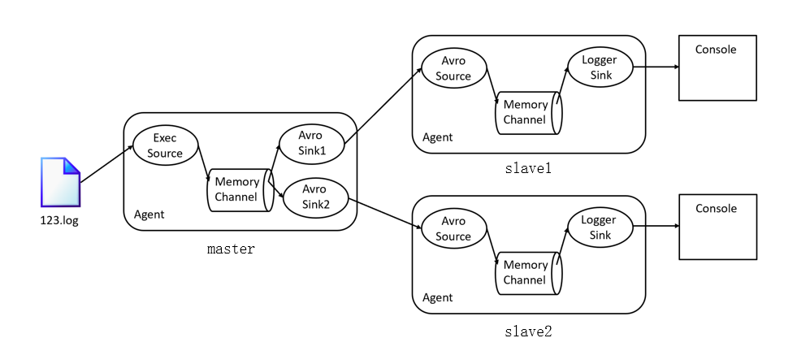


#### ① 指定master的采集方案

​	在master上创建采集方案

```shell
vi /usr/local/src/flume/job/master_exec_avro.conf
```


​	编写采集方案，如下:

```shell
# 分别定义Agent、Source、两个Sink和Channel的唯一标识符为a1、r1、k1、k2和c1
a1.sources  =  r1 
a1.sinks = k1 k2
a1.channels = c1

# 定义Source的类型为Exec Source
a1.sources.r1.channels = c1
a1.sources.r1.type = exec
a1.sources.r1.command = tail -F /opt/software/123.log

# 定义Channel的类型为Memory Channel，并且指定允许Channel缓存Event的最大数量为1000
a1.channels.c1.type = memory
a1.channels.c1.capacity = 1000

# 定义唯一标识符为k1的Sink类型为Avro Sink，指定主机名为slave1，指定端口号为53421，并且将标识符为k1的Sink与Channel建立连接
a1.sinks.k1.channel = c1
a1.sinks.k1.type = avro
a1.sinks.k1.hostname = slave1
a1.sinks.k1.port = 53421

# 定义唯一标识符为k2的Sink类型为Avro Sink，指定主机名为slave2，指定端口号为53421，并且将标识符为k2的Sink与Channel建立连接
a1.sinks.k2.channel = c1
a1.sinks.k2.type = avro
a1.sinks.k2.hostname = slave2
a1.sinks.k2.port = 53421

# 定义Sink Groups的唯一标识符为g1；定义Sink Groups包含的Sink的唯一标识符k1和k2；分别指定Sink处理的类型为负载均衡接收器处理器实现负载均衡、开启退避机制、使用随机选择机制，以及指定黑名单中Sink的超时时间为10000毫秒
a1.sinkgroups = g1
a1.sinkgroups.g1.sinks = k1 k2
a1.sinkgroups.g1.processor.type = load_balance
a1.sinkgroups.g1.processor.backoff = true
a1.sinkgroups.g1.processor.selector = random
a1.sinkgroups.g1.processor.maxTimeOut=10000

```


#### ② 指定slave1的采集方案

​	在虚拟机slave1的/usr/local/src/flume/job/目录下，自定义配置文件avro-logger1.conf，指定采集方案。

```
[root@slave1 ~]# vi /usr/local/src/flume/job/avro-logger1.conf
```

​	slave1采集方案如下：

```shell
a1.sources = r1
a1.sinks = k1
a1.channels = c1
a1.sources.r1.type = avro
a1.sources.r1.bind = slave1
a1.sources.r1.port = 53421
a1.sinks.k1.type = logger
a1.channels.c1.type = memory
a1.channels.c1.capacity = 1000
a1.channels.c1.transactionCapacity = 100
a1.sources.r1.channels = c1
a1.sinks.k1.channel = c1
```


#### ③ 指定slave2的采集方案

​	在虚拟机slave2的/usr/local/src/flume/job/目录下，自定义配置文件avro-logger2.conf，指定采集方案。

```
[root@slave2 ~]# vi /usr/local/src/flume/job/avro-logger2.conf
```

​	slave2采集方案如下：

```shell
a1.sources = r1
a1.sinks = k1
a1.channels = c1
a1.sources.r1.type = avro
a1.sources.r1.bind = slave2
a1.sources.r1.port = 53421
a1.sinks.k1.type = logger
a1.channels.c1.type = memory
a1.channels.c1.capacity = 1000
a1.channels.c1.transactionCapacity = 100
a1.sources.r1.channels = c1
a1.sinks.k1.channel = c1
```


#### ④ 在master上创建目标文件

```
[root@master ~]# vi /opt/software/123.log
```

​	随意输入内容


#### ⑤ 启动任务

​	**在slave1上执行**

```shell
flume-ng agent -n a1 -c /usr/local/src/flume/job/ -f /usr/local/src/flume/job/avro-logger1.conf \
-Dflume.root.logger=INFO,console
```

​	


​	**在slave2上执行**

```shell
flume-ng agent -n a1 -c /usr/local/src/flume/job/ -f /usr/local/src/flume/job/avro-logger2.conf \
-Dflume.root.logger=INFO,console
```


​	

​	**在master上执行**

```shell
flume-ng agent -n a1 -c /usr/local/src/flume/job/ -f /usr/local/src/flume/job/master_exec_avro.conf -Dflume.root.logger=INFO,console
```


​	**在虚拟机master启动的Agent中两个Sink都已经启动成功**


#### ⑥ 持续写入数据，测试负载均衡

​	打开一个master的新会话。


​	向[/opt/software/](/opt/software/)目录的[123.log](/opt/software/123.log)文件中持续写入数据，命令如下。

```shell
while true;do echo "flume flume ..." >> /opt/software/123.log;sleep 1;done
```

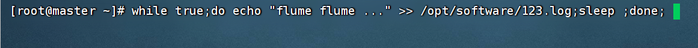


​	查看slave1和slave2的结果，发现**成功实现负载均衡**

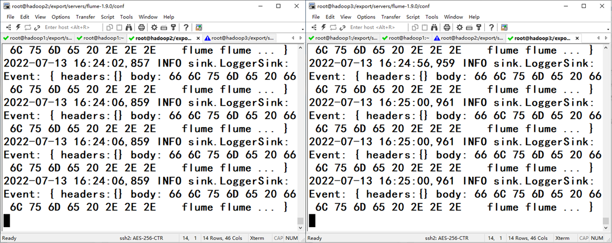


## 6.7 Flume复杂结构的使用（待续）

### 6.7.1 单数据源多出口

### 6.7.2 多路复用和拦截器的使用

### 6.7.3 聚合

