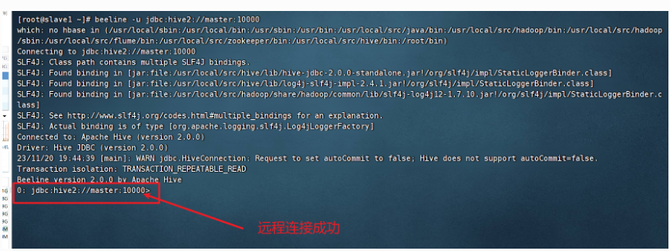

# 第7章 Hive数据仓库

​	Hive最初设计的目的是为了解决海量日志数据的分析而开发，它是建立在Hadoop基础上的数据仓库工具，用来对数据进行提取、转化和加载。

​	[Hive可以将结构化的数据文件映射为一张表]()，并定义了类似SQL的查询语言HiveQL，通过HiveQL实现的复杂查询语句能够转换为[MapReduce任务]()来执行。

​	本章将针对Hive数据仓库的相关内容进行详细讲解。

​	比如我们在MapReduce章节中最后学习的案例：


​	我们就可以将其通过Hive映射成一张表结构。


## 7.1 Hive的部署与安装

### 7.1.0 前提组件

**linux目录约定**

| /opt/software  | 存放软件安装包   |
| -------------- | ---------------- |
| /usr/local/src | 存放安装好的软件 |

**安装环境列表（主机名要求一致，IP地址按自己的实际地址设定）**

| 服务器主机/IP |            master            |      slave1       |      slave2       |
| :-----------: | :--------------------------: | :---------------: | :---------------: |
|    JDK环境    |         jdk1.8.0_141         |   jdk1.8.0_141    |   jdk1.8.0_141    |
|     HDFS      |           NameNode           |                   |                   |
|   nameNode    |           DataNode           |     DataNode      |     DataNode      |
|     YARN      | ResourceManager  NodeManager |    NodeManager    |    NodeManager    |
|   MapReduce   |       JobHistoryServer       |                   |                   |
|     mysql     |              √               |                   |                   |
|     hive      |      √  作为hive服务器       | √  作为hive客户端 | √  作为hive客户端 |


### 7.1.1 安装MySQL

​	补充说明：MySQL用于存储Hive[元数据]()，该模式称之为本地模式。

​	将默认存储元数据的Derby数据库（内嵌模式）替换为关系型数据库，如MySQL，从而摆脱由于Derby数据库存储元数据带来[元数据不共享的问题]()。

​	

#### ① 卸载linux自带的MariaDB


(1)首先检查下本机的MariaDB

```
[root@master ~]# rpm -qa | grep mariadb
```

​	说明：结果显示 Linux 系统中已经安装了 mariadb-libs-5.5.52-2.el7.x86_64 软件包，需要将其卸载


(2)卸载MariaDB

```shell
rpm -e --nodeps mariadb-libs-5.5.60-1.el7_5.x86_64
```

命令说明：

- rpm -qa 列出所有已安装软件包
- rpm -e packagename 删除软件包
- rpm -e --nodeps packagename 强制删除软件和依赖包
- rpm -q 包名 查询包是否安装
- rpm -ivh 包名 安装软件包
- 

#### ② 在master节点安装unzip命令

​	说明：后面需要解压缩mysql-5.7.18.zip

```shell
yum -y install unzip
```


#### ③ 安装MySQL必要的插件

​	安装perl插件：

```shell
yum -y install perl.x86_64
```


​	安装net-tools插件：

```shell
yum -y install net-tools
```


#### ④ 安装MySQL

(1)将mysql-5.7.18.zip压缩包上传到/opt/software下


(2)解压缩mysql-5.7.18.zip（必须先安装上一步的unzip插件）

```shell
unzip /opt/software/mysql-5.7.18.zip -d /opt/software/
```


(3)切换到mysql安装目录

```
cd /opt/software/mysql-5.7.18
```


(4)使用rpm下载mysql

​	按[顺序逐条]()执行下述命令

```
[root@master mysql-5.7.18]# rpm -ivh mysql-community-common-5.7.18-1.el7.x86_64.rpm
[root@master mysql-5.7.18]# rpm -ivh mysql-community-libs-5.7.18-1.el7.x86_64.rpm
[root@master mysql-5.7.18]# rpm -ivh mysql-community-client-5.7.18-1.el7.x86_64.rpm
[root@master mysql-5.7.18]# rpm -ivh --nodeps mysql-community-server-5.7.18-1.el7.x86_64.rpm
```


#### ⑤ 检查mysql安装组件是否完整

```shell
rpm -qa | grep mysql 
```


​	从结果可以看出，安装的四个组件都已经成功。


### 7.1.2 MySQL配置

#### ① 配置my.cnf文件

​	说明：[my.cnf]()是mysql配置文件，在安装mysql的时候会自动生成“[/etc/my.cnf](/etc/my.cnf)”。

​	(1)执行命令打开my.cnf文件

```shell
vi /etc/my.cnf
```

​	(2)在my.cnf文件中增加如下配置信息并保存([可以不做]())

```
#增加mysql配置信息
default-storage-engine=innodb
innodb_file_per_table
collation-server=utf8_general_ci
init-connect='SET NAMES utf8'
character-set-server=utf8
```


#### ② 启动mysql并查看启动状态

​	(1)启动Mysql服务

```shell
systemctl start mysqld
```


​	(2)查看mysql启动状态

```
systemctl status mysqld
```

​	可以看到服务状态如下


PS：如果Mysql启动报错，报如下错误


​	很大原因是数据文件冲突，删除原有的数据文件（[如果报错才删除，没报错千万别删！！！！]()）

```shell
rm -rf /var/lib/mysql/*
```

​	删除完后，再次启动MySQL，就解决报错问题了。

```shell
systemctl start mysqld
```


#### ③ 修改Mysql默认密码

(1)查看mysql初始密码（[密码为安装时随机生成，不要照搬]()）

```shell
cat /var/log/mysqld.log | grep password
```


​	比如我本次随机生成的密码是：

(2)重新设置密码

​	输入命令（安全配置向导命令）

```shell
mysql_secure_installation
```


​	输入正确后，出现如下提示，即要求[输入新密码]()


​	该界面要求输入root的新密码。

​	按照1+X大数据平台运维实训手册规则，统一设置密码为（[Password123$]()）。


#### ③ 安装配置环节

​	在设置完新密码后，会直接进入安装配置环节	

​	接下来会出现6个交互确认信息（[注意第4个交互信息]()），按照以下回答：

​	

[(1)交互信息1]()：Change the password for root ? ((Press y|Y for Yes, any other key for No)

​	表示是否更改 root 用户密码，可以点y在键盘[输入 y 和回车]()。


​	再次输入新的密码（[Password123$]()）：


[(2)交互信息2]():Do you wish to continue with the password provided?(Press y|Y for Yes, any other key for No)

​	表示是否使用设定的密码继续，在键盘[输入 y和回车]()


[(3)交互信息3]():Do you wish to continue with the password provided?(Press y|Y for Yes, any other key for No)

​	表示是否删除匿名用户，在键盘[输入y和回车]()


[(4)交互信息4]():Disallow root login remotely? (Press y|Y for Yes, any other key for No)

​	表示是否拒绝 root 用户远程登录，

​	[重要！！！！！！！！！！！！！]()

​	在 键盘[输入n 和回车]()，表示允许 root 用户远程登录。


[(5)交互信息5]():Remove test database and access to it? (Press y|Y for Yes, any other key for No)

​	表示是否删除测试数据库，在键盘[输入 y 和回车]()。


​	PS：test库在MySQL中特殊存在，一般部署完mysql后应当删除该库，并规定不能创建以test和test_字符开头的数据库。因为在mysql中，test库对任意用户都有管理员权限，会造成安全问题。


[(6)交互信息6]():Reload privilege tables now? (Press y|Y for Yes, any other key for No)

​	表示是否重新加载授权表，在键盘[输入 y 和回车]()。


#### ④ MySQL的登陆和注销

(1)使用前面步骤设置的新密码登陆MySQL

```shell
mysql -uroot -pPassword123$
```


(2)注销Mysql

​	输入注销命令

```
exit
```


### 7.1.3 在MySQL上创建Hive的元数据表

​	要将Hive 元数据存储在[MySQL]()上，因为需要在Mysql中创建好相应的库和表。

#### ① 登陆mysql

```shell
mysql -uroot -pPassword123$
```

#### ② 创建hive_db数据库

​	新建 hive_db 数据库作为 [Hive 的元数据存储地址]()（自定义）。

​	后续步骤中会在hive的配置文件hive-site.xml中指向本数据库。

​	其实在hive-site.xml中配置属性时会有属性createDatabaseIfNotExist=true的设定，即不存在相关数据库也会自动创建数据库。

​	

​	创建hive_db

```mysql
mysql>create database hive_db;
```


#### ③ 授权hive_db

​	赋予root用户对所有数据库所有表的所有权限，且任何地址都能建立连接“%”（即具有远程连接功能），并具有授予权。

```mysql
mysql>grant all privileges on *.* to 'root'@'%'identified by 'Password123$' with grant option;
```

​	命令说明

​	grant option：grant 权限 1,权限 2,...权限 n on 数据库名称.表名称 to 用户名@用户地址。


#### ④ 刷新MySQL

​	刷新 MySQL 的系统权限相关表，即让上一步设置的权限生效

```mysql
mysql>flush privileges;
```


​	完成后退出MySQL，准备进行hive的安装

```mysql
mysql>exit;
```


### 7.1.4 Hive部署

#### ① 上传Hive安装包到/opt/software/

​	将apache-hive-2.0.0-bin.tar.gz从windows拷贝到master节点的/opt/software目录下

​	结果如下：


#### ② 解压安装Hive

(1)在master节点解压apache-hive-2.0.0-bin.tar.gz到安装目录

```shell
tar -zxvf /opt/software/apache-hive-2.0.0-bin.tar.gz -C /usr/local/src
```

(2)更改apache-hive-2.0.0-bin.tar.gz安装文件夹的名字，方便后续操作

```shell
mv /usr/local/src/apache-hive-2.0.0-bin /usr/local/src/hive
```


#### ③ 配置环境变量

(1)在master节点配置hive环境变量

​	打开/etc/profile文件

```shell
vi /etc/profile
```

​	在打开的配置文件中的末尾加入配置信息并保存

```shell
# set hive environment
export HIVE_HOME=/usr/local/src/hive
export PATH=$PATH:$HIVE_HOME/bin
export HIVE_CONF_DIR=$HIVE_HOME/conf #Hive 的环境变量
```


(2)分发环境变量

```
[root@master ~]# scp /etc/profile slave1:/etc/
[root@master ~]# scp /etc/profile slave2:/etc/
```


(3)在三台主机上生效环境变量

​	三台机子都要执行以下命令：

```shell
source /etc/profile
```


#### ④ 新建并编辑hive-site.xml文件（难点）

(1) 复制模板新建hive-site.xml文件

​	将/usr/local/src/hive/conf 文件夹下 hive-default.xml.template 文件，更名为hive-site.xml。

```shell
cp /usr/local/src/hive/conf/hive-default.xml.template /usr/local/src/hive/conf/hive-site.xml
```

(2) 打开hive-site.xml文件文件

```shell
vi /usr/local/src/hive/conf/hive-site.xml
```


(3)编辑并保存hive-site.xml文件

​	主要是进行Mysql连接的配置、日志文件的存放路径、webui的地址和端口设置。

​	[因为hive-site.xml配置文件内容较多，建议使用vi的“/”指令进行内容查找，通过键盘上的n键来定位下一个，找到之后再进行修改。逐条一个一个修改。]()

```xml
<property>
        <name>hive.server2.enable.doAs</name>
        <value>false</value>
        <description>ljy手动加上，原1+X没有，如果不设定为false,则beeline远程连接时会无法执行启用mapreduce的任务。doAs为true表示以登录hiveserver2的用户身份（实际登陆用户的身份）执行hadoop job，为false表示以启动hiveserver2进程的用户身份（即hive用户）去执行hadoop job</description>
</property>
<property>
        <name>javax.jdo.option.ConnectionDriverName</name>
        <value>com.mysql.jdbc.Driver</value>
        <description>配置数据库连接驱动，设置为mysql驱动</description>
</property>

<property>
    <name>javax.jdo.option.ConnectionURL</name>
    <value>jdbc:mysql://master:3306/hive_db?createDatabaseIfNotExist=true&amp;useSSL=false</value>
    <description>设置 MySQL 数据库连接JDBC 连接字符串，默认为自带的 metastore_db 数据库，现以 MySQL 作为元数据存储地址，需建立 JDBC 连接，且 hive_db 处为实验二中创建的 MySQL 数据库，存储元数据。</description>
</property>

<property>
        <name>javax.jdo.option.ConnectionUserName</name>
        <value>root</value>
        <description>连接 MySQL 的 hive 操作用户</description>
</property>

<property>
        <name>javax.jdo.option.ConnectionPassword</name>
        <value>Password123$</value>
        <description>连接 MySQL 的 hive 操作用户的密码</description>
</property>


<property>
        <name>hive.querylog.location</name>
        <value>/usr/local/src/hive/tmp</value>
        <description>hive的系统日志存储位置，本处自定义，需要额外创建该文件夹</description>    
</property>

<property>
        <name>hive.server2.logging.operation.log.location</name>
        <value>/usr/local/src/hive/tmp/operation_logs</value>
        <description>hive的Job日志存储位置，本处自定义，需要额外创建该文件夹</description>
</property>

<property>
        <name>hive.downloaded.resources.dir</name>
        <value>/usr/local/src/hive/tmp/resources</value>
        <description>远程资源下载的临时目录，resources目录hive运行时会自己创建</description>
</property>

<property>
        <name>hive.exec.local.scratchdir</name>
        <value>/usr/local/src/hive/tmp/${hive.session.id}_resources</value>
        <description>用来存储不同阶段的 map/reduce 的执行计划的目录，同时
也存储中间输出结果。${hive.session.id}指hive连接的 sesion的id，这个sessionId是UUID类生成的，这样方便查看。也可以使用1+X大数据运维初级里设定的目录：/usr/local/src/hive/tmp</description>
</property>

<property>
        <name>hive.server2.webui.host</name>
        <value>master</value>
        <description>1+X大数据运维中级配置，WebUI 页面访问的IP/主机地址</description>
</property>

<property>
        <name>hive.server2.webui.port</name>
        <value>10002</value>
        <description>默认端口也是10002，1+X大数据运维中级配置，WebUI 页面访问的端口号</description>
</property>


 <property>
    <name>hive.metastore.warehouse.dir</name>
    <value>/user1/hive/warehouse</value>
    <description>qlj加上。hive默认的数据库在hdfs上存放的路径，原来的/user/和我们测试的垃圾桶冲突，会在webui中打不开这个文件夹，为了方便看到数据库效果，所以进行修改</description>
 </property>
```

<description></description>标签的内容是注释，不需要写入。

注意：我们不是像原来一样在文件的最后添加新的内容，而是[修改原有的内容]()。


我以下列配置为例：


首先找到`hive.querylog.location`配置项


​	回车找到该配置项，并修改<value></value>标签的内容为/usr/local/src/hive/tmp


​	最终修改成功如下：


#### ⑤ 创建tmp文件夹


​	按照hive-site.xml配置信息新建tmp文件夹

```shell
mkdir /usr/local/src/hive/tmp
```


#### ⑥ 新建并编辑hive-env.sh文件

​	在该文件中配置Hive 和 Hadoop 环境变量

(1)创建hive-env.sh文件

​	将/usr/local/src/hive/conf 文件夹下 hive-env.sh.template 文件，更名为hive-env.xml。

```shell
cp /usr/local/src/hive/conf/hive-env.sh.template /usr/local/src/hive/conf/hive-env.sh
```


(2)打开hive-env.xml文件

```shell
vi /usr/local/src/hive/conf/hive-env.sh
```


(3)编辑并保存hive-env.sh文件

```shell
# Set JAVA，配置JAVA环境变量
export JAVA_HOME=/usr/local/src/java
# Set HADOOP_HOME to point to a specific hadoop install directory，配置hadoop所在路径
export HADOOP_HOME=/usr/local/src/hadoop
# Hive Configuration Directory can be controlled by。Hive的安装路径
export HIVE_CONF_DIR=/usr/local/src/hive/conf
# Folder containing extra ibraries required for hive compilation/execution can be controlled by。指定放置额外的jar包，如本例要连接mysql，必须将mysql驱动包导入到Hive指定存放路径中，即下面的路径。
export HIVE_AUX_JARS_PATH=/usr/local/src/hive/lib
```


### 7.1.5 Hive连接MySQL的元数据库

#### ① 上传MySQL驱动到/opt/software/

​	将MySQL驱动包mysql-connector-java-5.1.45.jar上传到/opt/software下


#### ② 将MySQL驱动拷贝Hive下

​	将mysql-connector-java-5.1.46.jar拷贝到Hive的lib文件夹下

```shell
cp /opt/software/mysql-connector-java-5.1.45.jar /usr/local/src/hive/lib
```


#### ③ 初始化hive元数据（[只执行一次]()）

在master节点的初始化hive元数据（[只执行一次！！！！！]()）

​	执行初始化命令

```shell
schematool -initSchema -dbType mysql
```

​	

​	说明：schematool是Hive组件bin目录下的命令，作用是升级元数据,即将最新的元数据重新写入MySQL中。

​	执行该命令的前提是[MySQL服务出于启动状态]()并且[Hive拥有MySQL的驱动包]()。

​	当如下显示[schemaTool completed]()时，初始化成功，Hive 与 MySQL 建立连接。


**如果出现[Fali to load Driver]()**，说明初始化失败，重点检查两方面

1. 配置文件hive-site.xml有错，重点检查jdbc项
2. MySQL拒绝 root 用户远程登录

#### ④ 打开MySQL查看hive_db

​	(1)打开mysql

```
mysql -uroot -pPassword123$
```

​	(2)查看所有数据库

```mysql
mysql> show databases;
```


​	(3)使用hive_db

```mysql
mysql> use hive_db
```


​	(4)查看hive_db下的所有数据表

```mysql
mysql> show tables;
```


### 7.1.6 启动Hive

#### ① 启动hadoop

​	在master节点启动hadoop（如果已经启动可以略过）

```shell
start-all.sh
```

#### ② 启动MySQL

​	在master节点启动MySQL（如果已经启动可以略过）

```shell
systemctl start mysqld
```

#### ③ 启动Hive

​	在master节点启动Hive

```shell
hive
```


#### ④ 退出Hive

```hive
hive>exit;
```


#### 7.1.7 beeline Cli 远程访问Hive

​	说明：要在其他节点使用beeline命令访问master节点的Hive服务，[必须在其他节点也安装hive组件]()，以便调用beeline命令执行访问，但不需要安装数据库mysql和配置元数据等。


#### ① 修改所有节点的core-xite.xml

​	说明：本例采用分别修改的方法，也可以使用scp拷贝修改后的core-site.xml到其他节点，过程略。

(1)在[所有节点]()修改Hadoop 的core-site.xml文件（增加root用户访问权限）

​	分别在各节点打开core-site文件文件

```
[root@master ~]# vi /usr/local/src/hadoop/etc/hadoop/core-site.xml
[root@slave1 ~]# vi /usr/local/src/hadoop/etc/hadoop/core-site.xml
[root@slave2 ~]# vi /usr/local/src/hadoop/etc/hadoop/core-site.xml
```


(2)编辑并保存core-site.xml文件

​	[增加]()如下配置信息

```xml
<property>
        <name>hadoop.proxyuser.root.hosts</name>
        <value>*</value>
        <description>表示 Hadopp 集群下所有节点可以使用代理用户root访问 Hive</description>
</property>
<property>
        <name>hadoop.proxyuser.root.groups</name>
        <value>*</value>
        <description>表示 Hadopp 集群下所有节点可以使用代理用户组访问 Hive</description>
</property>

```


#### ② 重启Hadoop集群（[不需要重启]()）

(1)在master节点执行一键hadoop关闭命令

```
[root@master ~]# stop-all.sh
```

(2)在master节点执行一键hadoop打开命令

```
[root@master ~]# start-all.sh
```


#### ③ 启动Hive远程服务

​	在master节点启动hiveserver2服务供其他节点远程访问

```
[root@master ~]# hiveserver2
```

​	执行后如下图


​	说明：执行后master窗口的命令行会卡住，如果需要保持该服务。

​		可以通过第三方连接工具（如FinalShell）[重新打开]()一个master节点的连接窗口进行操作。

​	


#### ④ 分发Hive

​	将master节点的hive拷贝到其他节点

```
[root@master ~]# scp -r /usr/local/src/hive root@slave1:/usr/local/src/
[root@master ~]# scp -r /usr/local/src/hive root@slave2:/usr/local/src/
```

​	

​	[并检查一下7.1.4的③布的分发环境变量已经完成]()


#### ⑤ 在slave1远程连接master节点的Hive服务

​	首先保证master的Hive服务是开启的。


​	在slave1上连接到master节点的hive服务

```
[root@slave1 ~]# beeline -u jdbc:hive2://master:10000
```

​	建议用root登录

```
[root@slave1 ~]# beeline -u jdbc:hive2://master:10000 –n root
```

​	连接成功，如下图：




#### ⑥ 通过Web网站查看Hive远程连接情况

​	说明：必须要执行hiveserver2命令并保持运行才能打开该网页。

​	在浏览器输入网址：http://master:10002/hiveserver2.jsp


​	因为测试时只在slave1节点执行了beeline连接，所以可以看到网站上面有slave1的连接信息。


### 7.1.7 Hive映射测试

​	以MR章节的销售额数据为例

​	我们以之前在MapReduce对[sale.csv]()做的营业额分析为例，我们可以通过Hive的HQL语句快速的完成MR计算。


​	打开hive

```
hive
```


​	创建[SALE_DB]()数据库

```hive
hive> CREATE DATABASE IF NOT EXISTS SALE_DB;
```


​	切换[SALE_DB]()数据库

```hive
hive> USE SALE_DB;
```


​	创建[SALE]()表

```hive
create table sale (
	goodType varchar(50),
    volume float,
    unit float
) row format delimited fields terminated by ","
lines terminated by "\n"
stored as textfile;
```


​	此时我们来到https://master:50070, 看到Hive创建了如下层级的目录([/user/hive/warehouse/sale_db.db/sale/](/user/hive/warehouse/sale_db.db/sale/)


​	我们先将sale.csv文件上传到hdfs上的[/user/hive/warehouse/sale_db.db/sale/](/user/hive/warehouse/sale_db.db/sale)上

​	（**步骤省略，已经学到这了，该自己写了**）上传结果如下：


​	在Hive中查看该数据

```hive
hive> select * from sale limit 5;
```

​	我们就可以发现该文本文件被[映射]()成了表结构


​	我们可以通过HQL语句完成对营业额的统计

```hive
hive> select goodType, SUM(volume * unit) from sale group by goodType;
```

​	启动MR进行计算


​	计算结果如下：


​	

​	比如去设计MR的程序，使用我们更加熟悉的类似于SQL的[HQL语句]()来实现对目标的统计计算，会更加简便，一句HQL语句就等于我们之前写的三个程序，这也是Hive的强大之处。


​	在接下来的章节，我们就要逐步来学习Hive和HQL语句的使用。

## 7.2 Hive简介

​	Hive最初设计的目的是为了解决海量日志数据的分析而开发，它是建立在Hadoop基础上的数据仓库工具，用来对数据进行提取、转化和加载。

​	[Hive可以将结构化的数据文件映射为一张表]()，并定义了类似SQL的查询语言HiveQL，通过HiveQL实现的复杂查询语句能够转换为[MapReduce任务]()来执行。

### 7.2.1 数据仓库介绍

​	Hive是一个分布式的[数据仓库]()工具，首先我们要来学数据仓库是什么，和我们之前学习的数据库有什么相同或不同的地方。


#### ① 数据仓库简介

​	数据仓库是一个[面向主题]()、[集成的]()、[相对稳定]()和[反映历史变化]()的数据集合，它用于支持企业或组织的决策分析。

​	数据仓库的目的是分析。

​	而数据库更多的是增删改查操作。


#### ② 数据仓库的特点


#### ③ OLTP和OLAP

数据库：OLTP-->联机事务处理过程

​	OLTP是[数据库]()管理系统的主要应用，它主要针对的是最基本的日常事务处理(增删改查)。


数据仓库：OLAP-->联机分析处理

​	OLAP是[数据仓库]()的主要应用，它支持复杂的[分析]()操作，侧重决策支持，并且提供直观易懂的查询结果。


| **对比项目** |            **OLTP**            |            **OLAP**            |
| :----------: | :----------------------------: | :----------------------------: |
|     功能     |            事务处理            |            分析决策            |
|    DB设计    |      基于ER模型，面向应用      |   星形或雪花型模型，面向主题   |
|   数据写入   |    按照预定计划批量写入数据    |          连续写入数据          |
|     数据     | 最新的、细节的、二维的、分立的 | 历史的、聚集的、多维的、集成的 |
|   响应时间   |              毫秒              |  在秒、分钟、甚至小时之间变化  |
|   操作频度   |      非常频繁（以秒计算）      | 比较稀松（以小时甚至以周计算） |
|   工作单元   |           严格的事务           |           复杂的查询           |
|   数据冗余   |               低               |               高               |
|   主要特征   |             低延迟             |             高吞吐             |
|   性能指标   |           事务吞吐量           |           查询吞吐量           |
|  并发访问量  |               高               |               低               |


#### ④ 数据仓库系统结构

​	数据仓库的结构是由[数据源]()、[数据存储及管理]()、[OLAP服务器]()和[前端工具]()四个部分组成。     


**(1)数据源**

​	数据源是数据仓库的基础，即[系统的数据来源]()，通常包含企业的各种[内部信息]()和[外部信息]()。


**(2)数据存储及管理**

​	数据存储及管理是整个数据仓库的[核心]()，数据仓库的组织管理方式决定了对外部数据的表现形式，针对系统现有的数据，进行[抽取]()、[转换]()和[装载]()，按照主题进行组织数据。


**(3)OLAP服务器**

​	OLAP服务器对需要分析的数据按照多维数据模型进行重组，以支持用户随时进行[多角度、多层次的分析]()，并发现数据规律和趋势。


**(4)前端工具**

​	[PS:不是我们web中说的前端。]()

​	前端工具主要包含各种[数据分析工具]()、[报表工具]()、[查询工具]()、[数据挖掘工具]()以及各种[基于数据仓库]()或[数据集市开发]()的应用。


#### ⑤ 数据仓库分层

​	数据仓库分层是对数据仓库内的数据进行有效组织和管理的方法。

​	通常情况下，数据仓库内的数据分为[3层]()，即：

- **源数据层（ODS）**
- **数据仓库层（DW）**
- **数据应用层（ADS）**


​	我们以电商数据仓库为例，具体来说，如下图：


**(1) 源数据层(ODS)**

​	源数据层存储的数据是数据仓库的基础数据，[该层存储的数据抽取自不同的数据源]()，

​	抽取的这些数据通常会进行诸如去噪、去重、标准化等一系列转换操作后才会加载到源数据层。

​	不过在某些应用场景中，为了确保源数据层存储数据的原始性，也可以直接将不同数据源抽取的数据加载到源数据层，不进行任何转换操作。

​	


**(2)数据仓库层(DW)**

​	数据仓库层存储的数据是对源数据层中数据的轻度汇总，所谓轻度汇总就是按照一定的主题去组合这些数据。

​	数据仓库层从上到下，又可以细分为[明细层（DWD）]()、[中间层（DWM）]()和[业务层（DWS）]()，具体介绍如下：


​	•[明细层(DWD)]()的作用是根据业务需求对[源数据层]()的数据进行进一步转换，不过该层的数据粒度与源数据层的数据粒度保持一致。


​	•[中间层(DWM)]()的作用是在明细层的基础上，对数据做一些轻微的[聚合操作]()，生成一系列的中间表，从而提高公共指标的[复用性]()，[减少重复工作]()。


​	•[业务层(DWS)]()的作用是在明细层和中间层的基础上，[对某个主题的数据进行汇总]()，其主要用于为后续的数据应用层提供查询服务。业务层的表会相对较少，一张表会涵盖比较多的业务内容，包含较多的字段，因此通常称该层的表为宽表。


**(3)数据应用层 （ADS）**

​	数据应用层的数据可以来源于明细层，也可以来源于业务层，或者是二者混合的数据。

​	数据应用层的数据主要是提供给数据分析、数据挖掘、数据可视化等[实际业务场景使用的数据]()。 


PS：中间表

​	[中间表是业务逻辑中的概念]()，主要用于存储中间计算结果的表，可以通过中间表拓展其他计算，从而减少复杂度，临时表是中间表较多采用的一种形式。


#### ⑥ 数据仓库模型

(1)星形模型： 由一个事实表和一组维度表组合而成。


(2)雪花模型：雪花模型也是数据仓库建模的一种选择方式，它是对星形模型的扩展。


#### ⑦ 事实表和逻辑表

​	[MySQL是事实表。]()

​	[Hive是逻辑表。]()


(1)事实表

​	[事实表是指存储事实记录的表]()，每个数据仓库都包含一个或者多个事实表，事实表是对分析主题的度量，

​	它包含了与各维度表相关联的外键，并通过连接（join）方式与维度表关联。

​	事实表的度量通常是数值类型，且记录数会不断增加，表规模迅速增长。

​	例如，有一张记录订单数据的事实表，其包含字段Prod_id（商品id）和TimeKey(订单时间)，其中字段Prod_id可以关联商品维度表，字段TimeKey可以关联时间维度表。


(2)维度表（逻辑表）

​	[维度表可以看作用户分析数据的窗口]()，它是与事实表相对应的一种表，其保存了维度的属性值，可以跟事实表做关联，相当于将事实表上经常重复出现的属性抽取、规范出来用一张表进行管理。


### 7.2.2 Hive简介

​	Hive是一个逻辑表。

​	Hive采用了类似SQL的查询语言HiveQL，因此很容易将Hive理解为传统关系型数据库。

​	其实从结构上来看，Hive和传统关系型数据库除了拥有类似的SQL查询语言，再无其他类似之处。


#### ① Hive和MySQL的对比

​	接下来，通过介绍Hive和传统关系型数据库MySQL的[区别]()，来帮助大家更好的了解Hive。

|  **对比项**  |   **Hive**   |  **MySQL**   |
| :----------: | :----------: | :----------: |
|   查询语言   |    HiveQL    |     SQL      |
| 数据存储位置 |     HDFS     | 本地文件系统 |
|   数据格式   |   用户定义   |   系统决定   |
|   数据更新   | 支持（稀疏） | 支持（密集） |
|   执行延迟   |      高      |      低      |
|   可扩展性   |      高      |      低      |
|   数据规模   |      大      |      小      |

​	针对表Hive与MySQL罗列的对比项进行详细介绍。


(1)查询语言

​	在MySQL中，主要就是使用SQL语言进行数据的[增、删、改和查]()操作，而Hive使用的是类似SQL语言的HiveQL，所以熟悉SQL语言的用户可以很方便使用 Hive 管理数据。


(2)数据存储位置

​	Hive是建立在Hadoop上的，所以Hive的数据都是[基于HDFS]()进行存储，而MySQL则是将数据保存在本地文件系统。


(3) 数据格式

​	Hive中没有定义专门的数据格式，数据格式由用户[自定义]()。

​	自定义数据格式时需要指定三个属性，分别是[字段分隔符]()（默认为空格）、[行分隔符]()（默认为换行符）和[读取文件数据的格式]()（默认为TextFile）。

​	符合用户自定义数据格式的数据会被加载到Hive存储。而MySQL定义存储数据的数据格式，存储在MySQL的数据必须严格按照数据格式的规范。


​	如下的数据就可以通过Hive实现映射成结构（案例）

​	


(4)数据更新

​	Hive是一个数据仓库工具，数据仓库中数据更新的频率较为[稀疏]()。

​	MySQL是一个数据库管理系统，通常会频繁的处理不同的事务请求，因此MySQL的数据更新频率更为[密集]()。


#### ② Hive系统架构

Hive架构组成主要包含四个部分：

- [用户接口]()
- [跨语言服务]()
- [驱动引擎]()
- [元数据存储系统]()


#### ③ Hive元数据

​	在Hive中，元数据（Metadata）是关于存储在Hive中的数据的信息。

​	元数据包含了关于[表]()、[分区]()、[列]()和[其他对象的描述性信息]()

​	它们是Hive查询优化和执行的关键组成部分。

​	在我们的部署模式中，我们将元数据存放在MySQL中。


Hive 元数据的主要组件包括：

1. **表定义**：包含表名、列名和数据类型等信息。
2. **分区和存储信息**：包括数据如何分区（如果有的话）以及数据的存储位置。
3. **SerDe信息**：SerDe（序列化/反序列化）信息定义了如何将存储在 HDFS 中的数据转换为 Hive 能够理解的格式，以及如何将 Hive 表的数据转换回 HDFS。
4. **其他元数据**：如表和列的注释、索引等。


对于该原始数据而言：


Hive所包含的最基本的元数据（[表名]()，[列名]()和[数据类型]()）为：


**表名：购买记录表**

| 日期     | 用户id | Session id | 页面id | 动作时间点 | 搜索关键字 | 点击品类 | 产品id | 下单品类id | 产品id | 支付品类ids | 产品ids | 城市id |
| -------- | ------ | ---------- | ------ | ---------- | ---------- | -------- | ------ | ---------- | ------ | ----------- | ------- | ------ |
| DateTime | Int    | String     | String | DateTime   | String     | String   | Int    | Int        | Int    | Int         | Int     | Int    |


元数据还包含分割规则和存储方式：

- 字段之间用"_"分割
- 记录之间用"\n"分割


#### ④ Hive工作原理

​	Hive利用Hadoop的[HDFS存储数据]()，利用Hadoop的[MapReduce执行查询]()。


Hive与Hadoop相互协作的工作原理：

1. [CLI]()将用户提交的[HiveQL]()语句发送给[DRIVER]()。
2. [DRIVER]()将[HiveQL语句]()发送给[COMPILER]()获取执行计划。
3. [COMPILER]()从[METASTORE]()获取HiveQL语句所需的[元数据]()。
4. [METASTORE]()将查询到的[元数据信息]()发送给[COMPILER]()。
5. COMPILER得到元数据后，首先将HiveQL语句转换为[抽象语法树]()，然后将抽象语法树转换为[查询块]()，接着将查询块转换为[逻辑执行计划]()，最后将逻辑执行计划转换为[物理执行计划]()，并将物理执行计划解析为[MapReduce任务发送给DRIVER]()。 
6. [DRIVER]()将[MapReduce任务]()发送给[EXECUTION ENGINE]()（执行引擎）执行。
7. [CLI]()向[DRIVER]()发送获取HiveQL语句执行结果的请求。
8. [DRIVER]()与[EXECUTION ENGINE]()进行通信，请求获取HiveQL语句执行结果的请求。
9. [EXECUTION ENGINE]()向[NameNode]()发送请求获取HiveQL语句执行结果的请求。


#### ⑤ Hive存储模型

​	Hive的数据存储模型和传统关系型数据库MySQL的数据存储模型相似，都是由[数据库]()（Database）和[表]()（Table）组成。

​	Hive中的表可以创建[分区]()（Partition）和[桶]()（Bucket）。

​	创建分区的表称之为[分区表]()，创建桶的表称之为[桶表]()。


(1)**数据库**

​	数据库用于[存储与同一业务相关的一组表]()，可以有效隔离不同业务的表。


(2)**表**

​	表是数据库中用来[存储数据的对象，对象以二维表格的形式组织数据]()。

​	Hive中的表分为内部表和外部表这两种类型。


(3)**分区**

​	根据分区规则将表的整体数据划分为[多个独立的数据进行存储]()，每个独立的数据看做是一个分区，每个分区存储在HDFS文件系统的不同目录中。


(4)**桶**

​	根据指定分桶规则将表的[数据随机、均匀的划分]()到不同的桶进行存储。

​	每个桶存储在HDFS文件系统的不同文件中。


#### ⑥ 分区与分桶的区别

​	Hive中的[分区]()（Partitioning）和[分桶]()（Bucketing）是两种不同的数据存储和查询优化技术。

​	它们都是为了[提高查询效率]()，但是应用的方式和场景有所不同。


**(1) 分区（Partitioning）**

​	[分区]()是一种将表中的数据分散到多个部分的方法，[每个部分对应于一个文件夹]()，通常是基于表中的一个或多个列的值。

​	这样做的好处是查询时可以[只扫描特定的分区]()，而不是整个表，从而提高查询效率。


**例子**：

​	假设有一个销售数据表，有日期和地区两个字段，我们可以按照日期来进行分区。这样，当我们只需要查询某一天的数据时，Hive只会扫描那一天对应的分区。

```hive
CREATE TABLE sales (
  date STRING,
  region STRING,
  amount DOUBLE
)
PARTITIONED BY (date);
```

​	如果你执行一个查询只需要特定日期的数据：

```hive
SELECT * FROM sales WHERE date = '2023-01-01';
```

​	Hive只会查询`2023-01-01`对应的分区，而不是整个`sales`表。


**(2) 分桶（Bucketing）**

​	分桶则是[基于表中某个列的哈希值]()将数据分散到固定数量的桶中。

​	这对于对表进行采样或者想要控制数据分布以便可以更有效地进行[连接操作]()（例如JOIN）时非常有用。


​	我们可以将上述的销售数据表按照`region`字段进行分桶，假设我们有5个地区，我们可以创建5个桶。

```hive
CREATE TABLE sales (
  date STRING,
  region STRING,
  amount DOUBLE
)
CLUSTERED BY (region) INTO 5 BUCKETS;
```

​	当执行一个需要大量JOIN操作的查询时，如果两个表都按照相同的键进行了分桶，Hive可以利用这一点来优化JOIN。

```hive
-- 假设另一个表也按照region进行了分桶
SELECT *
FROM sales a
JOIN another_table b ON a.region = b.region;
```

​	Hive知道相同的`region`值会在两个表的相同桶中，所以它可以只JOIN相对应的桶，而不是全表扫描，从而提高了查询效率。


**(3) 总结**

- [分区]()是**水平切分**，根据某个或某些字段的值将数据切分到不同的子目录中。
- [分桶]()是**基于字段值的哈希水平切分**，将数据平均分配到指定数量的桶中。


在实际应用中:

- [分区]()经常用于日期或地区等字段，这样数据可以按照时间或地理信息组织起来。
- [分桶]()则常用于需要经常进行JOIN操作的字段，通过分桶可以使得JOIN操作更加高效。两者也可以结合使用，以达到最优的查询效率。


## 7.3 Hive数据类型

​	本节目标：了解Hive数据类型，能够举例说出Hive支持的基本数据类型和复杂数据类型

​	[数据类型]()是一种属性，用于指定Hive表中每个字段的类型。

​	Hive支持的数据类型分为[基本数据类型]()和[复杂数据类型]()。


### 7.3.1 基本数据类型

​	大体和MySQL是一样的。

| **数据类型** |                           **描述**                           |
| :----------: | :----------------------------------------------------------: |
|   TINYINT    |         占用1字节的整数数据类型，其范围为-128~127。          |
|   SMALLINT   |       占用2字节的整数数据类型，其范围为-32768~32767。        |
|     INT      |        占用4字节的整数数据类型，其范围为-231~231-1。         |
|    BIGINT    |        占用8字节的整数数据类型，其范围为-263~263-1。         |
|    FLOAT     |   单精度浮点型数据类型，占用4字节，范围为-3.4*10~3.4*10。    |
|    DOUBLE    |   双精度浮点型数据类型，占用8字节，范围为-1.7*10~1.7*10。    |
|   DECIMAL    | 高精度浮点数，从  Hive0.13开始,用户可以在创建具有 DECIMAL数据类型的表时通过 DECIMAL(precision,scale)语法指定小数和精度。如果未指定scale,则默认为0(无小数位);如果未指定精度，则默认为10。 |
|  TIMESTAMP   |                     精确到毫秒的时间戳。                     |
|     DATE     |         以年/月/日形式描述的日期,格式为 YYYY-MM-DD。         |
|   INTERVAL   |      表示时间间隔，例如INTERVAL '1' DAY 表示间隔一天。       |
|    STRING    |                 字符串类型，对长度没有限制。                 |
|   VARCHAR    | 变长字符串类型，长度介于1~65535之间，例如字段的数据类型为VARCHAR(30)，当插入字段的数据为20个字符时，仅占用20个字符的空间。 |
|     CHAR     | 定长字符串类型，固定长度为255，例如字段的数据类型为CHAR(30)，当插入字段的数据为20个字符时，会占用30个字符的空间，剩下的10个字符用空格代替。 |
|   BOOLEAN    |               布尔值类型，取值为true或false。                |


### 7.3.2 组合数据类型

​	Hive还支持组合数据类型

| **数据类型** |                           **描述**                           |
| :----------: | :----------------------------------------------------------: |
|    ARRAY     | ARRAY  是一组具有相同数据类型元素的集合，ARRAY 中的元素是有序的,每个元素都有一个编号，编号从0开始，因此可以通过编号获取 ARRAY 指定位置的元素。 |
|     MAP      | MAP是一种键值对形式的集合，通过key（键）来快速检索value（值）。在 MAP中，key是唯一的,但value可以重复。 |
|    STRUCT    | STRUCT和 C语言中的struct或者“对象”类似，都可以通过“点”符号访问元素内容，元素的数据类型可以不相同。 |


**组合数据类型的使用：**

​	创建一个表complex，演示如何使用Hive的基本数据类型和复杂数据类型。

​	具体示例代码如下：


​	转换成Java的代码去理解如下:

```java
public class Test01 {
    public static void main(String[] args) {
        // Array类型
        int[] col1 = new int[] {};

        // MAP类型
        Map<Integer, String> col2 = new HashMap<Integer, String>();

        // STRUCT类型 相当于JAVA中的类
        class Structure1 {
            String a;
            int b;
            double c;
        }
        Structure1 col3 = new Structure1();
    }
}
```


## 7.4 Hive操作（重点）

​	在Hive中，大部分的操作可以通过Hive查询语言（[HQL]()），这是一种类似于SQL的语言，来执行。这些操作包括创建表、查询数据、插入数据、更新数据和删除数据等。

​	[HQL]()受到SQL的很大影响，并且两者在很多方面都相似，但还是有一些关键的区别。

### 7.4.1 数据库操作

​	本小节的目标是熟悉数据库操作，能够使用HiveQL语句完成创建数据库的操作

#### ① 创建数据库

[创建数据库]()的语法格式如下：

```hive
CREATE DATABASE [IF NOT EXISTS] database_name
[COMMENT database_comment]
[LOCATION hdfs_path]
[WITH DBPROPERTIES (property_name=property_value, ...)];
```

•CREATE DATABASE：[创建数据库]()的固定语法。

•IF NOT EXISTS：为可选，用于[判断创建的数据库是否存在]()，若存在则不创建。

•database_name：用于自定义[数据库的名称]()。

•COMMENT database_comment：为可选，用于自定义[数据库的描述信息]()。

•LOCATION hdfs_path：为可选，用于定义数据库在[HDFS存储数据的目录]()。

•WITH DBPROPERTIES (property_name=property_value, ...)：为可选，用于自定义[数据库的属性信息]()。


### 7.4.2 表操作


### 7.4.3 数据操作


## 7.5 Hive综合实训(待续)


### 7.5.1 网络小说数据分析


### 7.5.2 某网络商城点击情况分析


### 7.5.3 工业机器数据分析


## 7.6 Hive的优化和高级特性


## 7.7 Hive的Java Api操作(待续)

​	数据仓库是很少进行增删改的，所以本章节我们只介绍在数据仓库中最常用的[建表]()和[查询]()。

### 7.6.1 建表

### 7.6.2 查询

