# 第三章 Spark集群部署使用

## 3.1 安装部署高可用Spark

### 3.1.1 解压Spark压缩包

- 进入到/usr/local/src目录下，输入以下命令：

```shell
cd /usr/local/src
```

- 解压spark压缩包，输入命令：

```shell
tar -zxvf spark-2.1.1-bin-hadoop2.7.tgz -C /opt
```

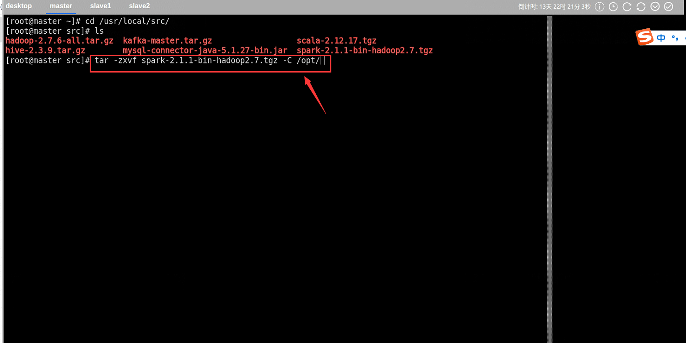

### 3.1.2 重命名

- 进入到/opt目录下

```shell
cd /opt
```

- 将目录名为spark-2.1.1-bin-hadoop2.7 ，重命名为spark

```shell
mv spark-2.1.1-bin-hadoop2.7 spark 
```

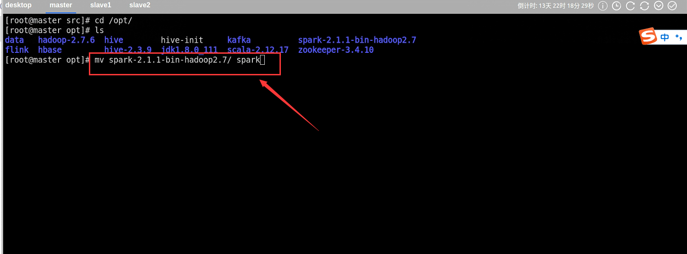

### 3.1.3 添加环境变量

- 编辑/etc/profile文件，输入以下命令

```shell
vi /etc/profile
```

- (**注意**：通过快捷建shift + gg，可以快速到达文件最末端。通过快捷键shift+zz快速保存)
- 添加spark的环境变量，如下图所示

```shell
# set spark environment
export SPARK_HOME=/usr/local/src/spark
export PATH=$PATH:$SPARK_HOME/bin:$PATH
```

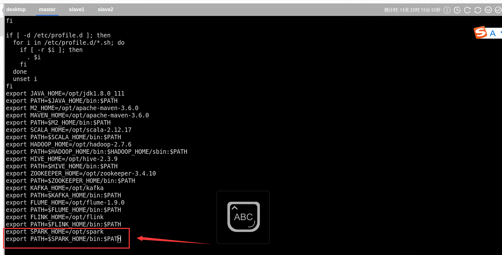

### 3.1.4 使环境变量生效

- 输入命令

```shell
source /etc/profile
```

- 使spark环境变量生效

### 3.1.5 验证Spark命令

- 输入命令

```shell
`echo $SPARK_HOME `
```

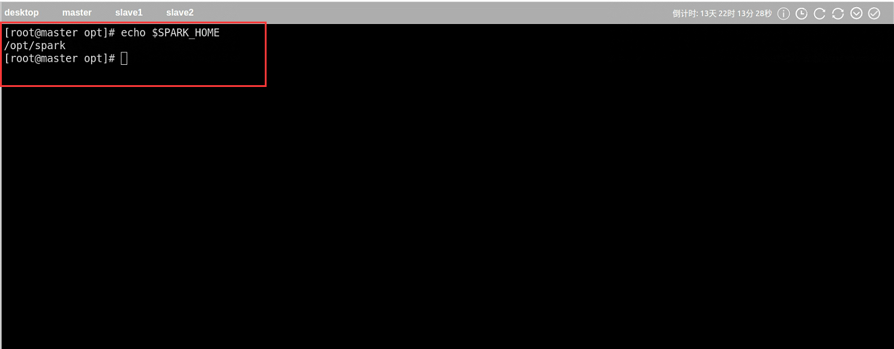

### 3.1.6编辑spark配置文件

​	首先进入到**spark配置文件目录**下，输入命令

```shell
cd /opt/spark/conf
```

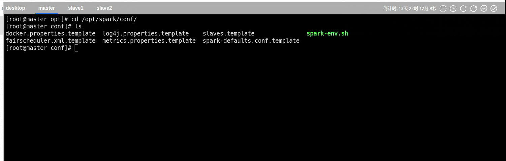

#### 1.spark-env.sh文件

- **编辑文件spark-env.sh，输入命名**

```shell
vi spark-env.sh
```

​	**在文件最后一行添加以下配置项**

```shell
#java的路径
JAVA_HOME=/opt/jdk1.8.0_111
#spark集群中主节点的 IP 地址或者名称
SPARK_MASTER_IP=master
#spark集群中主节点的 端口号。
SPARK_MASTER_PORT=7077
#scala的路径
SCALA_HOME=/opt/scala-2.12.17

#下面几个参数完成spark和hadoop的挂接，使spark可以提交作业到hadoop的yarn运行
#完成 spark 和hadoop 的挂接
#hadoop的路径
HADOOP_HOME=/opt/hadoop-2.7.6
SPARK_DIST_CLASSPATH=$(/opt/hadoop-2.7.6/bin/hadoop classpath)
#下面几个参数配置将spark设置为hadoop的yarn运行
HADOOP_CONF_DIR=/opt/hadoop-2.7.6/etc/hadoop
SPARK_YARN_USER_ENV="CLASSPATH=/opt/hadoop-2.7.6/etc/hadoop"
YARN_CONF_DIR=/opt/hadoop-2.7.6/etc/hadoop
```

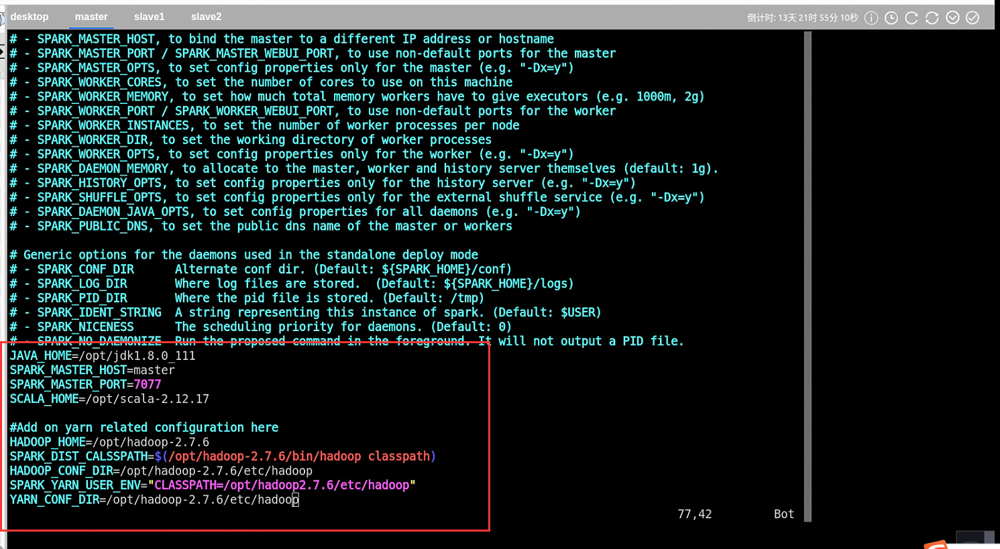

#### 2.slaves文件

- **复制文件slaves.template，并命名为slaves，输入命令**

```shell
cp slaves.template slaves`
```


- **打开文件slaves，输入命名**

```shell
vi slaves
```

​	**将文件中localhost改为以下配置**

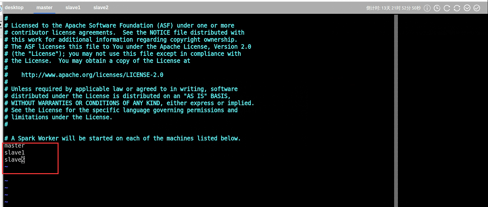

### 3.1.7 spark目录

1. 将master节点上的spark目录复制到其他节点上去（slave1和slave2）

​	远程复制命令：

```shell
scp -r /opt/spark slave1:/opt
scp -r /opt/spark slave2:/opt
```

2. 将master节点上的/etc/profile文件复制到其他节点上去（slave1和slave2）

```shell
scp /etc/profile slave1:/etc/profile
scp /etc/profile slave2:/etc/profile
```

3. 在其他节点上（slave1和slave2）使/etc/profile文件生效，在slave1和slave2上执行命令

```shell
source /etc/profile
```

4. 在其他节点上（slave1和slave2）验证spark命令，在slave1和slave2上执行命令

```shell
echo $SPARK_HOME
```

## 3.2 Spark集群运行模式

​	**Spark 的常用运行模式有 Local(也称单节点模式），Standalone(集群模式），Spark on Yarn(运行在Yarn上）。**

### 3.1.1 Spark local模式运行

1. Spark单机运行模式，一般用于开发测试。运行该模式非常简单，只需要把Spark的安装包解压后，改一些常用的配置即可使用，而不用启动Spark的Master、Worker守护进程，也不用启动Hadoop的各服务（除非需要用到HDFS）。

​	在**master**节点上执行以下命令

```shell
spark-submit  \
--class org.apache.spark.examples.SparkPi \
--master local[1] \
--driver-memory 1g  \
--executor-memory 1g  \
--executor-cores 1 /opt/spark/examples/jars/spark-examples_2.11-2.1.1.jar 40
```

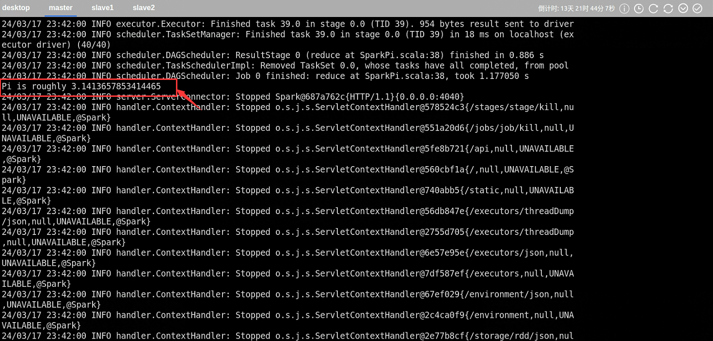

​	参数说明：

| 参数名                  | 参数说明                                                     |
| ----------------------- | ------------------------------------------------------------ |
| spark-submit            | 表示提交任务到spark集群或yarn执行。                          |
| --class                 | 应用程序的主类，仅针对 java 或 scala 应用，本例指            /opt/spark/examples/jars/spark-examples_2.11-2.1.1.jar中的类。 |
| --master                | master 的地址，提交任务到哪里执行，可以选择spark、yarn、local，如果是spark集群，则输入地址如spark://master:7077。 |
| -deploy-mode            | 在本地 (client) 启动 driver 或在 cluster 上启动，默认是 client。 |
| --driver-memory         | Driver内存，默认 1G                                          |
| --executor-memory       | 每个 executor/计算节点的内存，默认是1G                       |
| --executor-core         | 每个 executor 的核数，在yarn或者standalone下使用。           |
| <Application-jar>       | 即表示表示执行的类所在的jar路径，例如本例：/opt/spark/examples/jars/spark-examples_2.11-2.1.1.jar |
| [application-arguments] | 传入jar的主类的参数，例如本例：40                            |

### 3.2.2 Spark Standalone模式

​	构建一个由Master+Slave构成的Spark集群。和单机运行的模式不同，这里必须在执行应用程序前，先启动Spark的Master和Worker守护进程。这种运行模式，可以使用Spark的8080 来观察资源和应用程序的执行情况了。

#### 1. 启动Spark集群

​	①在master节点输入命令

```shell
/opt/spark/sbin/start-all.sh
```


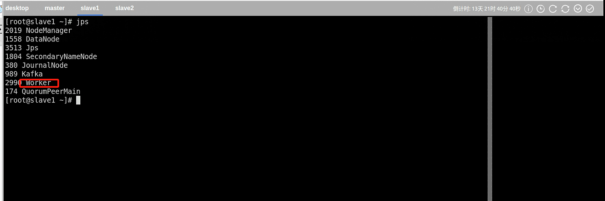

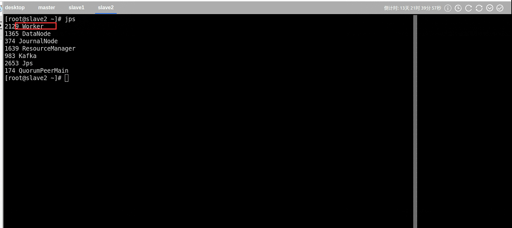

#### 2.基于standalone下的client模式

​	①client模式下：适用于交互、调试，希望立即看到任务的输出。

- 在master节点下输入命令：

```shell
spark-submit  \
--class org.apache.spark.examples.SparkPi \
--master spark://master:7077 \
--deploy-mode client  \
--driver-memory 512M  \
--executor-memory 512M  \
--executor-cores 1 /opt/spark/examples/jars/spark-examples_2.11-2.1.1.jar 40

```


- 通过网页端观察资源和应用程序的执行情况（http://master:8080/）


#### 3. 基于standalone的cluster集群模式

​	①cluster模式下:适用于生产环境

- 在master节点下输入命令：

```shell
/usr/local/src/spark/bin/spark-submit  \
--class org.apache.spark.examples.SparkPi \
--master spark://master:7077 \
--deploy-mode cluster  \
--driver-memory 1g  \
--executor-memory 1g  \
--executor-cores 1 /opt/spark/examples/jars/spark-examples_2.11-2.1.1.jar 40
```


- cluster模式下结果查看


### 3.2.3 停止spark集群

1. 在master节点输入以下命令停止spark集群

```shell
/usr/local/src/spark/sbin/stop-all.sh 
```

## 3.3 spark-shell操作

### 3.3.1 spark-shell运行

1. 基于local模式运行spark-shell应用

​	命名：

```shell
/opt/spark/bin/spark-shell --master local --deploy-mode client
```

​	说明：

| 参数名       | 参数说明                                                     |
| ------------ | ------------------------------------------------------------ |
| spark-submit | 表示提交任务到spark集群或yarn执行。                          |
| --class      | 应用程序的主类，仅针对 java 或 scala 应用，本例指/usr/local/src/spark/examples/jars/spark-examples_2.11-2.0.0.jar中的类。 |
| --master     | master 的地址，提交任务到哪里执行，可以选择spark、yarn、local，如果是spark集群，则输入地址如spark://host:port。 |
| -deploy-mode | 在本地 (client) 启动 driver 或在 cluster 上启动，默认是 client。 |

2. 执行结果

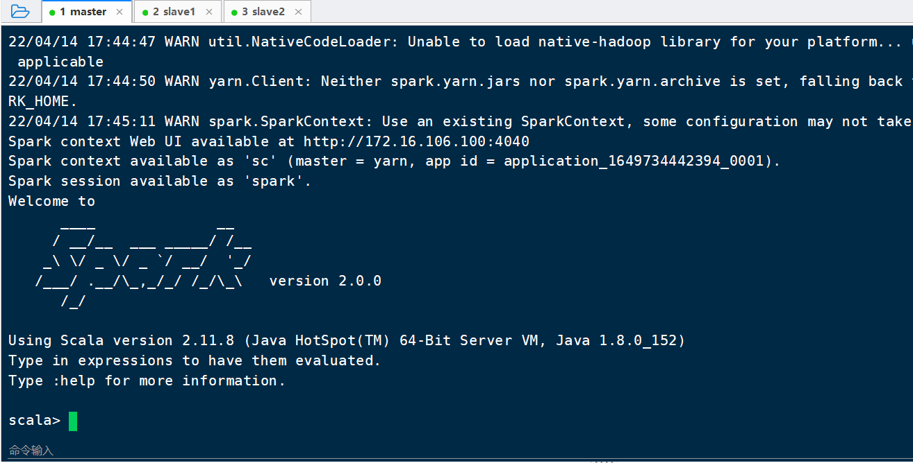

### 3.3.2 WordCount单词统计

1. 需求

​	使用spark将wordcount1.txt中每个单词的次数统计出来。

- 在linux系统tmp下创建文件wordcount1.txt

```shell
vi  /tmp/wordcount1.txt
```

- 在文件中添加以下内容

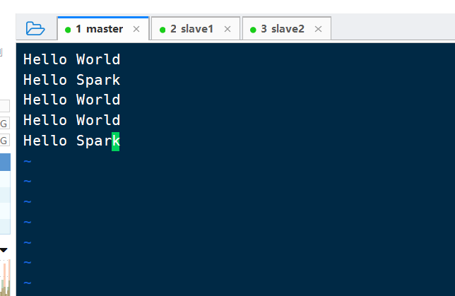

- 最终计算结果为

```
Hello 6,World 3,Spark 2
```

2. 实现步骤

​	①加载本地文件数据创建RDD

- 创建RDD

```shell
scala> val line=sc.textFile("file:///tmp/wordcount1.txt")
line: org.apache.spark.rdd.RDD[String] = file:///tmp/wordcount1.txt MapPartitionsRDD[1] at textFile at <console>:24
```

​	说明：

​	(1)textFile方法

​	通过Linux或HDFS加载文件创建RDD。如果文件在HDFS上的路径为/demo/wordcount1.txt，则使用方法为sc.textFile("/demo/wordcount1.txt")

​	(2)parallelize方法

​	通过集合方式创建RDD，例如：sc.parallelize(Array(1,2,3,4,5))。

- 检查RDD里面的数据

```shell
scala> line.collect()
res0: Array[String] = Array(Hello World, Hello Spark, Hello World, Hello World, Hello Spark)

```

​	(1)collect方法

​	以数组的形式返回数据集RDD中的所有元素。

​	②将数据集中的单词组合拆分成一个一个单词

- 拆分操作

```shell
scala> val words=line.flatMap(_.split(" "))
words: org.apache.spark.rdd.RDD[String] = MapPartitionsRDD[2] at flatMap at <console>:26
```

​	说明：

​	(1)flatMap方法

​	将每个输入的元素映射出去变为0或者多个输出结果，具体值参照下面结果

​	(2)map方法

​	将每个元素传递到函数中，返回的结果是一个数据集。它与flatMap的区别在于是按行划分的，如果本例使用map方法，结果如下，可以看出不符合本例的计算要求。

- 检查数据集

```shell
scala> words.collect()
res3: Array[String] = Array(Hello, World, Hello, Spark, Hello, World, Hello, World, Hello, Spark)
```

​	③将数据集转化为键值的形式

- k-v键值

```shell
scala> val wordAndOne=words.map((word)=>(word,1))
wordAndOne: org.apache.spark.rdd.RDD[(String, Int)] = MapPartitionsRDD[3] at map at <console>:28
```

- 检查数据集

```shell
scala> wordAndOne.collect
res4: Array[(String, Int)] = Array((Hello,1), (World,1), (Hello,1), (Spark,1), (Hello,1), (World,1), (Hello,1), (World,1), (Hello,1), (Spark,1))
```

​	④对数据集中的数据进行统计

- 统计key值相同的值进行相加

```shell
scala> val wordCount=wordAndOne.reduceByKey((x,y)=>x+y)
wordCount: org.apache.spark.rdd.RDD[(String, Int)] = ShuffledRDD[6] at reduceByKey at <console>:30
```

​	说明：

​	(1)reduceByKey方法

​	应用于（key,value）键值对的数据集时，返回一个新的（key,value）形式的数据集。其中，新的value值是将每个key值键传递到函数中进行聚合后的结果。其中reduceByKey((x,y)=>x+y)，其作用是寻找相同key的数据，当找到这样的两条记录时会对其value(分别记为x,y)做(x,y) => x+y的处理，即只保留求和之后的数据作为value。反复执行这个操作直至每个key只留下一条记录。

- 输出最终结果

```shell
scala> wordCount.foreach(println)
(Spark,2)
(Hello,5)
(World,3)
```

​	⑤wordcount简化版写法

```shell
scala> sc.textFile("file:///tmp/wordcount1.txt").flatMap(_.split(" ")).map((_,1)).reduceByKey(_+_).foreach(println)
(Spark,2)
(Hello,5)
(World,3)
```

### 


